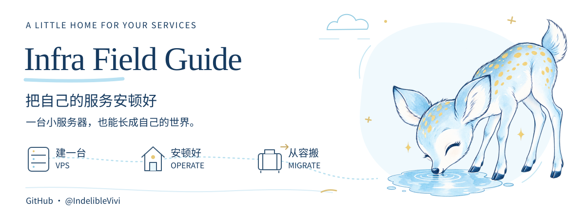
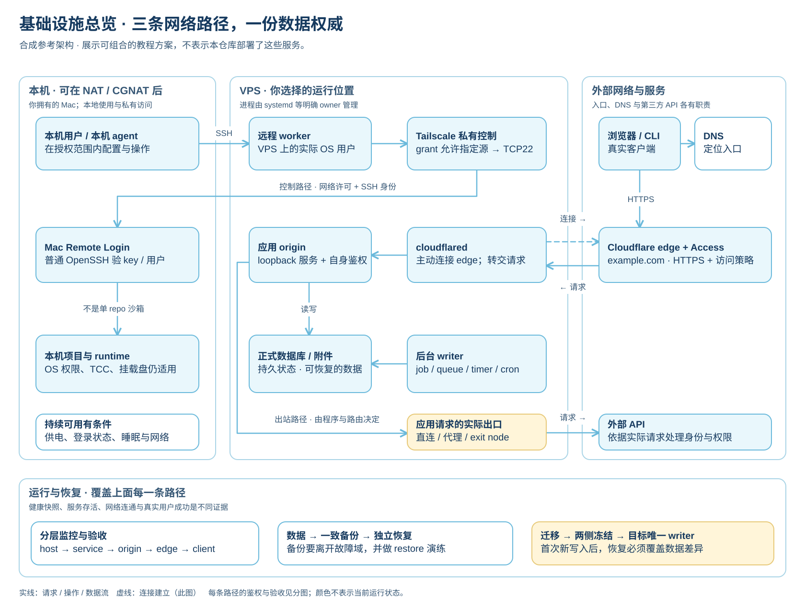

[简体中文](README.md) · [English](README.en.md)

[](https://github.com/IndelibleVivi/infra-field-guide)

# Infra Field Guide · Give your services a home

For people choosing their first VPS, moving a local service online, or replacing a server—and the AI agents helping them do it.

**Nine chapters, reusable agent work orders, configuration examples, six architecture diagrams, and a working read-only health tool.** The full tutorials are written in Chinese with English technical terms; this English entry point maps the same capabilities. Examples use synthetic identities and documentation addresses.

[Reading paths](#start-with-your-task) · [Architecture atlas](docs/architecture.md) · [Agent entry](agents/README.md) · [Checks](https://github.com/IndelibleVivi/infra-field-guide/actions/workflows/check.yml)

**[Open the reading site →](https://indeliblevivi.github.io/infra-field-guide/)** with chapter navigation, in-browser search, mobile layouts, inline term definitions and the architecture atlas. It renders the same Markdown sources; the full guide remains in Chinese. See [site/README.md](site/README.md) for building and maintenance.

## Start with your task

| Task | Read | Result |
| --- | --- | --- |
| Understand plans before buying | [01 · VPS basics](docs/01-vps-basics.md) | A workload, resource, network and budget checklist |
| Set up a new server | [02 · First day](docs/02-first-server.md) | Recovery access, independent login, limited exposure |
| Deal with memory pressure or full disks | [03 · Operations](docs/03-operations.md), [08 · Troubleshooting](docs/08-troubleshooting.md) | Layered diagnosis, swap/OOM context and recovery |
| Move a local service to a VPS | [04 · Local → VPS](docs/04-local-to-vps.md) | Candidate deployment, data transfer, ingress and client checks |
| Switch servers or providers | [05 · VPS → VPS](docs/05-vps-to-vps.md) | One active writer and a data-aware cutover/recovery plan |
| Reorganize a Claude environment after account problems | [06 · Backup, cleanup and recovery](docs/06-account-recovery.md) | Two attributed approaches, concrete state locations and selective restoration |
| Understand DNS, Tunnel, VPN and proxies | [07 · Networks and proxies](docs/07-network-and-proxies.md) | Separate ingress, administration and application egress |
| Let a VPS worker reach a Mac project | [09 · Private remote access](docs/09-private-access.md) | Tailscale grants, ordinary OpenSSH and non-interactive environment checks |
| Inspect resource headroom | [Health tool](tools/README.md) | A Linux resource snapshot and offline HTML report |
| Work with an agent | [Agent work orders](agents/README.md) | Explicit scope, stop conditions, recovery and evidence |

Each chapter starts with a concept map; three additional comparisons explain SSH keys, RAM / swap, and migration rollback boundaries. The [29-term glossary](docs/glossary.md) provides short definitions and links back to the relevant section. On the reading site, dotted-underlined terms open in place; pinned notes highlight common confusions.

New readers can start with **01 → 02 → 03 → 07**, then choose a migration or private-access path. Account cleanup does not require buying a server.

## Run a synthetic example

Python 3.9+ is enough. No pip dependencies. Download the repository or clone it:

```sh
git clone https://github.com/IndelibleVivi/infra-field-guide.git
cd infra-field-guide
```

From the repository root in a POSIX shell:

```sh
mkdir -p reports
python3 tools/health.py collect --demo -o reports/health-demo.json
python3 tools/health.py render reports/health-demo.json -o reports/health-demo.html
```

Open `reports/health-demo.html` from your file manager. It shows RAM, swap, load, root filesystem bytes/inodes, uptime and memory PSI, including attention and unknown states. Repeated runs need new output filenames: the tool protects existing files.

This demo uses a fixed synthetic fixture. It does not SSH, access accounts, install services or make network requests. Real collection supports Linux only; macOS and Windows can run the demo and render JSON. On Windows, create `reports` manually and use your available Python command. The report is a snapshot, not continuous monitoring or an alerting service. Read the [tool contract](tools/README.md) for thresholds, errors, container limits and data handling.

## See the complete system

[](docs/architecture.md)

[Open the full-size overview SVG](docs/diagrams/infrastructure-overview.svg). The [architecture atlas](docs/architecture.md) includes overview, control access, public ingress, outbound access, migration state and repository/health data flow. Editable source and rendered diagrams are included. Deployment nodes are illustrative options; the repository does not provision them. Administration, incoming service traffic and outgoing application traffic have different routing and authentication boundaries.

## The author's service choices and referrals

**VPS: GreenCloud Budget KVM Sale.** After moving from Hetzner to GreenCloud, the author recommends considering this annual plan for small personal services and remote workers. Chapter 01 retains the [GreenCloud referral, ordinary product link and dated plan comparison](docs/01-vps-basics.md#作者选择greencloud-budget-kvm-sale). Choose based on your region, workload and billing commitment; check prices, resources and stock at purchase time.

**Residential proxy: Proxy-Cheap Dedicated.** The author purchased the **Dedicated** tier of its static residential product, reports very good IP test results for the address received, and says it is usable for accessing the official Claude website / app. This is the author's experience with that purchase, not a promise about every IP's score or availability. Results can vary by ISP, assigned address and test time. Use the [author's Proxy-Cheap referral](https://app.proxy-cheap.com/r/3zNHbA), or start with the [ordinary product page](https://www.proxy-cheap.com/services/static-residential-proxies) and the [terminology and experience notes](docs/07-network-and-proxies.md#住宅代理选项proxy-cheap-dedicated).

An overseas VPS should use its own egress by default: **a static residential proxy is not a standard requirement, and this guide does not recommend routinely chaining the two.** Access must still meet the target service's region, account and usage requirements; a proxy does not guarantee eligibility or account safety.

Qualifying purchases through either referral may reward the author with a commission or account credit. No additional discount is promised. Ordinary product links are provided so you can compare and choose independently.

## What belongs on a VPS

Small websites, authenticated APIs/MCP services, scheduled tasks, lightweight databases, monitoring, independent backup storage and private network access can fit. Desktop UI, a local Keychain, private desktop data sources and GPU-heavy workloads need their own design. A Tunnel does not automatically provide application authorization.

The guide draws on migration and operational failure modes, then rebuilds them as portable instructions. It contains no private infrastructure repository, host inventory, credentials or inherited Git history. Community procedures retain attribution and distinguish local results from claims about account enforcement. Official references were first checked on **2026-10-02**; version-sensitive details need fresh verification.

## Maintain and verify

`docs/` serves readers; `agents/` provides work orders; `examples/` holds synthetic input; `tools/` implements behavior; `tests/` supplies evidence. [AGENTS.md](AGENTS.md) governs repository contributions and grants no authority over any server.

```sh
python3 -m unittest discover -s tests -v
```

CI runs checks on Linux and Windows with Python 3.9 and 3.13. Linux jobs also collect and render the CI runner's resources. Tutorial commands receive static shell syntax checks; they are not executed against real infrastructure. See [contributing](CONTRIBUTING.md) and [sources and verification scope](docs/sources-and-maintenance.md). Report versions, failing steps and redacted errors, never secrets or raw operational exports.

## Licensing

Original functional code and configuration examples use [SUL-1.0](LICENSE). Original prose and diagrams use [CC BY-NC-SA 4.0](LICENSE-DOCUMENTATION.md). This is a source-available project. These licenses apply to different materials; see [LICENSING.md](LICENSING.md) for the exact scope, attribution and third-party boundaries. Product names do not imply affiliation or endorsement.
