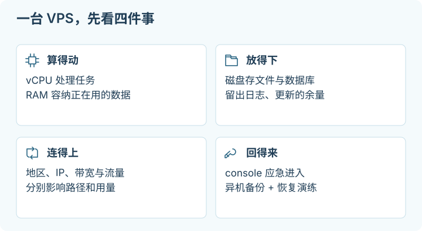

# 01 · 选购第一台 VPS：买的是哪些能力

## 这一章帮你做什么

写给还没买过 VPS、或者看不懂套餐页的人。前提：你大概知道自己想跑什么（哪怕只是“一个小工具”），并有一个可接受的月预算。读完你会得到：一份按用途、资源和网络写下的购买需求卡，知道该确认哪些项、哪些说法容易误读，以及下单后先验收什么。

VPS（Virtual Private Server）是一台租来的虚拟服务器。你获得一份 CPU、内存、磁盘和网络资源，通过控制台或 [SSH](glossary.md#ssh) 管理操作系统。它可以运行自己的小网站、Webhook 接收端、定时任务、经授权的 API 客户端和远程开发环境；是否能运行某个 AI 模型，仍取决于模型需要的内存、GPU 和计算量。租到一台 Linux 机器，并不等于获得 GPU，也不等于获得某个 AI 平台的使用资格。

第一次购买，先写一句可验收的目标，例如：“让我自己的两个设备访问一个小型工具，每天备份一次，月度总费用不超过自定预算。”有这个目标，才能判断你需要公网入口、多少资源，以及故障时愿意花多少时间恢复。下面也放了作者实际使用后愿意推荐的选择；套餐信息标记查阅日期，按下单时页面核对。

> [!TIP]
> **先记住这一点：容量单位 GB 和 GiB 不是一回事。**
> 商品页按十进制写 GB（`1 GB = 1,000,000,000 bytes`），很多系统工具按二进制显示 GiB（`1 GiB = 1,073,741,824 bytes`）。`100 GB` 约等于 `93.13 GiB`，再加上文件系统开销，实际可用还会更小。比价时别把两种单位当成同一种。

## 作者选择：GreenCloud Budget KVM Sale

作者从 Hetzner 搬到过 GreenCloud。对常驻小工具、轻量数据库、调用远端模型的 worker 这类用途，**Budget KVM Sale 是作者愿意推荐、值得先看的年付方案**：资源给得比较宽裕，价格也适合个人基础设施。它和官网常规的 Budget KVM VPS 是两个商品入口，找活动套餐时别走错。

**[使用作者的 GreenCloud referral](https://greencloudvps.com/billing/aff.php?aff=10083)** → 在产品列表选择 **Budget KVM Sale**。也可以直接用[普通套餐入口](https://greencloudvps.com/billing/store/budget-kvm-sale/?language=english)。这是推荐链接；符合商家的 referral 规则时，作者可能获得佣金或账户奖励。这里不承诺额外折扣。

官方商品页在 **2026-10-02** 列出的例子：

| 活动档位 | 内存 / vCPU | 年付价格 | 适合怎样评估 |
| --- | --- | --- | --- |
| Budget KVM Sale 的 4GB 档 | 4GB / 2 vCPU | US$25 / 年 | 几个轻量服务，先核算构建和数据库峰值 |
| Budget KVM Sale 的 8GB 档 | 8GB / 4 vCPU | US$45 / 年 | 多个小服务或远程 worker，留出更新和缓存余量 |

US$45/年折合每月 US$3.75，但结账是年付；不同机房的 CPU 型号、磁盘、流量、可售库存不同。选择自己需要的地区，再读对应那一行。活动页明确写了不适用退款或 money-back guarantee；标出的高速端口也不是独享持续带宽。购买前核对[现行条款里的 CPU、网络公平使用与备份责任](https://greencloudvps.com/terms-of-service.php)。这份推荐针对上面的轻量用途；持续编译、转码或本地大模型推理要另算资源。

## 1. 把商品页翻译成自己的需求

以下是适合初次学习的选择方法，不是每个任务通用的最低配置。

| 项目 | 第一次怎样判断 | 常见误读 |
| --- | --- | --- |
| 操作系统 | 本教程后续以 Ubuntu 24.04 LTS、systemd 为例，先确认可选该镜像 | “Linux”不代表命令、配置目录和服务管理器相同 |
| 虚拟化 | 优先选择明确说明可运行自有 Linux 内核、提供 console 的虚拟机方案；确认具体产品类型 | KVM 不代表独享物理 CPU；NAT 也不是一种虚拟化技术 |
| CPU | 少量工具先根据其文档和实际负载选档；编译、转码、模型推理另算 | “2 [vCPU](glossary.md#vcpu)”不等于两颗独占物理核心 |
| 内存 | 给应用、数据库、系统、构建和缓存都留空间；几个服务的峰值可能重叠 | 能启动一次不代表长期运行有余量；[swap](glossary.md#swap) 不等于 [RAM](glossary.md#ram) |
| 磁盘 | 算上系统、应用数据、镜像、更新、日志和临时文件 | 标称容量不是全部可用；同盘备份挡不住整盘丢失 |
| 网络 | 分别确认 IPv4、IPv6、入站端口、出站限制、月流量和超额处理 | “有公网 IP”不等于所有端口可达，也不等于无限流量 |
| 恢复能力 | 必须找到 console、rescue/recovery、重装入口和备份说明 | “可以重装”通常意味着原盘数据被清除 |
| 费用 | 比较完整一个账期和续费后的总价 | 首购折扣、停机、删除、取消订阅是不同状态 |

如果某款极小内存方案需要你在首次 SSH 登录前就研究内存压缩、裁减服务和存储转移，它往往不适合拿来学习基础运维。可以先选能容纳目标工作负载和更新过程的档位，待有真实用量记录后再缩减。反过来，也不要为一个轻量 Webhook 预购长期大套餐。

> [!NOTE]
> **停下检查点：把营销词翻译成可询问的问题。**
> 看到“优化线路”“多线”“独享 IP”“住宅 IP”时，不要直接相信或否定。逐条问：优化的是哪一段、入向还是回程？是不是共享出口？停机或迁区后地址怎么处理？只有能落到合同和实测上的描述，才进入你的需求卡。

## 2. KVM、OpenVZ 与资源共享

**KVM 虚拟机**有虚拟硬件，可运行自己的 guest 操作系统和内核。你一般有较完整的系统管理能力，但 CPU、磁盘吞吐和网卡仍可能与同一宿主机的其他租户共享。“完全虚拟化”描述实现方式，并不承诺性能独占。[KVM 项目说明](https://www.linux-kvm.org/page/Main_Page)

商品页上的 **OpenVZ 容器**通常指操作系统层虚拟化：容器共用宿主内核，能用哪些内核能力由宿主决定。运行 Docker、创建 TUN 设备、启用某种 VPN、修改内核参数或建立 swap，可能受限。OpenVZ 产品本身也包含虚拟机能力，因此应问清卖的是容器还是虚拟机，而非仅看品牌名。[OpenVZ OS virtualization](https://docs.openvz.org/openvz_users_guide.webhelp/_basics_of_os_virtualization.html)、[OpenVZ overview](https://docs.openvz.org/openvz_users_guide.webhelp/_openvz_overview.html)

**共享 [vCPU](glossary.md#vcpu)**表示调度到你的虚拟 CPU 上的时间仍要竞争。应用执行很慢时，先区分自己的计算负载、磁盘等待和 CPU steal。Linux 工具中的 `st`/steal 是 guest 等待宿主安排 CPU 的一个信号；持续偏高值得记录时间段和负载，向服务商询问或迁移，但单个瞬间值不能证明商家超售。**Dedicated vCPU**的含义也要按合同确认：是专用线程、专用核心，还是更高的调度保障。内存保证、CPU 持续占用限制和公平使用条款分别阅读。[Ubuntu vmstat(8)](https://manpages.ubuntu.com/manpages/noble/man8/vmstat.8.html)

## 3. 公网入口与公网出口是两件事

**入站**是其他设备主动连接你的服务器。例如浏览器访问 `app.example.com:443`，或你的电脑连接 SSH。**出站**是服务器主动请求别的服务，例如下载 Ubuntu 更新或调用获准使用的 API。入站能否成功取决于地址、端口映射、云防火墙、主机防火墙和进程监听；出站 IP 则由路由、NAT 或显式出口决定。

| 商品类型 | 入站意味着什么 | 出站意味着什么 |
| --- | --- | --- |
| 独享公网 IPv4 | 通常可使用分配给该实例的地址；仍受端口与防火墙限制 | 通常从该地址或服务商规定的 NAT 地址出去，需实际核对 |
| NAT IPv4 | 多个实例共享一个公网地址，可能只给你若干映射端口；不能假定拥有 80/443 | 常与别人共享出口 IPv4，入站映射端口不会变成独享出口 |
| IPv6-only | 有全球 IPv6 地址也需要客户端网络支持 IPv6；IPv4 客户端不能直接连接 | 不能默认访问 IPv4-only 目标；DNS64/NAT64 是否提供须另查 |
| IPv4 + IPv6 | 两套路径分别配置和验证 | 应用可能优先选 IPv6，两个地址族的出口与路由可能不同 |

NAT 方案也能有用途，例如只运行主动发出的定时任务。但如果你要按教程直接发布 HTTPS 网站，先确认是否拥有需要的入站能力。Tunnel 可以改变入口设计，不能补成任意协议、任意端口的无限公网主机。具体区别见 [网络、DNS 与代理](07-network-and-proxies.md)。

“独享 IP”通常仅表示租期内地址分配方式，不代表以前没人使用、没有历史记录、没有同 ASN 的其他租户，更不保证 IP 永久不变。停机、重建、迁区、更换网络产品或欠费后的地址保留规则，要在下单前确认。

## 4. 地区、线路、ASN 与“住宅 IP”

地区首先影响你到服务器、服务器到目标服务的距离及路由。它也影响服务条款允许的使用区域和数据存放要求。选择时同时看两段路径：你访问远程工具需要低延迟；后台任务访问某个存储或 API，重心可能在服务器到该服务的网络质量。单次测速和地图距离都无法证明高峰期稳定。

有些商品以“优化线路”“多线”“精品网络”命名。把营销词转换成可询问的问题：优化哪一地、哪一家接入运营商、入向还是回程；是否承诺带宽或丢包；是否有测试地址、Looking Glass、短期试用或明确退款条件。商家给的测试节点可能与实际套餐不在同一网络，应确认关联。只对提供给你测试的目标做轻量检查，不用高流量压测来“验货”。

**[ASN](glossary.md#asn)**是自治系统编号，描述一个具有统一路由策略的网络域。它能帮助理解 IP 由谁宣告、经过哪些网络，不能单凭 ASN 判断机器物理位置、实际带宽或账号风险。[RIPE：What is an AS Number?](https://www.ripe.net/manage-ips-and-asns/as-numbers/)

普通 VPS 常使用机房或云网络地址。“住宅”是网络接入及地址分类语境，并不是给 VPS 安装一个协议后能获得的属性。地理数据库与商业分类也可能不同步。**独享 IPv4、住宅标签、某种代理协议，都不是账号不受限制的保证。** 使用 AI 服务仍应满足其区域、账户、自动化与 API 条款；出现账户限制，应使用官方支持和申诉路径。更换出口不是修复资格问题的方法。

海外地区的 VPS 默认直接使用自身出口，**不需要再把静态住宅代理作为标配，也不推荐常规叠加**。额外一跳会增加费用、延迟与排障环节；先确认自己的任务是否真有单独的代理需求。作者另外购买过 Proxy-Cheap 的 Dedicated 静态住宅代理，反馈所购 IP 测试结果很好，可用于访问官方 Claude 网页 / app；这不是 VPS 的必购配件，也不能推广为所有 ISP 或 IP 都有相同表现。产品术语、[referral 与体验边界见网络章节](07-network-and-proxies.md#住宅代理选项proxy-cheap-dedicated)。

## 5. 带宽是速度，流量是累计用量

`100 Mbps`是每秒 100 megabit；理想换算约 `12.5 MB/s`，实际还要扣除协议开销并受共享链路、对端、延迟和丢包限制。`1 Gbps`端口也可能是共享峰值，不代表你可持续跑满。月流量是累计传输量，要看入站、出站是否都计费，跨区/内网是否另计，备份下载是否也算。

存储与流量单位尤其容易混淆：`1 GB = 1,000,000,000 bytes`，`1 GiB = 1,073,741,824 bytes`。`100 GB`约等于 `93.13 GiB`，操作系统还要占用文件系统元数据等空间。不要直接把商品页的 GB 与某个工具显示的 G 当成同一种单位。[NIST：binary prefixes](https://physics.nist.gov/cuu/Units/binary.html)

可以先用自己的假设估算：每天从服务器发出 `2 GB` 的结果，30 天约 `60 GB`；再加上上传、下载、备份、重试和隧道开销，按实际计费方向留余量。不要把这个例子当成推荐额度。持续 `100 Mbps` 跑满一小时，理论传输约 `45 GB`，一次大测速就可能用掉可观流量。

下单前找出超额后到底发生什么：停网、降速、额外按量计费，还是允许购买流量包。设置商家支持的用量提醒和预算提醒，并确认“预算提醒”是否只是通知，是否真有硬性费用上限。

## 6. 磁盘、快照与备份

SSD/NVMe 表示设备类型或产品标签，实际随机读写、吞吐、共享程度和容量限制仍需确认。小 VPS 上，应用镜像、数据库、日志和构建缓存常比程序本身更快占满磁盘。磁盘快满后，服务可能无法写日志、SSH 登录也可能异常。

快照适合在升级前保留一个恢复点，但它可能与实例处于同一供应商和账户故障域，删除实例后是否保留也要看规则。运行中数据库的磁盘快照不自动等于应用一致的备份。需要独立保管的数据，应使用应用支持的备份方式，再复制到另一故障域并验证恢复。RAID、额外硬盘和“平台可靠性”都不能代替恢复演练。操作步骤见 [日常运维](03-operations.md)。

如果磁盘按需扩容，问清扩容是否可逆、是否需要调整分区/文件系统、快照如何计费，以及缩容是否只能重建迁移。第一次使用，避免为了省一点空间把可恢复路径也删掉。

## 7. 实际购买与验收顺序

1. **写需求卡。** 记录用途、访问者、是否需要公网入站、目标软件、预算、可接受停机时间，以及要保留哪些数据。没有业务数据时，把“可重建”作为练习目标。
2. **读产品细则。** 确认虚拟化、架构（x86_64/ARM64）、内存、磁盘、IPv4/IPv6、端口限制、可用镜像、console、退款与公平使用条款。软件只提供 x86_64 二进制时，不要未经确认就选 ARM64。
3. **记录费用全貌。** 把实例、IPv4、磁盘、快照/备份、流量、税费和续费金额分别写下。若某项按小时计费，确认月上限、停机收费、最低计费单位和自动续费行为。保存下单时的条款与账单，避开只看首月折扣的判断。
4. **在自己的本地设备准备 SSH key。** 见 [首次建机](02-first-server.md)。向服务商提供公钥，保管私钥；若只能初始密码登录，走后续的密钥迁移流程。
5. **在控制面板选择并创建。** 本书示例选择 Ubuntu 24.04 LTS。仔细复核区域、套餐与付费项后再确认购买。打开账号 MFA，把恢复码保存在自己可访问的安全位置；不要把控制台账号、密码或恢复码贴给 AI。
6. **先找恢复入口，再做系统修改。** 确认控制面板能打开 console；查明 SSH 断联时怎样登录或使用 rescue。确认镜像实际版本、实例地址和 SSH 用户。面板写“Running”仅说明平台状态。
7. **完成基础验收。** 按下一章核对 host key、第二登录、资源、时间、更新与防火墙；从将来真正使用它的设备和网络测试所需连接。发现架构、容量、入站能力或合同不符，趁退款期限内联系服务商，先不要存入唯一副本的数据。
8. **记下续费与退出日期。** 提前安排是否续费、导出数据、下载备份和验证恢复。停止服务、关机、删除实例、释放额外 IP/磁盘、取消订阅可能是多个动作；以账单和资源列表的实际回读为准。

取消时先确认备份能在别处恢复，再按服务商当前流程逐项释放收费资源；删除前保存必要账单和配置清单。销毁实例会失去数据，有的附加资源反而继续计费，不能靠“机器已经关了”判断费用停止。

## 8. 本章完成时应能回答

你能说明买的是什么类型、如何恢复登录、IPv4/IPv6 分别能做什么、流量怎么计费、续费总价和取消路径在哪里，并能解释为什么该配置适合自己的任务。还不能回答的购买关键项，留在需求卡上核实，不靠另一篇过期优惠帖补全。

下一步：[02 · 第一次连接与基础加固](02-first-server.md)。回到 [仓库入口](../README.md)。

## 一手资料与查阅日期

查阅日期：**2026-10-02**。以下链接用于定义与机制核验；具体商家的价格、网络、限制和退款政策必须在下单时重新读取。

- [KVM 项目说明](https://www.linux-kvm.org/page/Main_Page)：虚拟机与虚拟硬件。
- [OpenVZ：OS virtualization](https://docs.openvz.org/openvz_users_guide.webhelp/_basics_of_os_virtualization.html)、[OpenVZ overview](https://docs.openvz.org/openvz_users_guide.webhelp/_openvz_overview.html)：容器与虚拟机区分；这是架构文档，不是当前商家产品承诺。
- [RIPE：AS Number](https://www.ripe.net/manage-ips-and-asns/as-numbers/)：ASN 定义。
- [Ubuntu vmstat(8)](https://manpages.ubuntu.com/manpages/noble/man8/vmstat.8.html)：CPU steal 的观察含义。
- [NIST：binary prefixes](https://physics.nist.gov/cuu/Units/binary.html)：GB/GiB 与 bit/byte。
- [Ubuntu 24.04 LTS release notes](https://discourse.ubuntu.com/t/ubuntu-24-04-lts-noble-numbat-release-notes/39890)：本书示例发行版的基础。
