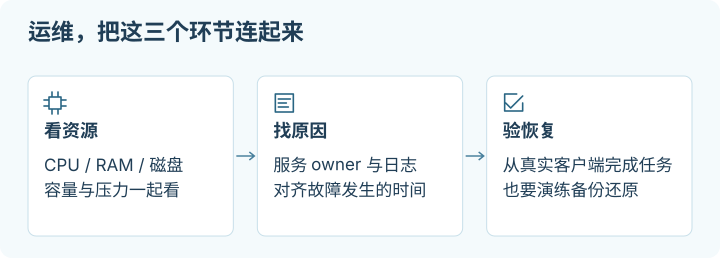
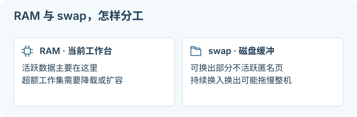

# 03 · 日常运维：看得见问题，也恢复得回来

## 这一章帮你做什么

写给机器已经能登录、想让它稳定跑下去的人。前提：你有一台可登录的 Ubuntu 机器，最好已经放过至少一个真实服务。读完你会得到：一套能区分“慢、卡、被杀”是哪一种压力的检查方法，理解 swap 和 OOM 的边界，会管理日志增长、安全更新，以及做一次真正的恢复演练。



<details>
<summary>适用环境与验证范围</summary>
<p>以 Ubuntu 24.04 LTS 和 systemd 为例；swap 实验另有本地 ext4、无现成 swap 等明确条件，见第 3 节。</p>
<p>本章命令作静态检查，未据此验证真实主机的 swap、更新、重启或业务恢复。合成恢复练习与真实应用恢复分别验收。具体记录见<a href="sources-and-maintenance.md">来源与维护</a>。</p>
</details>

本章继续使用 Ubuntu 24.04 LTS + [systemd](glossary.md#systemd)。目标是让一台小 VPS 可持续运行：知道进程由谁负责，发现资源压力，控制日志增长，完成更新，并且能从[备份](glossary.md#备份)恢复。没有部署应用时也可以先做只读检查；文中的 `example.service` 是合成服务名，执行前必须换成你已确认的 unit。

命令块均说明运行位置。除明确标注的练习与修改外，检查不会主动改变服务器；涉及 swap、日志清理、重启和恢复的步骤应逐步运行。一次读数、脚本退出码、服务进程存在、真实客户端任务成功，各自证明不同的事情。

> [!NOTE]
> **停下检查点：swap 和 OOM 不是二选一的关系。**
> 加 [swap](glossary.md#swap) 只是把部分不活跃内存搬到磁盘当缓冲，磁盘比内存慢得多，它救不了持续超额的工作集，也不能阻止容器被 [OOM](glossary.md#oom) 杀。看到服务被杀，先按第 2 节找证据，再决定是加内存、降并发还是调 cgroup 限制。

## 1. 建立一张小而可用的运行记录

在自己控制的私密位置记录：服务器用途、系统和架构、服务名、配置与数据目录、启动方式、监听端口、备份位置、最近一次恢复演练、更新时间和 console 恢复入口。不要把凭据混在运行记录里，也不要把原始日志和完整环境变量直接提交公共仓库。

多个 harness 在不同本地/远程机器协作时，增加发起端、实际工具执行端、共享资源和原任务的定位信息，具体见[跨机器运维专题](multi-machine-operations.md)。

第一周，在完成一次实际任务后看资源；稳定后按工作负载安排每日自动告警和周期性人工巡检。记录“为什么异常、采取了什么行动”，比每小时截一张全部绿色的面板更有用。

**运行位置：VPS 的普通 sudo 用户会话。下面是一轮轻量只读巡检。**

```sh
date -Is
uptime
free -h
swapon --show
df -hT /
df -i /
systemctl --failed --no-pager
sudo journalctl -p warning --since '-1 hour' --no-pager
```

预期时间准确，容量有余量，failed unit 与警告都能解释。`free` 的 `available` 通常比只看 `free` 更适合判断还能承受多少新负载；缓存占用内存并不自动是泄漏。`uptime` 的 load average 包括等待 CPU 及部分不可中断等待任务，不能等同 CPU 使用率。日志可能含地址、路径或请求数据，分享前摘取必要片段并脱敏。

发现异常时按下一节定位，不先运行“清理所有缓存”“一键优化内存”。本仓库提供的只读工具、样例输入和输出解释，统一见 [Health toolkit](../tools/README.md)，以那里实际公布的命令为准。

## 2. 应用慢、进程消失：先区分是哪一种压力

**运行位置：VPS；只读。**

```sh
vmstat 1 5
ps -eo pid,comm,%cpu,%mem,rss --sort=-rss | head -n 15
cat /proc/pressure/cpu
cat /proc/pressure/memory
cat /proc/pressure/io
sudo journalctl -k --since '-1 hour' --no-pager
```

`vmstat` 第一组通常是开机以来平均值，后续四组才是短时间样本。结合应用实际变慢的时段看 `r`、CPU `us/sy`、`wa`、`st` 与 `si/so`；持续 swap 进出并伴随延迟升高可能是 thrashing，不能用“swap 还有空间”证明状态健康。RSS 是驻留内存，多个进程相加可能重复计算共享页面，不是准确的全机内存账单。[Ubuntu vmstat(8)](https://manpages.ubuntu.com/manpages/noble/man8/vmstat.8.html)

PSI（Pressure Stall Information）报告任务因 CPU、内存、I/O 资源等待而损失的时间。`some` 表示有任务停滞，`full` 表示所有非空闲任务同时停滞的状态；`avg10/60/300` 是相应时间窗百分比。系统级 CPU `full` 不应拿来作通用健康阈值。看它们与错误率、响应时间的共同变化，不套用一个对所有机器生效的神奇数字。若 `/proc/pressure` 不存在，记录内核或容器能力缺口，不写一个假的 0。[Linux PSI documentation](https://docs.kernel.org/accounting/psi.html)

[OOM](glossary.md#oom) 是内存压力后可能发生的进程终止机制，原因不只“整台机器的 RAM 用光”。内核日志中的 `Out of memory`、`Killed process`、`Memory cgroup out of memory` 能提供线索，但日志中没搜到字样不等于未发生：日志可能不持久、权限不足，或是 systemd-oomd 等用户态组件采取了行动。

**运行位置：VPS；`example.service` 换成受影响的真实 unit。**

```sh
systemctl status example.service --no-pager
systemctl show example.service -p Result -p ExecMainStatus -p NRestarts -p ControlGroup -p MemoryCurrent -p MemoryHigh -p MemoryMax -p MemorySwapMax
sudo journalctl -u example.service --since '-1 hour' --no-pager
systemctl status systemd-oomd.service --no-pager
sudo journalctl -u systemd-oomd.service --since '-1 hour' --no-pager
```

若 systemd-oomd 未安装/未启用，缺失状态是线索，不要求你为了检查而安装它。cgroup v2 可以给服务或容器设置独立内存与 swap 限制，因此主机尚有可用内存，某个容器仍可能被 OOM kill。用 `stat -fc %T /sys/fs/cgroup` 确认是否为 `cgroup2fs`。若 `ControlGroup` 实际显示 `/system.slice/example.service`，可以进一步读取：

```sh
sudo cat /sys/fs/cgroup/system.slice/example.service/memory.events
sudo cat /sys/fs/cgroup/system.slice/example.service/memory.max
sudo cat /sys/fs/cgroup/system.slice/example.service/memory.swap.max
sudo cat /sys/fs/cgroup/system.slice/example.service/memory.pressure
```

实际路径不同时使用真实值，不在不同 cgroup 版本间生搬文件名。`memory.events` 的 `oom`/`oom_kill` 是累计事件，比较故障前后增量；停止后已消失的 cgroup 不能靠这个文件补回历史。还要看父级限制，子组不能突破父级预算。[Linux cgroup v2](https://docs.kernel.org/admin-guide/cgroup-v2.html)

对应处理通常是减少并发或批大小、修复泄漏、把构建与在线服务错峰、纠正错误的 cgroup 限制，或增加真实内存。先保存必要错误证据，再按服务 runbook 恢复。不要给无法控制的任务无限重启，也不要把 kernel OOM 机制整体关闭。

## 3. Swap 是缓冲，不是 OOM 的治疗方案



[Swap](glossary.md#swap) 可以把部分不活跃匿名内存换到磁盘，让短暂峰值有余地；磁盘访问通常比 RAM 慢得多。它不能修复持续超额工作集、无限并发和内存泄漏，也不能越过容器禁止 swap 的限制。持续繁忙的 swap 甚至会把“快速失败”变成“整机长期卡住”。先看第 2 节的证据，再决定是否需要。

以下只给一个明确场景：**Ubuntu 24.04 的虚拟机、目标文件位于可写的本地 ext4 文件系统、没有现成 swap、希望加一个 2 GiB 缓冲文件**。2 GiB 是演示大小，不是“内存必须乘二”的规则。不用于 OpenVZ 容器、Btrfs/ZFS、NFS、只读或未知文件系统；这些环境应按自身官方流程处理。`swapon` 对文件中的 holes 和 Copy-on-Write 有要求，因此这里用完整写入的文件，不用 `truncate`。[swapon(8)](https://man7.org/linux/man-pages/man8/swapon.8.html)

### 3.1 先读状态并确认不会覆盖

**运行位置：VPS；只读。**

```sh
systemd-detect-virt
findmnt -no SOURCE,FSTYPE,OPTIONS -T /
df -B1 /
free -h
sudo swapon --show --bytes
sudo grep -nE '^[^#].*[[:space:]]swap[[:space:]]' /etc/fstab
sudo ls -ld /swapfile-infra-guide
sudo ls -l /etc/fstab.before-infra-guide-swap
```

本流程预期没有活动 swap、没有待启用的既有 swap 配置，两个拟创建的路径都不存在，根文件系统为可写 ext4。`ls` 的不存在错误和 `grep` 的无匹配在这里可预期；其他权限或 I/O 错误要停。如果有 swap、zram、同名文件或备份，先调查 owner 和用途，不覆盖、不关闭后硬套教程。

本例要求至少有 **2 GiB 文件空间 + 5 GiB 可用余量**，并确认这份余量足以容纳你近期的更新、日志和应用增长；更大的任务应留更多。用 `df -B1` 的可用 bytes 核算，不只看百分比。配额、薄配置或服务商限制也可能使写入失败。如果机器正在 OOM、磁盘异常或繁忙，先降载并恢复稳定，别一边写 2 GiB 一边赌系统还能撑住。

### 3.2 创建文件，一次只走一步

**运行位置：VPS；此步新建并写入 2 GiB 文件，会消耗磁盘和 I/O。** 命令使用 GNU `dd` 的 `conv=excl`，如果路径已存在就失败；`umask 077` 使新文件从创建起就不对其他用户开放。

```sh
sudo sh -c 'umask 077; dd if=/dev/zero of=/swapfile-infra-guide bs=1M count=2048 conv=excl status=progress'
```

预期正常结束、写入 `2147483648` bytes。`File exists`、`No space left on device`、I/O error 或中断都属于停止条件，不能继续 `mkswap`，也不能重复命令覆盖残留。先检查这个确切文件、磁盘可用空间和 `swapon --show`；确认仅是此次未启用的残留后，再按已核实的恢复计划清理该文件或另选操作时机。`conv=excl` 的目的就是让误重跑停下来。[GNU dd manual](https://www.gnu.org/s/coreutils/manual/html_node/dd-invocation.html)

**继续前只读核验：**

```sh
sudo stat -c '%n %U:%G %a %s' /swapfile-infra-guide
df -h /
```

应是 root 所有、权限 `600`、大小 `2147483648`，剩余空间仍符合预留预算。然后逐条执行：

```sh
sudo mkswap /swapfile-infra-guide
```

预期识别为约 2 GiB 的 swap area。这里 `mkswap` 只用于本节刚创建并核实的文件，**不能把目标改成磁盘、分区或现有数据文件**。成功后才启用：

```sh
sudo swapon /swapfile-infra-guide
sudo swapon --show --bytes
free -h
```

预期表中出现这个确切路径，总量比文件大小略小属正常元数据开销；已用量可以为 0。如果 `swapon` 报不支持、无权限或 holes，停下核对文件系统/虚拟化能力，不靠换一组随机内核参数强行启用。

### 3.3 最后才持久化到启动配置

**运行位置：VPS；此步备份并编辑 `/etc/fstab`。** 确认预留备份名仍未存在，复制原文件：

```sh
sudo cp --no-clobber --preserve=mode,ownership,timestamps /etc/fstab /etc/fstab.before-infra-guide-swap
sudo ls -l /etc/fstab.before-infra-guide-swap
sudoedit /etc/fstab
```

保留原有全部挂载项，确认没有重复后只追加一行：

```text
/swapfile-infra-guide none swap sw,nofail 0 0
```

本例把 swap 视为可选缓冲，使用 `nofail` 避免文件缺失被当作必须成功的启动依赖；它不保证 swap 真正启用，仍需监控。写完后：

```sh
sudo findmnt --verify --verbose
sudo systemctl daemon-reload
sudo swapon --show
```

出现 fstab 错误时不要重启，先修正本次行；不要删除看不懂的其他条目。当前 `swapon --show` 验证的是已启用状态，持久化是否成功要在下次按计划重启后再次检查。不要为了测试这一行去执行涉及全部文件系统的重挂载命令。

### 3.4 回退与后续观察

若尚未改 fstab，当前设置不会自动跨重启保留。若已经追加，先用 `sudoedit /etc/fstab` 移除本次那一行，验证 fstab 并 `sudo systemctl daemon-reload`；若期间还有别的合法改动，不整体覆盖旧备份。

准备立即停用时，先停止或降载会消耗内存的应用，确认有足够内存承接已换出的页面且系统稳定，再运行 `sudo swapoff /swapfile-infra-guide`。**swapoff 也可能触发严重内存压力或失败**；失败就停，保留文件，重新评估容量。`swapon --show` 确认该路径完全不在列表后，才可在核实路径的前提下删除这个自建文件以收回空间；不要删除仍在用的 swap。

日后同时观察 `available`、`si/so`、PSI 和真实响应时间。不要因看见 swap 已用就立刻清空它。`vm.swappiness` 表示匿名页换出与文件页回收之间的相对取舍，不是“内存用到百分之几才开始 swap”；本教程不武断把它改成 1 或 10。只有明确的负载测试和存储条件支持时，才记录原值、改变一项并比较。[Linux VM sysctl documentation](https://docs.kernel.org/admin-guide/sysctl/vm.html)

## 4. 谁负责让进程继续运行

| 运行方式 | 能解决的事 | 生存边界 |
| --- | --- | --- |
| 普通 SSH shell 前台进程 | 临时交互调试，输出直接可见 | 连接或 shell 结束时可能被终止；没有自动恢复 |
| tmux / screen | 断开终端后重新接回同一交互会话 | 不自动跨服务器重启；退出登录后的行为还与会话管理策略有关 |
| nohup + 后台 | 避免部分 hangup 导致退出 | 不提供健康检查、重启策略、资源归属和完整日志管理 |
| systemd system service | 启动、停止、资源归属、失败结果、日志、按配置开机启动与恢复 | 需正确配置 unit；服务启动成功仍不证明业务可用 |
| systemd timer / 任务系统 | 有明确频率和补跑语义的定时工作 | 需验证任务幂等、上次状态、并发和失败通知 |

长期服务应有明确 owner，例如 systemd system unit。常驻程序的 unit 应声明运行用户、绝对 `ExecStart` 路径、工作目录、配置来源、必要的恢复策略，并让服务自身或平台负责持久状态；不要仅因网上模板用了 `Restart=always` 就照搬。失败后重启适合某些无状态服务，但会重复执行的发信、付款、数据迁移等任务必须另有幂等语义。[Ubuntu systemd.service(5)](https://manpages.ubuntu.com/manpages/noble/man5/systemd.service.5.html)

**运行位置：VPS；读取实际应用 unit，可能含敏感路径或内联配置，输出只留在本机。**

```sh
systemctl cat example.service
systemctl is-enabled example.service
systemctl is-active example.service
systemctl show example.service -p MainPID -p User -p FragmentPath -p Restart -p NRestarts
sudo journalctl -u example.service -n 80 --no-pager
```

预期你能找到唯一启动入口和运行用户。`enabled` 表示开机接入关系，`active` 表示此刻状态；有些 socket/timer 激活 unit 合理地是 `static`，不要为了把输出统一成 enabled 而改掉设计。修改 unit 后需要 `daemon-reload`，修改应用配置是否支持 reload 则由应用决定。重启前确认正在处理的请求和恢复路径；失败时保存错误日志并恢复已知有效的那份配置，不把成功启动的新空实例覆盖原数据。

长任务还需要记录已完成单元、进度文件和可重复的恢复命令。systemd 能重启一个进程，不能替你证明已经完成的数据没有重复、遗漏或损坏。

连接超时、更换 CLI 或交给另一只 agent 时，按[原任务恢复与交接](multi-machine-operations.md#断线超时与原任务恢复)继续查询和验收。日历定时、间隔与进程耗时的区别见[时间专题](time-synchronization.md#定时触发与经过时长)。

## 5. 日志与磁盘：先查增长来源，再限制

**运行位置：VPS；只读。**

```sh
df -hT /
df -i /
sudo journalctl --disk-usage
sudo du -xhd1 /var/log
```

如果应用数据在单独卷，`df` 也要检查该实际挂载点。容量还有但写入报 `No space left on device` 时，检查 inodes；大量小文件也能耗尽它们。`du -xhd1 /var/log` 只查看一个相关目录，不先全盘扫描。若是容器镜像、数据库或备份目录增长，应使用各自的保留和清理机制；不要删除 Docker 内部目录或正在使用的数据库文件。

Journal 可以是内存中的 volatile storage，也可以持久化到磁盘。先用 `sudo systemd-analyze cat-config systemd/journald.conf` 看合成配置，用 `sudo journalctl --list-boots` 看是否有历史启动日志；只有本次启动记录不能自动证明配置错误，也可能尚无可保留历史。

如果需要跨重启保存诊断，并希望控制小服务器日志预算，可以配置一个自己的 drop-in。**运行位置：VPS；这是保留策略变更，会在达到限制时淘汰旧日志。** 先保存尚需用于事故调查的记录，确认以下新文件名没有被占用，再编辑：

```sh
sudo install -d -m 755 /etc/systemd/journald.conf.d
sudoedit /etc/systemd/journald.conf.d/60-local-retention.conf
```

示例内容：

```ini
[Journal]
Storage=persistent
SystemMaxUse=200M
SystemKeepFree=1G
RuntimeMaxUse=50M
MaxRetentionSec=14day
```

这些数字是一个小机器的预算例子，应用排障、审计和磁盘规模不同时调整。`SystemMaxUse`/`SystemKeepFree` 同时约束 journal；后者不是全盘空间保证，也不会替别的服务回收磁盘。`RuntimeMaxUse` 约束运行时 journal。限额不管应用自行写的日志、Docker JSON 日志或数据库 WAL，应另设轮转。[Ubuntu journald.conf(5)](https://manpages.ubuntu.com/manpages/noble/man5/journald.conf.5.html)

```sh
sudo systemd-analyze cat-config systemd/journald.conf
sudo systemctl restart systemd-journald.service
sudo journalctl --flush
systemctl status systemd-journald.service --no-pager
sudo journalctl --disk-usage
```

预期服务正常、配置符合所写内容；如日志显示未知选项或服务失败，恢复/注释本次片段后重新启动，保留错误信息。这里 `restart` journald 使用其服务机制，不手动删 journal 文件。

急需释放旧 journal 且已保留必要证据时，可明确选择 `sudo journalctl --rotate --vacuum-size=200M`。**这会不可逆删除最旧的归档日志**；先说明丢掉哪个保留窗口，不能当作每次排障的第一步。vacuum 仅清理归档，活动文件仍计入 `--disk-usage`，所以实际总量可能高于目标。[Ubuntu journalctl(1)](https://manpages.ubuntu.com/manpages/noble/man1/journalctl.1.html)

## 6. 更新与重启要有验收

先确认 console、近期可恢复备份、预期服务列表和低流量时段。若是数据库或有不可中断写入的任务，按应用 runbook 做一致性和停机准备；“只重启一分钟”不是数据安全条件。

**运行位置：VPS；先读取再更新。**

```sh
systemctl --failed --no-pager
uname -r
sudo apt update
apt list --upgradable
sudo apt upgrade
```

更新包列表后读拟变更项和交互提示。签名/源错误、配置冲突和锁占用按 [首次建机](02-first-server.md) 的停止条件处理。更新过程中不要强制断电；自动更新可能与人工更新互斥，等待实际任务完成。内核包已安装，不等于正在运行该内核；容器镜像更新也不是 `apt upgrade` 的职责。

**确认应用已停止或可安全重启后，运行位置仍是 VPS：**

```sh
sudo systemctl reboot
```

SSH 断开是预期。通过 console 观察启动，等系统恢复后新建 SSH 连接。不要在失联几秒后连续发硬重启；如果超出这台机器正常启动时间，检查 console 报错和服务商状态。

**运行位置：重连后的 VPS；只读。**

```sh
uptime
uname -r
systemctl --failed --no-pager
sudo journalctl -b -p warning --no-pager
sudo swapon --show
sudo ss -lntup
```

核对机器确实完成新启动、预期服务与 swap 恢复、监听端口正确。接着从真实客户端完成一次最小正常业务请求；单看 `active` 或 HTTP 200 可能只到达默认页或缓存。失败时先定位启动/应用/入口哪层坏了。软件回滚应使用已准备的版本和数据兼容方案；不要把整盘[快照](glossary.md#快照)回滚与不丢最新数据混为一谈。

## 7. 备份至少要成功恢复一次

先定义两件事：你最多能接受丢掉多久的数据（RPO），多久必须恢复使用（RTO）。一天一次备份可能丢掉一天数据；某个压缩包下载要半天，也就不可能满足一小时恢复目标。备份内容要包含应用数据、可重建的配置和必要版本信息，密钥单独受控保存；凭据不能因为“在备份里”就变成公开材料。

实际数据库要使用其支持的一致性备份或停写流程。正在写入的目录直接 `tar`，不能承诺产生可恢复数据库。备份至少有一份在不同故障域；同机另一目录只适合操作失误恢复，挡不住实例丢失。加密备份还必须在恢复时取得解密材料，不能只存在原服务器。

> [!TIP]
> **先记住这一点：备份的分数由恢复（restore）决定，不由备份动作决定。**
> 有一个压缩包、一个数据库 dump 或一份磁盘快照，都只是“可能能恢复”。真正的验收是在隔离目录或测试实例里把它恢复出来，读回一条已知记录、附件和权限。没做过这一步，就还在猜。

### 先做一个不碰业务数据的恢复练习

**运行位置：VPS 普通用户的 home。此练习只创建合成文本。** 检查 `~/restore-lab` 不存在；若已存在，停下选择新练习目录，不覆盖。然后逐步执行：

```sh
mkdir -m 700 "$HOME/restore-lab"
mkdir "$HOME/restore-lab/source" "$HOME/restore-lab/backup" "$HOME/restore-lab/restored"
printf '%s\n' 'synthetic restore practice' > "$HOME/restore-lab/source/note.txt"
tar -czf "$HOME/restore-lab/backup/sample.tar.gz" -C "$HOME/restore-lab/source" .
tar -tzf "$HOME/restore-lab/backup/sample.tar.gz"
```

预期归档只包含合成 `note.txt`。若目录创建或归档失败就停，不继续从未知归档恢复。下面恢复到**另一个空目录**，保留 source 原样：

```sh
tar -xzf "$HOME/restore-lab/backup/sample.tar.gz" -C "$HOME/restore-lab/restored"
cmp "$HOME/restore-lab/source/note.txt" "$HOME/restore-lab/restored/note.txt"
cat "$HOME/restore-lab/restored/note.txt"
```

预期 `cmp` 无输出且成功，内容等于合成文本。只对自己刚创建、已列出内容的归档做这个练习；不要以 root 解包来历不明的归档。

**运行位置：本地电脑，前提是已完成上一章 SSH 核验。** 先创建一个不存在的本地接收目录 `~/infra-backup-lab`；若存在则停，不覆盖。将这份合成归档下载，演练“原服务器不可用时仍拿得到备份”：

```sh
mkdir -m 700 "$HOME/infra-backup-lab"
scp -i ~/.ssh/infra_demo_ed25519 operator@192.0.2.10:/home/operator/restore-lab/backup/sample.tar.gz "$HOME/infra-backup-lab/"
mkdir "$HOME/infra-backup-lab/restored"
tar -tzf "$HOME/infra-backup-lab/sample.tar.gz"
tar -xzf "$HOME/infra-backup-lab/sample.tar.gz" -C "$HOME/infra-backup-lab/restored"
cat "$HOME/infra-backup-lab/restored/note.txt"
```

成功只证明这份练习文本完成了打包、传输和恢复，**不证明真实应用可恢复**。下一次应在隔离目录或测试实例恢复真实备份，按应用官方步骤启动，验证一条已知记录、附件和权限；关闭测试实例的发信、Webhook 与定时任务，避免对外重复副作用。记录备份时刻、恢复耗时、使用版本、结果和发现的缺口，再决定是否可以删除原实例。

## 8. 监控从主机走到真实客户端

| 层级 | 应观察的证据 | 不能据此证明什么 |
| --- | --- | --- |
| 平台与主机 | 实例状态、时间、容量/inodes、内存/PSI、重启事件 | 控制面板 Running 不证明应用正常 |
| 进程与 owner | unit、重启次数、退出原因、日志 | PID 存在不证明已监听或能完成请求 |
| 本机应用 | 监听地址、直接请求健康端点、依赖状态 | 本机成功不证明防火墙/公网入口正常 |
| origin 与 edge | 分别测试真实 origin 和公开入口，区分 DNS、TLS、代理、缓存 | edge 200 可能来自缓存，不证明 origin 正常 |
| 出站依赖 | 服务器对必要 API、数据库、存储的最小授权请求 | 能打开公共网页不证明账户或 API 权限可用 |
| 真实客户端 | 目标设备和网络完成一次用户操作 | 一台电脑成功不代表 IPv6、移动网络或所有地区成功 |

告警应能引出行动，例如“磁盘按当前增长率将在维护前耗尽”“过去十分钟任务连续失败”“备份超过约定时限没有成功且恢复测试过期”。阈值由实际工作负载和恢复窗口决定。让监控失败也可见，否则监控程序停了会被误读成“没有告警”。

时间也需要观察其参考源、样本新鲜度与偏差，不能只记录 `date` 输出。具体检查及 NTP 失联时的选择见[时间同步专题](time-synchronization.md)。现有 Health 工具不测量时间偏差，不会因增加这篇教程自动提供校时告警。

到这里，你应知道怎样查看系统、停止错误方向、进行有限修改并验收恢复。网络路径继续见 [07 · DNS、Tunnel 与代理](07-network-and-proxies.md)，工具入口见 [Health toolkit](../tools/README.md)，全书导航见 [README](../README.md)。

## 一手资料与查阅日期

查阅日期：**2026-10-02**。上游 Linux 文档可能覆盖比 Ubuntu 24.04 更新的能力，本章只使用明确列出的基础接口；本机 manual 和实际文件存在性仍需核对。

- [Ubuntu vmstat(8)](https://manpages.ubuntu.com/manpages/noble/man8/vmstat.8.html)：CPU steal、swap 与采样含义。
- [Linux PSI](https://docs.kernel.org/accounting/psi.html)、[cgroup v2](https://docs.kernel.org/admin-guide/cgroup-v2.html)：压力与独立内存限制。
- [swapon(8)](https://man7.org/linux/man-pages/man8/swapon.8.html)、[GNU dd](https://www.gnu.org/s/coreutils/manual/html_node/dd-invocation.html)：swap 文件条件与防覆盖创建；未使用新版本独有的 `mkswap --file`。
- [Ubuntu findmnt(8)](https://manpages.ubuntu.com/manpages/noble/man8/findmnt.8.html)：挂载识别与 fstab 校验。
- [Linux VM sysctl](https://docs.kernel.org/admin-guide/sysctl/vm.html)：swappiness 的含义。
- [Ubuntu systemd.service(5)](https://manpages.ubuntu.com/manpages/noble/man5/systemd.service.5.html)：服务 owner 与恢复策略。
- [Ubuntu journald.conf(5)](https://manpages.ubuntu.com/manpages/noble/man5/journald.conf.5.html)、[journalctl(1)](https://manpages.ubuntu.com/manpages/noble/man1/journalctl.1.html)：日志持久化、限额与清理范围。
- [Ubuntu security updates](https://documentation.ubuntu.com/security/security-updates/)：更新边界与自动更新。

**想一想：主机还有可用 RAM，是否就能排除某个服务被 OOM kill？**

<details>
<summary>查看答案</summary>
<p>不能。服务或容器可能先碰到 cgroup 的独立限制；应结合该服务的日志、memory.events、限制与故障时段判断，不能只看全机剩余内存。</p>
</details>
