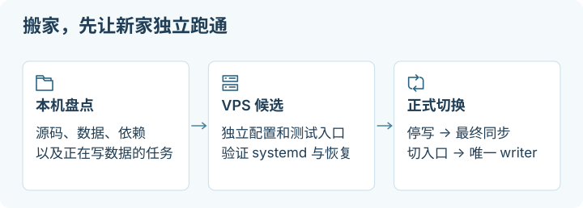

# 从本机迁到 Linux VPS

## 这一章帮你做什么

写给自己电脑上已有一个在跑的服务、想把它搬到 VPS 常驻的人。前提：你大概知道这个服务读了哪些数据、由谁启动；有一台可登录的候选 VPS。读完你会得到：一份可填写的迁移工单、一个不接正式流量的候选实例，以及“先冻结、再切入口、最后开放唯一 writer”的验收顺序。



迁移的对象是一个可持续运行的服务：代码、数据、启动方式、定时任务、入口和恢复办法都要一起考虑。先在 VPS 上建立不接正式流量的候选实例，再决定切换。把本机目录复制过去，只完成了其中一小步。

本文以 **Ubuntu 24.04、systemd、普通非 root SSH 用户**为示例；Docker 仅适用于原项目已经使用容器的分支。它是一份待填写的操作教程，没有执行过任何真实迁移。命令中的 `candidate-vps`、`operator`、`example_app` 都是合成名称，必须先替换并核对。参考资料查阅日期：**2026-10-02**。

先复制填写[迁移工单](../examples/migration-plan.example.json)和[服务清单](../examples/service-inventory.example.csv)，把真实记录放在自己的非公开运维目录。工单是记录格式，不是自动执行器；阅读教程不代表已获准购买服务器、传输私人数据、改 DNS 或删除本机数据。

> [!NOTE]
> **停下检查点：入口切了不等于数据切了，也不等于能回滚。**
> 把 DNS 或 Tunnel 指到新机只改变请求到达哪里。真正的分界是“目标是否接受过新写入”：在目标还没写之前，可以退回旧机；一旦写了，就必须先冻结、对账再决定方向，直接改回入口会丢数据或产生重复。

## 1. 先判断哪些值得迁

| 工作负载 | 适合迁移的理由 | 需要先解决的条件 |
| --- | --- | --- |
| 无界面的 API、网站、小型后台任务 | 要持续在线，本机经常休眠 | 能在 Linux 安装、独立启动；有明确数据与维护责任人 |
| 已有 Linux container 的服务 | 运行环境已有声明 | 镜像支持目标 CPU；持久卷、secrets 和依赖仍需另迁 |
| 只在工作时使用的开发服务器 | 通常留本机更直接 | 若要公开提供服务，先补齐正式启动、认证、日志与恢复方式 |
| 依赖桌面登录、浏览器个人 profile、Keychain、Windows COM、USB 或本地文件交互的工具 | 通常保留本机执行部分 | 把可独立的 server 部分拆出；不要把个人桌面状态整包上传 |
| 高 I/O、大量私人数据、GPU 工作或收费软件 | 可能适合，也可能成本更高 | 比较实测资源、存储/流量费、授权和数据位置要求 |

写下迁移收益和可接受停机时间。没有 Linux 运行路径、没有可恢复备份，或无法确认哪些程序会写数据时，先解决这些问题。保留“本机 agent + VPS API”的分工也是有效结果，不必迁走全部内容。

## 2. 清点实际运行的东西

每项至少记下：服务名、运行机器/用户、版本、启动命令或 unit、监听地址、数据目录、secrets 来源、入口、依赖、[writer](glossary.md#writer)、备份恢复方式、调度 owner，以及“迁移 / 留本机 / 退休”的决定。进程列表只是线索；还要覆盖 Docker、systemd timers、cron、LaunchAgents、Windows 计划任务、tunnel、证书续期、备份任务、DNS 和客户端配置。

**在源本机：只执行符合该 OS 的只读命令。** 输出可能包含私人路径或命令参数，只在本地检查，不要原样提交到 Git。

macOS 终端：

```bash
uname -m
lsof -nP -iTCP -sTCP:LISTEN
launchctl list
crontab -l
```

Windows PowerShell：

```powershell
$env:PROCESSOR_ARCHITECTURE
Get-NetTCPConnection -State Listen
Get-ScheduledTask | Select-Object TaskPath, TaskName, State
Get-Service | Where-Object Status -eq 'Running'
```

Linux 或 WSL 内的终端：

```bash
uname -m
ss -lntup
systemctl list-units --type=service --state=running
systemctl list-timers --all
crontab -l
```

**在实际拥有 Docker daemon 的机器，仅当项目用 Docker：**

```bash
docker context show
docker ps --format 'table {{.Names}}\t{{.Image}}\t{{.Ports}}'
docker volume ls
```

预期得到运行项清单，并能把每一项追到源配置。`crontab -l` 报没有 crontab 可以记录为“该用户无”；不能因此推断其他用户或系统 cron 都没有。Docker context 若指向远程 daemon，先停止盘点并确认操作对象；命令所在电脑不一定是容器所在机器。逐项读取已确认的配置，避免输出完整环境变量或 `docker inspect` 的 secret 值。

## 3. 做一次兼容性检查

| 维度 | 检查与处理 |
| --- | --- |
| OS 和桌面依赖 | `.app`、`.exe`、LaunchAgent plist、Windows Service/任务计划不直接变成 Linux 服务。找项目的 Linux 入口，缺失时先改造或保留本机部分。 |
| CPU 架构 | 在源与目标分别看 `uname -m`；`arm64/aarch64` 与 `x86_64/amd64` 的原生模块、二进制、镜像可能不同。按目标架构重新构建并运行项目检查。 |
| 路径与大小写 | 把用户目录、盘符和反斜线改为配置项。Linux 常见文件系统区分大小写；`Config.json` 与 `config.json` 的混用可能在迁移后才暴露。实际文件系统行为以检查结果为准。 |
| 依赖与环境 | 记录运行时版本和 lockfile；在目标重建依赖。不要复制 macOS/Windows 的 `.venv`、`node_modules`、缓存或 Homebrew 安装目录充当 Linux 安装。 |
| 权限和身份 | 映射服务用户与目标 UID/GID、读写目录和可执行位；不要照搬源机所有 owner。代码通常只读，业务数据目录只授予服务所需的权限。 |
| 配置和 secrets | Git 中只放无密钥示例；真实 token、数据库密码、SSH 私钥、tunnel 凭据通过批准的安全方式单独交付。优先使用应用支持的 secret file/credential 机制，[环境变量](glossary.md#环境变量)中的敏感配置也不进入 Git。 |
| 时间与调度 | 核对时区、cron 解释、timer 补跑行为。候选机的邮件发送、同步、付款或导出 job 默认不启动，避免重复副作用。 |
| 网络 | `localhost` 在 VPS 上指 VPS 自己。记录数据库、API、回调地址及 outbound 要求；把开发端口改成明确的 loopback 或批准的接口。 |

如果项目用 Docker，先在目标审阅 Compose 的镜像平台、bind mounts、named volumes、端口、用户和 restart policy。`docker compose config --quiet` 可检查配置是否可解析；它不验证运行兼容性。不要把 Docker Desktop VM 或整个 Docker 数据根目录作为跨 OS 迁移方案。Linux Docker 发布端口会参与自己的防火墙路径，不能只看到 UFW 的 deny 就认为端口未公开；优先使用 `127.0.0.1:主机端口:容器端口`，再从外部验证实际暴露面。[Docker 官方防火墙说明](https://docs.docker.com/engine/network/packet-filtering-firewalls/)

## 4. 建立独立候选机

本节前提是你已获准创建目标 VPS，并有服务商控制台恢复通道。Ubuntu 24.04、SSH、systemd、所需运行时和传输工具应按各自官方安装文档准备；本文不把一条全系统安装/升级命令当作迁移步骤。

**在目标 VPS，普通 SSH 会话；`sudo` 项需要管理员权限：**

```bash
hostnamectl
uname -m
df -h / /var
free -h
systemctl --version
command -v python3
sudo ssh-keygen -lf /etc/ssh/ssh_host_ed25519_key.pub
```

预期 OS、CPU、磁盘空间和目标角色与工单一致。通过服务商控制台或已信任渠道比对 SSH host key fingerprint，再保存新的 SSH alias；不要用 `StrictHostKeyChecking=no` 跳过身份核验。空间预算要容纳候选数据、备份/恢复副本和工作空间，不能只按源码体积估算。任一条件不符，先停在候选阶段，不触碰源 writer。

目标机保留独立的 machine ID、SSH host keys 和 mesh 节点身份。只复制应用声明的代码/数据/配置，不复制整份 `/etc`、`/var/lib`、本机 Keychain 或 mesh state。systemd 的 machine ID 是系统身份；Tailscale node state 包含识别设备的密钥。[systemd 镜像身份说明](https://systemd.io/BUILDING_IMAGES/)、[Tailscale node state](https://tailscale.com/docs/features/secure-node-state-storage)

## 5. 先预拷贝可复制的文件

先用项目自身的 build/release 流程生成 Linux 可用的产物目录。例子假定源机的 `migration-example/release/` 仅含已审阅的代码或静态文件；数据库、上传目录和 secrets 不混在其中。目标 staging 目录必须是本次迁移专用的新目录，不覆盖其他部署。

**在目标 VPS，以 `operator` 用户运行：**

```bash
install -d -m 0700 "$HOME/migration-example/release"
```

**在源本机 macOS / Linux / 已配置 SSH 和 rsync 的 WSL，替换 alias 与源目录后运行：**

```bash
rsync -rlt --dry-run --itemize-changes \
  "$HOME/migration-example/release/" \
  operator@candidate-vps:/home/operator/migration-example/release/
```

先检查路径方向与文件列表。只有列表符合预期且传输已授权，才去掉 `--dry-run`：

```bash
rsync -rlt --itemize-changes --partial \
  "$HOME/migration-example/release/" \
  operator@candidate-vps:/home/operator/migration-example/release/
```

这里的源路径尾部 `/` 表示复制目录内容；`-rlt` 保留目录结构、链接与时间，不试图照搬源机 owner。审阅 symlink，不能让它指向个人目录或目标机其他文件。Windows 原生 PowerShell 没有内置 rsync；可用已准备好的 WSL 运行本例，或改用经过清单核对的 SFTP 传输，不能照抄 POSIX 路径。两端的 rsync 必须均已可用。[rsync 官方手册](https://rsync.samba.org/ftp/rsync/rsync.1)

本例不带 `--delete`。重复预拷贝不会自动清理源已删除、目标仍存在的文件；在最终冻结后审阅这些差异，或使用新的候选版本目录。任何非零返回、权限失败、磁盘不足或意外路径都先停止，不通过扩大 sudo 权限、加删除参数来“修好”。大传输使用[长任务的 owner 与恢复方法](05-vps-to-vps.md#长任务不能由一个终端窗口兜底)。

## 6. 把一个 dev 命令交给 systemd 管理

下面是**无 secrets、无写入、仅 loopback 的静态文件实验**，用来学习“启动命令 → service → 日志 → 停止”的过程。Python `http.server` 不适合作为生产 Web server；它不提供认证，而且会跟随文件 symlink。目录只放本次合成页面，不放代码仓库、私人文件或任何 symlink。真实应用应使用项目支持的 production server。[Python 3.12 `http.server`](https://docs.python.org/3.12/library/http.server.html)

**在目标 Ubuntu VPS：**先确认 `/srv/field-demo`、`field-demo` 用户及 `field-demo.service` 都不是已有业务。若已有同名对象，停下选择另一套名称，不覆盖。

```bash
getent passwd field-demo
getent group field-demo
systemctl status field-demo.service --no-pager
ls -ld /srv/field-demo
```

这一组在全新实验上预期显示不存在；若显示已有对象，不继续下面创建步骤。确认 `/usr/bin/python3` 存在且创建演示服务已获授权后：

```bash
sudo useradd --system --user-group --no-create-home \
  --home-dir /srv/field-demo --shell /usr/sbin/nologin field-demo
sudo install -d -o root -g root -m 0755 /srv/field-demo/public
printf '%s\n' 'field-demo candidate' | sudo tee /srv/field-demo/public/index.html >/dev/null
sudo chmod 0644 /srv/field-demo/public/index.html
sudoedit /etc/systemd/system/field-demo.service
```

将以下内容保存到刚打开的新 unit：

```ini
[Unit]
Description=Loopback static migration demonstration
After=network.target

[Service]
Type=exec
User=field-demo
Group=field-demo
WorkingDirectory=/srv/field-demo/public
ExecStart=/usr/bin/python3 -m http.server 8080 --bind 127.0.0.1 --directory /srv/field-demo/public
Restart=on-failure
RestartSec=3
StandardOutput=journal
StandardError=journal

[Install]
WantedBy=multi-user.target
```

**仍在目标 VPS：**

```bash
sudo systemd-analyze verify /etc/systemd/system/field-demo.service
sudo systemctl daemon-reload
sudo systemctl start field-demo.service
systemctl status field-demo.service --no-pager
journalctl -u field-demo.service -n 30 --no-pager
ss -lntp 'sport = :8080'
curl --noproxy '*' --fail --max-time 5 http://127.0.0.1:8080/
```

预期 verify 无 unit 错误、进程运行、只监听 `127.0.0.1:8080`，响应正文是 `field-demo candidate`。`active` 只证明进程存在；正文检查才能确认这次请求到了预期目录。若失败，先 `sudo systemctl stop field-demo.service`，检查 journal 中的路径、用户权限、端口占用，不开放防火墙来处理本地启动错误。`Type=exec`、重启策略和 journal 属于 systemd 的 service/执行语义。[systemd service 源文档](https://github.com/systemd/systemd/blob/v255/man/systemd.service.xml)、[systemd execution 源文档](https://github.com/systemd/systemd/blob/v255/man/systemd.exec.xml)

**在管理电脑，已验证 `candidate-vps` SSH alias；保持此窗口打开：**

```bash
ssh -N -L 18080:127.0.0.1:8080 operator@candidate-vps
```

在管理电脑浏览器打开 `http://127.0.0.1:18080/`，应看见同一正文。`Ctrl-C` 关闭的是本地 SSH 转发，VPS service 继续运行。这里无需新增公网入站端口，也没有配置公网认证或 tunnel。若只做实验，最后在目标执行 `sudo systemctl stop field-demo.service`；若明确决定保留并随开机启动，验收后才执行 `sudo systemctl enable field-demo.service`。`enable` 不替代一次真实的重启恢复验收；重启须安排窗口。

真实应用沿用同样的 owner、绝对路径和日志思路，但从自己的 runbook 填写 `ExecStart`、数据目录和 secrets。不要把 `.env` 上传到静态目录。若应用只能读取 environment file，单独放在受限目录，限制读取权限；service 环境不是 secret vault，别把密码拼进命令行、日志或 Git。

## 7. 数据库先做恢复演练，再做最终快照

预拷贝允许源继续写，最终迁移必须定义一致性时刻：暂停 API 写入口、queue consumer、定时 job、同步器和管理员手工操作，等待在途事务结束，再生成最终快照。数据库与上传文件有关联时，二者必须属于同一冻结窗口；仅数据库内部一致还不够。

### SQLite

不要在写入中只复制主 `.sqlite` 文件；WAL 模式可能还有相关状态。用应用的备份功能、SQLite Backup API 或 CLI `.backup` 生成独立快照。`.backup` 使用 backup 机制；`VACUUM INTO` 也是一致性快照选项，但输出文件必须不存在或为空，并可能占用更多 CPU。[SQLite Backup API](https://www.sqlite.org/backup.html)、[SQLite VACUUM INTO](https://www.sqlite.org/lang_vacuum.html)

**在源本机的 POSIX 终端，SQLite CLI 已安装；路径是示例，先替换成已核实的文件。** 目标快照名称必须尚不存在，源文件必须存在且属于本次应用；SQLite 打开一个错误的新路径可能创建空数据库，不能只凭命令返回 0 判定成功。

```bash
sqlite3 /path/to/example-app/app.sqlite \
  ".backup '/path/to/private-migration/final-app.sqlite'"
sqlite3 /path/to/private-migration/final-app.sqlite 'PRAGMA integrity_check;'
```

Windows 原生环境使用同版本 `sqlite3.exe`，并把参数换成真实 Windows 文件路径；`.backup` 目标字符串可写成 `C:/private-migration/final-app.sqlite`。不把 POSIX `/path/to` 原样粘到 PowerShell。

预期完整性结果是 `ok`，并且应用关键表/记录符合冻结时的清单。确认备份命令完成后，通过已批准的 SSH/SFTP 路径把快照与同窗口的附件复制到候选机的私人 staging，并保留独立备份。在隔离候选机上用快照副本启动对应版本的应用，读取已知记录与关联附件；要做试写时使用可丢弃的演练副本，正式切换前重新从最终快照恢复。完整性检查不能证明业务数据齐全。失败则保留源和快照证据，查清原因；不切入口、不用空文件覆盖源。

### PostgreSQL

小型数据库可用 logical dump/restore，避免跨 OS/版本直接复制运行中的 data directory。`pg_dump` 得到单库一致快照，但不包含集群级角色和 tablespace；与附件或其他库的一致性仍由应用冻结协调。dump 工具不能比源 server 的 major version 更旧，导入较旧 server 不受通用保证。先记录源、dump 工具与目标版本，再选相同版本或已演练的升级路径。[PostgreSQL `pg_dump`](https://www.postgresql.org/docs/current/app-pgdump.html)

**在源数据库所在机器或经批准的管理客户端；连接参数必须指向源库。** 下面假定已经有 `app_backup` 备份角色、受限的本地备份目录和安全认证方式，不在连接 URL 或 shell history 里输入密码。

```bash
pg_dump --version
pg_dump --host=127.0.0.1 --username=app_backup \
  --format=custom --file=/path/to/private-migration/example-app.dump \
  --dbname=example_app
```

把成功完成的 dump 通过批准的加密传输复制到候选机，并保留源机之外的一份独立副本。失败或中断的 dump 不得当成最终快照。

**在目标 VPS，已准备目标 PostgreSQL 与 `migration_owner`；只恢复到尚不存在的新候选库：**

```bash
createdb --host=127.0.0.1 --username=migration_owner \
  --template=template0 example_app_candidate
pg_restore --host=127.0.0.1 --username=migration_owner \
  --exit-on-error --no-owner --no-privileges \
  --dbname=example_app_candidate /path/to/private-migration/example-app.dump
```

这组选项让候选对象归恢复角色所有，跳过源 ACL；它适合单应用演练，不是所有生产库的权限迁移方案。上线前按应用需要建立角色、权限、extensions 和 schema owner，逐项验收。若业务必须保留原 ownership/ACL，先制定角色映射和恢复步骤，再选择不同参数。不要为避开错误把 `--exit-on-error` 去掉，也不要对已有正式库加 `--clean`。恢复报错时保留失败候选库供诊断；修正后创建另一个明确命名的新库演练。[PostgreSQL `pg_restore`](https://www.postgresql.org/docs/current/app-pgrestore.html)

恢复成功后用应用检查核心记录、权限和附件，再在演练库做一条合成记录的写入、读回与业务级删除。dump 可列出目录、数据库可以连接，都不能替代这一步。数据库很大或停机预算无法容纳 dump/restore 时，应另选经过演练的 replication/backup 方案；不要临场缩短冻结步骤。

## 8. 切入口、开放唯一 writer、观察

| 阶段 | 源本机 | 目标 VPS | 推进条件 |
| --- | --- | --- | --- |
| 预拷贝 / 恢复演练 | 正常服务，唯一正式 writer | 入口隔离；只读或使用演练副本 | 能独立恢复，业务检查通过 |
| 最终冻结 | 所有正式 writer 已暂停 | writer 保持关闭 | 在途操作已结束，最终[快照](glossary.md#快照)与附件同步完成 |
| 候选验收 | 保持冻结，数据原样保留 | 恢复最终数据，继续禁写 | origin、配置和数据验收通过 |
| 已授权切入口 | 旧地址仍不能写 | 接受选定入口；先读验收 | DNS/tunnel/mesh/客户端分别确认 |
| 开放写入 | 继续禁止所有 writer | 唯一正式 writer，记录首次写入时间 | 操作者确认切换，短暂冻结预算允许 |
| 观察与退旧 | 保留恢复材料和禁写状态 | 观察错误率、job 与新备份恢复 | 另行批准删除/停用源端内容 |

域名、tunnel、mesh 或客户端如何切换，按[跨 VPS 迁移的入口策略](05-vps-to-vps.md#切入口有三条不同的路径)选择实际使用的路径。本机迁移也适用；尤其不能在候选验证前复用正式 tunnel ID，造成两端并发接流量。

在真实客户端完成一次登录、读取和授权的合成写入/读回，核对请求确实到目标。再观察至少覆盖一次关键定时任务、一次备份及恢复演练的窗口。窗口长度按业务频率填写，不用一个固定“等 24 小时”替代判断。记录日志位置、维护 owner、报警接收方式和下一次恢复检查。

**回滚分界是目标是否接受过新写入。** 在目标仍未写入时，可在确认目标 writer 关闭后把入口恢复至源，重新放开源 writer；冻结期的排队请求仍需处理。目标已经写入后，旧数据已落后，不能仅改回 DNS。先冻结受影响写入、保留两侧数据，再选择在目标 forward recovery，或经对账的反向迁移；细节见[回滚与数据边界](05-vps-to-vps.md#回滚分界目标是否已经接受新写入)。

完成报告分开写：源代码/配置已准备、候选已启动、数据恢复已验证、入口已切、目标已接收写入、真实客户端已验收、旧端是否保留。某层未执行就写“未验证”；不要把一个 HTTP 200 写成“迁移全部完成”。
