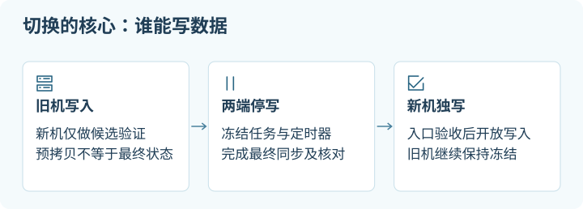

# 从旧 VPS 迁到另一家服务商

## 这一章帮你做什么

写给要换服务商、把一整台机器的服务搬到另一台的人。前提：你能盘点旧机上跑了什么，有另一台候选 VPS 可用。读完你会得到：迁移前必须做出的决定清单、找全隐性 writer 的方法、三条入口切换路径的取舍，以及“目标接受首次写入”之后才出现的回滚分界。



把 Provider A 的服务迁到 Provider B，通常应新建独立候选机、迁应用与数据，再切入口。跨服务商整盘克隆会带来启动驱动、网络配置、machine identity 和运行副作用；本教程采用逐项重建的路线。目标是让旧机停止承担业务后仍有明确的数据恢复办法，而不是仅让新 IP 返回 200。

示例 OS 是 **Ubuntu 24.04 + systemd**；Docker、Cloudflare Tunnel、Tailscale 和 Certbot 都是条件分支，只操作清单中实际存在的组件。本文为未执行的教程，官方资料查阅日期为 **2026-10-02**。`old-vps`、`new-vps`、`operator`、`app.example.com`、`203.0.113.20` 均为合成示例，最后一个属于文档地址范围，不是可用服务器。

若源是 macOS/Windows，先读[本机迁移](04-local-to-vps.md)。填写[迁移工单](../examples/migration-plan.example.json)和[服务清单](../examples/service-inventory.example.csv)；真实 IP、账号 ID、备份位置与日志保存在自己的私人运维记录中，不提交到本仓库。

> [!TIP]
> **先记住这一点：同一个 Tunnel 的多个 connector 不是主备，而是一起接流量。**
> 两个 connector 同时服务时，Cloudflare 按地理接近性选，不保证落到哪台。所以不能用“只启动新机、不改 DNS”就断定新机不会接请求，也不能把 replicas 当作受控主备。切换前先让候选保持隔离，具体入口路线（新独立 Tunnel、复用 Tunnel 短暂切换等）见本章“切入口有三条不同的路径”里的路径 B。

## 经验如何变成通用步骤

这条路线吸收了从 Hetzner 搬到 GreenCloud 时的实践：先盘点入口、后台 writer 和维护任务，再把候选机与正式流量隔离；Tunnel 与 DNS 各自切换，最终以数据、入口和真实客户端分别验收。商家名称说明经验来源，不代表购买推荐或当前主机状态。

其中尤其值得保留的是：同一个 Tunnel 的多个 connector 可能同时接流量；“服务起来了”不意味着证书续期和备份也有新 owner；旧主机删除后，就不能再把它列作回滚路径。本章把这些失败条件写进步骤，具体账号、主机地址和运维记录留在使用者自己的私有环境。

## 迁移前要做出的决定

| 决定 | 要有的答案 | 未解决时停在哪里 |
| --- | --- | --- |
| 准确目标 | A 的实例/卷角色、B 的候选角色、负责人与控制台恢复途径 | 不创建或修改未知目标 |
| 数据边界 | 哪些库、附件、队列状态、配置一起形成有效状态 | 可盘点，不做最终同步 |
| 停机与丢失预算 | 可暂停写入多久；允许丢失多少数据；演练耗时是否满足 | 不承诺无停机切换 |
| 独立恢复 | 能从 A/B 之外的副本恢复，且有已记录的演练结果 | 不退旧 |
| 入口方案 | DNS、tunnel、mesh、固定 IP 客户端各用哪条路径 | 候选保持隔离 |
| 执行权限 | 谁批准创建、传数据、冻结、切入口、开放 writer、退旧 | 仅做已批准部分 |
| 费用和退出 | 新旧并行预算；A 的终止流程；独立卷/快照/IP 等归属 | 不把停机当作账单停止 |

一次迁移不顺便升级数据库 major version、改应用架构或重写认证，除非这些变动已经独立演练并纳入验收。目标运行环境不能满足现有版本时，要先解决兼容性，不能等到冻结窗口再处理。

## 1. 找全服务与隐性 writer

**在旧 VPS，以下是只读盘点；`sudo` 用于读取需要权限的运行信息：**

```bash
hostnamectl
uname -m
df -h
sudo ss -lntup
systemctl list-units --type=service --state=running
systemctl list-unit-files --type=service
systemctl list-timers --all
crontab -l
```

然后逐一检查已识别的业务 service、timer、相关系统 cron 文件，以及实际运行它们的用户 crontab。`list-unit-files` 用于找已安装但未运行的 unit；没有正在运行并不代表下一次开机/调度不会启动。只把名字、owner、计划和必要配置记入 inventory，不把环境变量、完整私密 URL 或 secret 原文贴进报告。

**仍在旧机，仅在已确认 Docker context 指向旧机时：**

```bash
docker context show
docker ps --format 'table {{.Names}}\t{{.Image}}\t{{.Ports}}'
docker volume ls
```

需要逐个归属的项目包括：应用/API、数据库、queue consumer、scheduler、Docker restart policy、systemd timer、cron、webhook receiver、tunnel connector、mesh/subnet router、reverse proxy、证书续期、备份/同步器、监控、[DNS](glossary.md#dns) 的 A/AAAA/CNAME，以及写死旧 IP、旧 mesh 名称或 URL 的客户端。还要查退订/回调、源 IP allowlist、external API egress allowlist；它们常常不在应用目录里。

每个 writer 必须有停写与恢复动作。仅停止 API，后台 job 仍可能修改数据库；仅关闭网页入口，直连 IP、mesh 客户端仍可能写入。无法说清 writer 清单时，先停在盘点阶段。

## 2. 建立独立的目标候选

通过服务商正式镜像新建 B，按实际项目准备 OS/runtime、磁盘、用户和网络。购买、创建、安装、加入 tailnet 都是独立的执行动作，需要已有授权；教程不执行这些动作。

**在新 VPS，基础只读检查：**

```bash
hostnamectl
uname -m
df -h / /var
free -h
sudo ssh-keygen -lf /etc/ssh/ssh_host_ed25519_key.pub
```

预期资源与工单相符，SSH fingerprint 经 B 的控制台或可信渠道确认。在管理电脑建立独立 alias `old-vps` / `new-vps`；别把一个 alias 静默改为指向新机，让后续命令看不出所在机器。每次写操作前重新确认角色与路径。若 fingerprint 不匹配，停止并通过控制台核实，不能简单删除 known_hosts 告警后继续。[OpenSSH `ssh-keygen`](https://man.openbsd.org/ssh-keygen.1)

目标独立持有 machine ID、SSH host keys、Tailscale/其他 mesh 身份；不要复制旧 `/etc/machine-id`、`/etc/ssh/ssh_host_*` 或 mesh state。配置中的应用凭据与主机身份是两回事，按最小需要单独交付。machine ID 应按系统实例生成，Tailscale node state 含节点密钥。[systemd 镜像指南](https://systemd.io/BUILDING_IMAGES/)、[Tailscale node state](https://tailscale.com/docs/features/secure-node-state-storage)

候选不接正式写流量：先 bind loopback 或限定测试入口；关闭业务 scheduler、consumer 和会发邮件/回调的 job。不要靠“没人知道新 IP”实现隔离。Docker 候选用新 project/volume 名称和已审阅端口映射，不能在 `compose up` 时顺带启动所有 writer。[Docker 端口与防火墙](https://docs.docker.com/engine/network/packet-filtering-firewalls/)

## 3. 预拷贝，然后验证恢复

先在不影响 A 的情况下迁移代码、不可变资源和适合预拷贝的普通文件。数据库用应用一致的备份导出，不能 rsync 正在运行的 PostgreSQL data directory，也不能仅复制 SQLite 主文件。具体 SQLite/小型 PostgreSQL 方案见[数据库恢复演练](04-local-to-vps.md#7-数据库先做恢复演练再做最终快照)。

### 小规模 rsync 先 dry run

本例只复制 `/srv/example-app/uploads/` 的内容，目标是新建的私人 staging 目录。迁移普通上传文件不等于它们已和数据库处于同一快照时刻；最终冻结还要再同步。源目录是已核实的字面路径，不把 `/`、`/home` 或 `/var/lib` 整体当作源。

**在新 VPS，以本例 SSH 接收用户 `operator` 运行：**

```bash
install -d -m 0700 "$HOME/migration-work/precopy/uploads"
```

**在旧 VPS，以有权读取该应用文件的用户运行。** 前提：它可通过已授权、已验证的 SSH 路径登录 B 的 `operator`，两端有 rsync；不要为图方便开启 SSH agent forwarding，或把个人主私钥复制到旧机。

```bash
rsync -rlt --dry-run --itemize-changes \
  /srv/example-app/uploads/ \
  operator@new-vps:/home/operator/migration-work/precopy/uploads/
```

检查方向、目标路径、所有列出的文件和 symlink。然后仅在复制获准时运行：

```bash
rsync -rlt --itemize-changes --partial \
  /srv/example-app/uploads/ \
  operator@new-vps:/home/operator/migration-work/precopy/uploads/
```

`-rlt` 不照搬 UID/GID/权限；目标服务用户、可执行位、ACL/xattr 需要按应用要求明确映射。若应用依赖这些元数据，先在小样本上验证再选择适当参数。`rsync` 不能在同一命令里直接连接两个远程端；没有 A→B 的授权 SSH 路径时，从管理电脑分别 A→私人 staging、staging→B，或在 B 上用批准的只读路径拉取 A。每条命令只有一端是远程。[rsync 官方手册](https://rsync.samba.org/ftp/rsync/rsync.1)

默认不加 `--delete`。预拷贝中的源删除不会从目标消失；冻结后应审阅目标多余项，或把最终恢复放进新的空目录。确实需要删除时，另列精确删除集合、可恢复副本和授权；不要把同步参数当成删除审批。非零返回值都要解释；传输中断可重跑同一范围，磁盘不足、权限拒绝或源文件消失不能计为完成。

### 长任务不能由一个终端窗口兜底

先选一个真实 owner：已有迁移 service/调度器最好；一次迁移可用已安装的 tmux 管理进程，但必须有磁盘日志与恢复命令。tmux 能让程序脱离 SSH client 持续运行；主机重启、tmux server 退出、管理员 kill 或会话清理策略仍可能终止它。`nohup` 也不是重启恢复或进度记录方案。[tmux 官方 Getting Started](https://github.com/tmux/tmux/wiki/Getting-Started)

**在旧 VPS，已确认上一节路径和传输权限，且尚无同名 session：**

```bash
tmux new-session -s migration-precopy
```

**在刚打开的 tmux pane 内，仍是旧 VPS：**

```bash
umask 077
mkdir -p "$HOME/migration-work"
task_progress_dir="$HOME/migration-work/precopy-attempt-001"
mkdir "$task_progress_dir" || exit 1
rsync -rlt --partial --itemize-changes \
  --log-file="$task_progress_dir/rsync.log" \
  /srv/example-app/uploads/ \
  operator@new-vps:/home/operator/migration-work/precopy/uploads/
result=$?
printf '%s\n' "$result" > "$task_progress_dir/exit-code.txt"
date -u > "$task_progress_dir/finished-at.txt"
```

在 tmux 内按 `Ctrl-B`，松开后按 `D` detach。**重新 SSH 到旧 VPS后：**

```bash
tmux list-sessions
tmux attach-session -t migration-precopy
```

**在旧 VPS 的另一条 SSH 会话中查看磁盘记录：**

```bash
tail -n 20 "$HOME/migration-work/precopy-attempt-001/rsync.log"
cat "$HOME/migration-work/precopy-attempt-001/exit-code.txt"
```

退出码文件在 rsync 返回后才生成；缺失表示尚无本次完成证据。`0` 才是传输成功，其他值都需检查。状态来自该机器上的 log、退出码和已完成的文件集合。恢复前先确认没有同范围任务仍在写目标；未完成时重跑同一 rsync 预拷贝范围，但把 attempt 目录换成 `precopy-attempt-002` 等新的名称。创建 attempt 目录失败时示例会退出 pane，避免覆盖旧结果。重启后需要重新创建 session 并按记录恢复；不要因为 session 消失就把上一次退出码文件当作本次结果。保留每次 attempt 的源、目标和选项。日志增长、扫描数、进程存在都不等于已验证完成；在工单中只确认已完成并检查过的单元。

最终数据库导出中断时，一般应在新的快照文件重新开始；不要向一个部分 SQL dump 追加内容。若冻结窗口不足以完成，恢复源 writer 前先确认 B 仍未接受正式写入，然后改期或重新设计迁移方式。

### 先证明备份可以恢复

在 B 的隔离数据库/目录恢复预备份，验证版本、schema、关键记录、附件和权限。在可丢弃的演练副本上完成一条合成写入并读回；关闭邮件、支付、webhook 等外发副作用。记录恢复时间和所需密钥/权限。Provider A 的整机[快照](glossary.md#快照)可以保留，但跨服务商不可移植或没有恢复证明的快照，不能当作唯一恢复路径。

至少保留一份不依赖 A 实例存活、也不随 B 出错消失的独立备份；如果它需要解密密钥，密钥的恢复途径也要验证。副本存在与恢复成功是两条不同证据。

## 4. 冻结所有正式 writer，再做最终同步

安排明确窗口，通知实际使用者。把清单中的写入口置为维护/只读、暂停后台 job，等待在途请求和事务结束；处理队列时写清是排空、保留待执行，还是按去重键续接。不能通过丢弃队列缩短迁移时间。

**在旧 VPS，仅当清单确认下列合成 unit 正是本次 writer 且停止已获批准：**

```bash
sudo systemctl stop example-app-worker.service
sudo systemctl stop example-app-sync.timer
sudo systemctl stop example-app-sync.service
systemctl is-active example-app-worker.service example-app-sync.timer example-app-sync.service
```

停止 timer 不会自动终止它已经启动的 service，所以两者分别处理；实际名称必须来自盘点。预期各 writer 为 `inactive`，`is-active` 因 inactive 返回非零是这一检查的正常结果。API、cron、容器 restart policy、其他机器的 writer 还需各自批准的停写动作。不要使用 `systemctl stop '*app*'`、停止整个 Docker daemon 或禁掉所有定时任务。

确认 writer 停止后记录冻结时刻与最后业务记录/队列边界，生成应用一致的最终快照，同步附件等关联文件。在 B 恢复到明确的最终候选数据位置，继续禁写并禁用有副作用的 schedule。A 保持冻结；任何一步失败都不推进切入口。

停止服务并不保证机器重启后仍禁写。记录旧机的开机启动方式、容器 restart policy 和计划任务如何保持禁写，或明确禁止在观察期启动旧 writer；若需修改 enable 状态，逐项记录之前状态和恢复方法。否则一次重启就可能造成双写。

## 切入口有三条不同的路径

候选的 origin 与最终数据验证通过以后，才在已授权窗口调整真正使用的入口。三条路径可能同时存在，必须把全部客户端包含进来。

### 路径 A：直接 DNS 指向新 origin

提前检查权威区中的 A、AAAA、CNAME、代理状态和客户端使用的 hostname。若可调低 TTL，应在切换前至少留出旧 TTL 的传播窗口；降低 TTL 不会回溯改变已经缓存的旧记录。某些代理服务的 TTL 固定，且本地缓存可能比预期更久；Cloudflare proxied record 的默认 Auto TTL 为 300 秒，不能把“五分钟”写成全体客户端切换保证。[Cloudflare TTL](https://developers.cloudflare.com/dns/manage-dns-records/reference/ttl/)

切 A 时别遗留指向旧机的 AAAA。新机没有可用 IPv6 时，要对旧 AAAA 制定明确处理，而不是让双栈客户端随机落到两台。带 CDN/proxy 的公开 DNS 可能显示 edge 地址；这不能确认 origin 已切。

**在管理电脑，已具备 `dig`；这些查询只观察解析，不改 DNS：**

```bash
dig app.example.com A
dig app.example.com AAAA
dig app.example.com CNAME
```

记录 authoritative DNS 和实际客户端 resolver 的结果；查询权威服务器时先从真实 zone 配置确认其名称，再使用 `dig @已确认的权威服务器 app.example.com A`。正式变更在 DNS 提供商的受控界面/API 内按工单执行，保存变更前值、时间和 read-back。本文不提供默认账号写命令。

**在获准直连新 origin 的管理电脑，仅当新机已配置该 hostname 的有效 TLS 且接口允许测试：**

```bash
curl --noproxy '*' --fail --max-time 10 \
  --resolve app.example.com:443:203.0.113.20 \
  https://app.example.com/health
```

必须把 `/health` 换成应用真实的只读检查路径，文档地址换成工单中的目标地址。`--resolve` 保留 hostname/SNI 而定向新地址；不要加 `-k` 掩盖证书错误。仅供 edge 信任的 origin certificate 不一定被普通客户端信任，应走正确 CA 或内网验收路径，不放宽 TLS 校验。仅 tunnel/mesh 可达的 origin 不适用公网直连测试，不为测试额外开放入站。

### 路径 B：Cloudflare Tunnel

先确认 tunnel 是 remotely-managed 还是 locally-managed、正式 hostname 指向哪个 tunnel、connector 位于哪台机、入口对应哪个 origin。token、credentials JSON 属于 secrets，不写进仓库或报告。

| 策略 | 候选验证与切换 | 适用限制 |
| --- | --- | --- |
| 新独立 tunnel | B 使用新 tunnel；用受保护测试 hostname 验证；冻结最终同步后，按批准操作把正式 route 指向 B | 需要管理独立 route、Access 应用与政策；最容易看清候选/正式边界 |
| 复用同一 tunnel，短暂切换 | B 先不启动同 ID connector；完成数据验证后，停止 A connector、确认连接状态，再启动 B | 会有中断；确认 A 不会自动重启；切换前不能借同 ID 做隔离测试 |
| 同一 tunnel 多 replicas | 两个 connector 同时服务，作为冗余架构 | 只适用于两端均可安全处理正式请求的设计；状态与 writer 必须另有保证，不是迁移默认 |

同一个 tunnel ID 的 replicas 同时提供流量入口；Cloudflare 文档描述按地理接近性选择 replica，失败时也不保证具体落到哪台。它们不是你定义的主动/备用主机，不能用“启动 B 但不改 DNS”推断 B 不会接请求。需要受控流量选择/健康故障切换时，应评估独立 tunnel 与 Load Balancing，而非假设 replicas 提供这种控制。[Cloudflare replicas](https://developers.cloudflare.com/tunnel/configuration/)、[Cloudflare routing](https://developers.cloudflare.com/tunnel/concepts/routing/)

迁 tunnel 不等于迁 Access policy。按正式与测试 hostname 检查 Access application、Allow/Require/Exclude 条件、service token、session、客户端证书以及 origin 的 token 校验。用真实授权用户测试允许路径，用未登录/无权限用户测试拒绝路径；不要临时加 Bypass 掩盖配置错误。测试 hostname 在公网可达前也应有相应保护。[Cloudflare Access policies](https://developers.cloudflare.com/cloudflare-one/access-controls/policies/)

### 路径 C：tailnet / mesh 与固定 endpoint

让 B 以独立节点加入，再核对 tag、grants/ACL、设备批准、key expiry 和 DNS 名称。客户端中保存的旧 tailnet IP、旧 MagicDNS 名、subnet route、出口节点选择都需要逐项处理；新节点“在线”并不表示原客户端会自动改用它。不要复制旧节点 state 冒充旧机。[Tailscale node state](https://tailscale.com/docs/features/secure-node-state-storage)

**在实际使用服务的 tailnet 客户端，仅当已安装 Tailscale：**

```bash
tailscale status
tailscale ping new-vps
```

`new-vps` 必须替换成已确认的目标节点名。ping 证明网络路径可达；还要从应用原本使用的 URL/端口登录、读取和写回，验证应用权限。更新客户端配置后保留可逆的旧配置副本。若旧机也是 subnet router 或 exit node，应单独迁移这些网络角色并验收，不把它们当作普通 Web 应用附带完成。[Tailscale CLI](https://tailscale.com/docs/reference/tailscale-cli)

## TLS 与定时维护也必须有新 owner

分别确认浏览器→edge、edge→origin、mesh 内应用实际使用哪张证书、何处验证、由谁续期。复制证书只能延续当前有效期。证书续期任务的 systemd timer/cron、DNS API 权限、HTTP-01 路径、DNS-01 配置和 reload hook 都要归属到具体机器/平台，观察期内仍有流量的旧端也必须保持有效。

**在新 VPS，仅当实际使用 Certbot；先做只读盘点：**

```bash
sudo certbot certificates
systemctl list-timers --all
```

阅读该证书现有 renewal 配置和 hooks，确认 challenge 方式、CA server 与副作用后，才在获准测试的窗口运行：

```bash
sudo certbot renew --cert-name app.example.com --dry-run
```

证书名称必须以 `certbot certificates` 的实际输出为准，不一定等于 hostname。dry run 会访问 CA/challenge 流程，可能运行相关 hooks，不是纯本地静态检查；默认测试使用 staging，若配置了自定义 `--server` 应先确认其行为。不要用反复真实签发替代演练。失败时保留现有有效证书，修正 challenge/reload 后再验收，不能把“现在 HTTPS 正常”当成续期已经迁好。[Certbot renewal 与 dry-run](https://eff-certbot.readthedocs.io/en/stable/using.html#renewing-certificates)

同样核对 backup、日志轮转、monitor 与 alert owner。把旧 job 停掉但忘记启动新 job，会留下没有日常维护的“成功迁移”。新备份至少完成一次独立恢复证明，再进入退旧审批。

## 5. 分层验收，再开放唯一 writer

| 层 | 检查 | 它不能替代什么 |
| --- | --- | --- |
| origin | 新机本地/内部地址，版本、配置、真实依赖、数据与日志 | 不能证明 edge、DNS 或客户端已改用它 |
| edge / tunnel | 正式 hostname 路由、TLS、认证、拒绝路径、cache 行为 | 不能只看 tunnel Healthy 或固定健康页 200 |
| DNS | 权威区 read-back、A/AAAA/CNAME、实际 resolver 观察 | 不能证明已有连接/缓存已全部消失 |
| mesh | 新节点身份、策略、路由与实际服务端口 | ping 不证明业务授权 |
| 实际客户端 | 原 URL/客户端配置下登录、读已知数据、合成写入与读回 | 管理电脑 curl 不代表所有客户端类别 |
| 后台与恢复 | job 只在正确一侧运行，新备份可恢复 | 一次前台请求不验证定时任务 |

先保持两侧 writer 关闭，完成最终数据的只读候选验收，再切已批准的入口。源保持维护/禁写，处理旧缓存到达的请求时明确拒绝或展示维护状态。确认不会发生双写后，仅放开 B 的 writer，并立刻记录时间及第一条新业务写入。之后完成授权的合成业务写入验收，核对日志确实来自 B；如果客户端需要写操作才能完整测试，这就是回滚分界，不能隐瞒。

容量验收先使用正常的小量合成请求、已有资源监控和预拷贝/恢复耗时。不要为“证明带宽”对共享 VPS、第三方 API、CDN 或旧服务制造压力流量。需要 load test 时另列已授权环境、请求上限、时间窗和停止指标。

## 回滚分界：目标是否已经接受新写入


| 当前状态 | 可以怎样恢复 | 必须保留的事实 |
| --- | --- | --- |
| B 未接收新正式写入 | 停止/确认 B writer 关闭；恢复旧入口；重新开放 A writer；逐项恢复旧调度 | 最终快照、冻结时刻、入口旧值、排队请求处理 |
| B 已接收新写入，A 仍冻结 | 优先在 B forward recovery；或暂停 B、备份最新数据、对账后把最新状态反向迁回 A，再切入口 | B 的新增/变更/删除、队列消费边界、两侧快照 |
| A/B 意外同时写入 | 立即暂停受影响 writer 和入口，保存两侧数据；按业务规则对账解决冲突后指定唯一 writer | 不覆盖任一侧；不能以“选文件较新的”合并数据库 |

DNS、tunnel、客户端配置回退只改变到达位置，不会把 B 的新数据带回 A。目标接受写入后，直接把入口改回旧数据会造成丢失或重复处理；恢复方案必须包含数据方向和冲突处理。反向迁移属于新的受控迁移：冻结、快照、恢复验证、单 writer、入口验收，不能靠一个 DNS undo 按钮完成。

## 6. 观察，再独立授权退旧与账单清理

观察窗口必须覆盖实际使用的客户端类别、关键 job、一次备份及恢复演练。记录错误、延迟、磁盘增长、队列积压、证书续期证据和账单预期；没有异常只是其中一项，不能替代遗漏服务盘点。A 保持已记录的禁写状态，避免重启或 cron 再次激活旧 writer。

退旧是单独决定。先确认不存在依赖旧 endpoint 的客户端、监控、tunnel connector、mesh router、证书 challenge 或备份来源，且独立备份可用。列出精确资源及恢复代价，再批准停止服务、撤销不再需要的凭据、取消实例/合约或删除数据。不要先撤销唯一恢复路径的密钥。

| 要检查的资源 | 完成证据 |
| --- | --- |
| 旧实例 / 订阅 / 保留承诺 | 提供商侧终止状态、计费停止日或到期取消确认；SSH 不通不算 |
| 独立 volume、snapshot、backup、object storage | 各自保留/删除决定、费用与恢复用途 |
| Floating / reserved IP、load balancer、附加网络服务 | 归属确认、解绑/释放记录或继续保留原因 |
| DNS、tunnel、mesh 与外部 allowlist | 旧入口不再被依赖，规则实际 read-back |
| 本地备份、secret 与任务记录 | 保留期限、owner、可恢复性与批准后的清理方法 |

服务停止或虚机关机不必然停止收费。例如 DigitalOcean 的常规 CPU Droplet 关机后仍保留资源并计费，snapshots、volumes 和部分 reserved IP 情况各自收费；其他服务商须查本次合同与控制台，不套用示例的政策或价格。[Droplet 计费](https://docs.digitalocean.com/products/droplets/details/pricing/)、[Snapshot 计费](https://docs.digitalocean.com/products/snapshots/details/pricing/)、[Volume 计费](https://docs.digitalocean.com/products/volumes/details/pricing/)、[Reserved IP 计费](https://docs.digitalocean.com/products/networking/reserved-ips/details/pricing/)

最终交接写清“B 已验收且为唯一 writer”“A 保留 / 停机 / 已终止”“备份保留位置与恢复证据”“仍在计费的独立资源”。没有执行某层就写未执行，不把教程完成、文件上传、服务启动、业务切换和账单关闭合并为一个完成状态。
