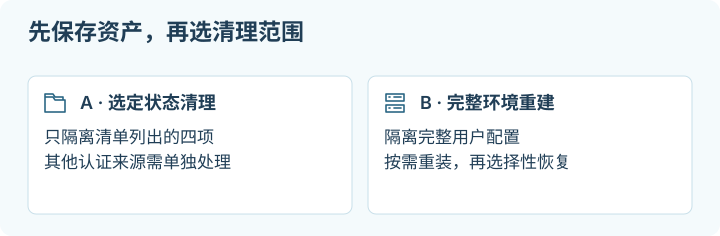

# 06 · CC「转生」资料：备份、环境清理与恢复

[返回首页](../README.md) · [交给 agent 的工单](../agents/account-cleanup.md)

## 这一章帮你做什么

写给账号突然不可用、担心本地项目与历史也跟着丢的人。前提：你能操作那台跑过 Claude 的机器，并接受“本地清理”和“平台账号结果”是两回事。读完你会得到：两套社区清理路线的对比、先备份再动手的顺序、按 A/B 二选一执行的办法，以及怎样把工作资产重建回来。



账号突然不能用了，最先让人慌的通常还有另一件事：项目、历史、Skills 和一起积累的工作环境怎么办。本章把收集到的两套社区清单展开，保留具体路径、两种清理力度，以及重建时怎么把资产带回来。

**本文可以帮助重置本地环境，不能证明清除了服务端关联，也不承诺账号结果。** “某目录造成封号”“全机零痕迹”等属于原作者的推断或报告用语；我们没有平台内部证据。路径是否存在、凭据是否退出、项目是否可恢复，则能在自己的机器上实际验证。

> [!NOTE]
> **停下检查点：删本地缓存不等于退出登录，也不等于消除服务端记录。**
> macOS 和 Linux 的凭据存放位置不同，`CLAUDE_CONFIG_DIR` 只隔离一部分状态，Console profile 登录还可能另有存储。清理前先分清“我要重置本地环境”和“我要处理平台账号”，两者可以分别进行，别把一个当成另一个的验收结果。

## 1. 先看材料之间的分歧

以下是对使用者提供材料的重新组织，不是作者亲历复述，也不是截图转载。已读材料包括三页《Claude Code 封号自救指南》、另一套《Claude Code 旧账号痕迹清理清单／最终清理报告》、备份及执行回报，共八张附件及配套文字。第一套截图署名为「有趣的灵魂董菲同学」（CoolGc）；另一套原作者及原帖链接尚未核实。

| 路线 | 原材料的具体做法 | 能保留什么 | 代价与缺口 |
| --- | --- | --- | --- |
| A · 选定状态清理 | 备份后处理 `session-env`、`telemetry`、`statsig`、`stats-cache.json`，再处理桌面缓存与浏览器 | 大部分项目历史、Skills、设置留在原位 | 未必处理实际认证来源；保留的文件也可能含账号或个人信息 |
| B · 完整配置重建 | 备份后移走整个 `~/.claude/`、旁边的 `.claude.json`；另查浏览器、IDE、CLI cache、Keychain | 从备份选择性恢复资产 | 历史、插件、hooks、MCP、信任和偏好也会重置，不能直接倒回整包 |
| 共同部分 | 保留完整原始备份，另外整理恢复包；逐层检查 CLI、桌面、浏览器和 IDE | 项目与工作资产不必随登录状态一起丢失 | 复制两份不等于第二份已清理；只备份 `.claude/` 会漏掉旁边的 `.claude.json` |

选 A 还是 B 取决于你要处理的范围。只是 CLI 认错账号，可以先核对认证来源并 logout；想把自己的本地环境重新建起，可以选 B。换出口、换 VPS 与本地清理是不同动作，见[网络与代理](07-network-and-proxies.md)。

## 2. 区分账号、网络与本地登录

| 现象 | 核实点 |
| --- | --- |
| 平台明确显示 suspended / disabled | 记录提示和时间；原账号的限制页提供官方申诉流程，部分账号也可导出资料 |
| 401、登录过期、一直显示旧账号 | 这次启动实际用了哪个配置目录、环境变量、API key、profile 或已保存登录 |
| 403、地区／组织／权限错误 | 错误来自平台、代理、WAF 还是自己的入口；不能只凭状态码归因于 IP |
| 429 或用量耗尽 | 套餐、组织限额、并发及官方状态；不要把速率限制当作封号证据 |
| VPS 和自己所有服务都失联 | 先查机器和链路，走[排障入口](08-troubleshooting.md) |

在使用 Claude 的机器查看，输出留本机，可能带账号信息：

```sh
claude --version
claude auth --help
claude auth status
```

旧版本没有对应子命令时，用其 help 与交互 `/status`。当前命令见 [CLI reference](https://code.claude.com/docs/en/cli-reference)。平台事故查[状态页](https://status.claude.com/)，申诉与资料选项查[官方说明](https://support.claude.com/en/articles/8241253-safeguards-warnings-and-appeals)。本地重置与申诉可以分别进行，不要把一个写成另一个的验收结果。

## 3. 盘点：哪些是资产，哪些是状态

先正常退出会写这些目录的 Claude CLI、Desktop、IDE 扩展和自动任务。记录待恢复任务；不要根据名字批量杀掉所有 Node、tmux 或 PM2 进程。项目中的未提交文件也需要备份，Git commit 不能覆盖未跟踪文件和运行中的数据库。

### CLI 与项目

下面是**查找清单，不是要求每项都存在的固定文件结构**。`~` 表示当前用户 home；使用 `CLAUDE_CONFIG_DIR` 时先定位实际目录，不能机械套用默认路径。

| 位置／名称 | 为什么检查 | 恢复建议 |
| --- | --- | --- |
| `~/.claude/` | 默认用户工作目录；可能含历史、插件、状态和凭据文件 | 完整私有备份；B 路线移走后分项恢复 |
| `~/.claude.json` | 用户级状态与部分 MCP 等配置；社区记录中出现 account/user 标识 | 单独备份；新配置生成后只迁回需要的配置项 |
| `.credentials.json`（实际配置目录内） | Linux 的认证文件；macOS 特定情形可回退到文件 | 不当成 Skills／历史的一部分恢复 |
| `session-env/`、`telemetry/`、`statsig/`、`stats-cache.json` | 第一套清单的重点；可能不存在或随版本变化 | 可在 A 路线单独隔离；目录名本身不能证明存着 token 或封禁标识 |
| `projects/`、`history.jsonl`、`file-history/`、`plans/` | 会话、历史、恢复材料 | 保留原始副本；新环境逐项导入或作为只读参考，路径映射可能变化 |
| `skills/`、`plugins/`、`settings.json`、`hooks` | 自己积累的能力与行为配置 | 检查执行命令、endpoint、token、旧绝对路径后恢复 |
| `debug/`、`usage-data/` | 第二套材料列出的诊断／使用记录 | 当私有日志保存；不默认为登录凭据 |
| 项目 `.claude/`、`.mcp.json`、`CLAUDE.md`，以及旧材料提到的 `mcp.json` | 项目级设置和说明；不同版本／工具位置不同 | 按实际项目核对；不要为了用户目录重置把整个项目目录也删掉 |

当前 macOS 通常使用 Keychain，Linux 使用配置目录内的凭据文件。`CLAUDE_CONFIG_DIR` 影响状态和登录隔离；Console 无 API key 的 profile 登录另有存储，不完全受目录隔离覆盖。官方还支持环境凭据与不同 provider。见[认证说明](https://code.claude.com/docs/en/authentication)与[配置层级](https://code.claude.com/docs/en/settings)。因此“清掉这几个缓存就一定退出所有认证”并不成立。

只显示相关变量是否存在，不打印值：

```sh
python3 - <<'PY'
import os
names = ('CLAUDE_CONFIG_DIR', 'ANTHROPIC_API_KEY', 'ANTHROPIC_AUTH_TOKEN',
         'CLAUDE_CODE_OAUTH_TOKEN', 'ANTHROPIC_BASE_URL', 'ANTHROPIC_PROFILE',
         'CLAUDE_CODE_USE_BEDROCK', 'CLAUDE_CODE_USE_VERTEX', 'CLAUDE_CODE_USE_FOUNDRY')
for name in names:
    print(name + ': ' + ('set' if name in os.environ else 'unset'))
PY
```

还要在本机核对 shell 启动文件、service／LaunchAgent、settings 的 helper、IDE 启动环境。退出登录后仍显示已认证，先查这些来源，不要反复删缓存。

### macOS 桌面、浏览器、IDE、Keychain

| 原材料列出的对象 | 查找与实际操作 | 影响 |
| --- | --- | --- |
| `~/Library/Application Support/Claude` | 退出 Desktop 后确认存在，备份并将这个精确目录移入隔离区 | Desktop 本地状态会重建，可能要求重新登录 |
| `~/Library/Caches/com.anthropic.claude*` | `*` 在这里表示候选名称；在 Finder 中逐项核对归属后移动，别把通配符直接接到删除命令 | 清应用缓存，不等于撤销云端会话 |
| `~/Library/Caches/claude-cli-nodejs` | 原材料的 CLI cache；按实际安装确认，不存在就跳过 | 清本地缓存；不能假定覆盖所有安装方式 |
| Chrome profile 的 `IndexedDB/https_claude.ai_0.indexeddb.leveldb` | `chrome://version` 可定位当前 profile；优先使用浏览器站点数据界面 | IndexedDB、Cookie、Local Storage 是不同存储；清一项不等于清全部 |
| Chrome 的其他 profiles | 每个实际使用过的 profile 分别处理 | 只清 Default 不会自动清掉其他 profile |
| `~/Library/Application Support/Code/logs/` 下的 `Anthropic.claude-code` | 用 VS Code 的日志目录入口确认时间、扩展和具体子目录，再备份／隔离 | 日志可能含路径和请求内容；删日志不会卸载扩展 |
| VS Code `CachedExtensionVSIXs` 中的 `anthropic.claude-code-<version>` | 这是第二套报告提到的安装包缓存，版本号只作历史样例；检查真实存放处 | VSIX cache 不等于已安装扩展或账号凭据 |
| Keychain 的 `Claude Safe Storage`、`Claude Code-credentials` 类条目 | 打开“钥匙串访问”，搜索 Claude，核对 service、account、归属；确有需要再删除选定条目 | Safe Storage 可能是应用存储加密材料，不能直接称为某账号 token；删除前保留相关应用数据 |
| 临时文件 | 原报告检查了 tmp；仅检查能归属到此次应用的精确文件 | 不清整个 `/tmp`，其他程序也在用 |

原报告写某项“无残留”只表示它检查的那台机器和当时版本。现代浏览器 profile、IDE 衍生产品、不同 config directory 不一定使用同名位置。

原材料还建议清 Claude 与 Cloudflare 站点数据。Claude 站点数据可以按站点清理；Cloudflare 为许多网站服务，只有核实具体故障与站点关系后才扩大范围。操作入口见 [Chrome 站点数据管理](https://support.google.com/chrome/answer/95647)和[可删除的数据类型](https://support.google.com/chrome/answer/2392709)。需要保留浏览器原始文件时，先退出浏览器，备份精确 profile；其中包含其他网站的私人数据，留在自己控制的备份位置。

## 4. 实际执行：先备份，再选择 A 或 B

以下命令面向 **macOS／Linux 的 Bash 或 Zsh，默认配置位置**。自定义目录、symlink、共享目录要先另定路径；Windows 使用同样的分层思路，但文件路径和凭据管理不同，不能照抄 shell 命令。

> [!TIP]
> **先记住这一点：动手前必须有一份完整、私有的原始备份。**
> 本章用“移入隔离区”代替直接删除，就是为了留下返回原状态的办法。备份要覆盖 `~/.claude/` 和旁边的 `~/.claude.json`，再加项目源码、未提交修改和独立数据库；`chmod`/`umask` 只限制本机权限，不能代替加密。没有这份[备份](glossary.md#备份)，就不要开始清理。

先查看磁盘空间、文件类型和目录大小，确认备份目的地不是自动同步的公共文件夹：

```sh
df -h "$HOME"
ls -ld "$HOME/.claude" "$HOME/.claude.json"
du -sh "$HOME/.claude"
```

缺失项可能正常。遇到 symlink 先确认它指向哪里，不用本段复制／移动示例。磁盘不够时先选一块有足够空间的私有备份盘，不要一边失败一边继续清理。

在同一个终端创建唯一、仅自己可访问的工作目录，并复制原始材料：

```sh
umask 077
cc_backup=$(mktemp -d "$HOME/cc-backup.XXXXXXXX") || exit 1
mkdir "$cc_backup/original" "$cc_backup/quarantine" || exit 1
if [ -d "$HOME/.claude" ]; then
  cp -pR "$HOME/.claude" "$cc_backup/original/claude-dir" || exit 1
fi
if [ -f "$HOME/.claude.json" ]; then
  cp -p "$HOME/.claude.json" "$cc_backup/original/claude-state.json" || exit 1
fi
printf '本次备份目录：%s\n' "$cc_backup"
```

`cp` 失败就停止。私有原始包可能仍含凭据和完整聊天；它不是可分享的 cleaned 包。另行备份项目源码、未提交修改和独立数据库；先抽查关键历史与配置能打开，再继续。`chmod`／`umask` 限制本机文件权限，不能代替加密。

**A：只隔离第一套材料列出的四项。** 已停掉写入者、备份通过后，在同一终端执行；变量必须仍指向刚生成的目录：

```sh
: "${cc_backup:?请在创建备份的同一终端继续}"
for cc_name in session-env telemetry statsig stats-cache.json; do
  cc_source="$HOME/.claude/$cc_name"
  if [ -e "$cc_source" ] || [ -L "$cc_source" ]; then
    cc_target="$cc_backup/quarantine/$cc_name"
    if [ -e "$cc_target" ] || [ -L "$cc_target" ]; then
      printf '隔离目标已存在，停止：%s\n' "$cc_target"
      exit 1
    fi
    mv "$cc_source" "$cc_target" || exit 1
  fi
done
```

随后按照上表处理确实需要重置的 Desktop／浏览器／IDE 层。A 不处理 `.claude.json`、系统凭据和其他认证来源；如果这也属于你选定的范围，单独记录并操作，或选 B。

**B：移走完整用户配置与旁边状态文件。** 与 A 二选一；仍在刚创建备份的终端，退出所有写入者后执行：

```sh
: "${cc_backup:?请在创建备份的同一终端继续}"
for cc_name in claude-dir claude-state.json; do
  if [ -e "$cc_backup/quarantine/$cc_name" ] || [ -L "$cc_backup/quarantine/$cc_name" ]; then
    printf '隔离目标已存在，停止：%s\n' "$cc_name"
    exit 1
  fi
done
if [ -e "$HOME/.claude" ]; then
  mv "$HOME/.claude" "$cc_backup/quarantine/claude-dir" || exit 1
fi
if [ -e "$HOME/.claude.json" ]; then
  mv "$HOME/.claude.json" "$cc_backup/quarantine/claude-state.json" || exit 1
fi
```

逐项检查原路径已移走、隔离副本可读；发生权限错误、碰撞或应用立即重建目录，就暂停并查清写入者。这里用隔离代替原材料里的 `rm -rf`，完成相同的活动路径重置，同时留下返回原状态的办法。

需要退出已保存的登录时，在移动文件**之前**使用该版本支持的 `claude auth logout` 或交互 `/logout`；手动 Keychain 操作按上表精确选择。卸载程序与移走状态是两个步骤，重装需求按[官方安装／卸载页](https://code.claude.com/docs/en/setup#uninstall-claude-code)匹配 native、包管理器或旧 npm 安装，不把所有方式全部执行一遍。

## 5. 重建与选择性恢复

1. 在选定配置目录启动，检查认证来源；按自己的账号状态完成登录。无痕窗口或新的浏览器 profile 可以隔离 Cookie，方便确认登录了谁，但不改变出口 IP、设备本身或服务端记录。
2. 先恢复自己写的 `CLAUDE.md`、Skills 和必要项目说明，再逐项恢复 settings、hooks、MCP、plugins。查旧账号字段、绝对路径、endpoint、token 和执行权限；不要将原始备份整包覆盖新环境。
3. 项目历史先留作只读材料。若选择迁回 `projects/`、`history.jsonl` 或 file history，先对当前新数据另存一份；检查路径映射和版本格式，打开一个已知会话确认。跨版本导入并非这里验证过的通用功能。
4. 做一个自己的低风险项目测试：读文件、执行已有测试、确认工作目录与模型/provider符合预期。不能用“出现登录成功”替代项目恢复验收。
5. 需要回到清理前状态时，退出应用，把刚生成的新目录也移到另一处保留；确认原路径空缺后，将对应隔离项移回原位置。不要覆盖新历史；手动删除的 Keychain 登录通常需重新授权，文件回放不能保证恢复它。

这一步完成后，分别记录：哪些本地对象已重置、哪些资产已恢复、认证来源是否正确、平台账号是什么状态。保留备份直到确认需要的项目、历史和工具都可用；销毁备份是另一项明确操作。

## 6. 让工作资产不依赖某次登录

材料里还有一条很有价值的备份支线：源码和说明用版本管理，数据库、会话与附件另外备份，留一份机器之外的受控副本，并定期做恢复演练。云端私有仓库不是所有私密资料的默认目的地；Git SHA 相同也不能证明数据库、未提交文件或聊天历史完整。

可以把恢复包分成项目说明、Skills、经过检查的配置样例和资产索引；原始对话、账号数据、Cookie 与凭据留在独立私有备份。这样下一次要换工具、换电脑或换 VPS，有明确的迁移对象和恢复顺序。相关方法见[本机 → VPS](04-local-to-vps.md)与[跨 VPS 迁移](05-vps-to-vps.md)。

官方资料核对于 **2026-10-02**。本仓库未在真实账号上执行上述清理，也没有验证社区材料对封号原因及后续账号结果的推断。
