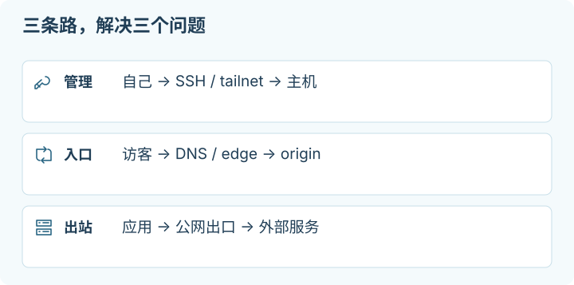

# 07 · DNS、Tunnel 与代理：一条请求究竟走了哪里

## 这一章帮你做什么

写给分不清“入口”和“出口”、被 DNS / 代理 / VPN / Tunnel 一堆词绕晕的人。前提：你有一条自己的服务或一次访问要排障，愿意先画清楚请求路径。读完你会得到：把域名到 HTTPS 请求逐段拆开的方法，Cloudflare、Tailscale 与各种代理协议各自解决什么，以及“一次只改一段”的排障顺序。



<details>
<summary>适用环境与验证范围</summary>
<p>适用于自有或获准测试的服务与网络；示例地址需替换，代理和协议能力需核对两端版本。</p>
<p>本章核对机制与命令静态语法，不代表具体客户端、网络路径或平台账号已经验收。商家产品资料与作者单次使用体验分开注明。具体记录见<a href="sources-and-maintenance.md">来源与维护</a>。</p>
</details>

网络排障先问方向：是“别人访问我的服务”，还是“我的设备或 VPS 访问别的服务”？前者需要入口，后者涉及出口。域名解析、反向代理、设备组网、应用代理和 VPN 可能同时存在，但各自解决不同问题。把它们区分开，才能知道修改究竟会影响哪一段。

本章使用 `app.example.com`、`192.0.2.10` 和 `2001:db8::10` 等文档示例；不是可直接使用的部署地址。命令用于你有权测试的服务，执行前替换目标。协议仅讨论管理自有系统、访问经授权网络与应用的用途；网络协议和出口 IP 都不能保证 AI 平台账号不受限制。

> [!NOTE]
> **停下检查点：Tunnel 改的是入口，不是应用的出口。**
> 给 `app.example.com` 配 Tunnel，只说明访问者怎么到达你的 origin；它**不会**改变应用调用外部 API 时的[出口 IP](glossary.md#出口-ip)。要改出口，得单独配通用出口、WARP/Gateway 或专门 egress。这两件事经常被混为一谈。

## 住宅代理选项：Proxy-Cheap Dedicated

**作者体验。** 作者购买的是 Proxy-Cheap 静态住宅产品中的 **Dedicated** 档，反馈这次拿到的 IP 测试结果很好，可用于访问官方 Claude 网页 / app。这是一次购买的使用体验，不能推广为整个 IP 池的质量。不同 ISP、分配地址与测试时间可能有差异，不能保证每个 IP 都有好分数；最终以自己的客户端与用途验收。

**[使用作者的 Proxy-Cheap referral](https://app.proxy-cheap.com/r/3zNHbA)**，或打开[不带 referral 的产品页](https://www.proxy-cheap.com/services/static-residential-proxies)。符合[商家 referral 规则](https://www.proxy-cheap.com/referrals)的注册与购买，可能为作者带来佣金或账户奖励；这里不承诺额外折扣。不要把推荐链接当成必须购买的步骤。

### 先分清产品用语

官方页面查阅日期：**2026-10-02**。官网把这一类列为 **Static Residential (ISP)**，静态住宅产品页列有 **Basic / Dedicated / Premium** 档位；作者购买的 Dedicated 是其中的产品选择。[Proxy-Cheap 官网](https://www.proxy-cheap.com/)、[Static Residential 产品页](https://www.proxy-cheap.com/services/static-residential-proxies)

| 用语 | 在这里怎样理解 | 不应推导出的保证 |
| --- | --- | --- |
| Static | 相对轮换池，使用较固定的代理 IP；保留与续费条件按订单确认 | 永久不变、不会被回收 |
| Residential / ISP | 商家对 IP 来源与产品类别的描述 | 代理机器一定放在真实家庭宽带后面 |
| Dedicated | 官方列出的档位；下单时确认所选产品的独享分配条件 | IP 测试分数、目标平台放行或账号安全 |

官方 [ISP 产品说明](https://www.proxy-cheap.com/services/isp-proxies)明确提到其 premium ISP proxies 在数据中心托管。因而不能只看“住宅”或 Dedicated 一词，就把所有产品视为同一种物理接入。下单前确认具体类型、国家、ISP、协议、账期、续费与退款条件；不要把网页上的档位名称或体验描述扩展成未写入订单的承诺。

### 海外 VPS 不需要常规再套一层

海外地区的 VPS 默认直接使用自身出口，**不需要把静态住宅代理作为标配，本指南也不推荐常规叠加**。先用实际应用确认 VPS 到目标的路径；多加代理会增加费用、延迟、凭据管理和故障点，不会自动改善所有访问问题。只有自己的任务确有单独出口需求时，再评估这一层。

浏览器、官方 app、CLI 和后台 worker 是否使用某个代理，需要分别验证；配置了浏览器代理并不证明所有程序都生效。访问 Claude 等服务仍须满足其地区、账户与使用规则。作者的体验不是 Proxy-Cheap 或目标平台的兼容性承诺，IP 分数也不能代替真实客户端验收。

## 1. 从域名到一次 HTTPS 请求

假设你访问 `https://app.example.com/`。客户端先通过 [DNS](glossary.md#dns) 解析域名，选择一个可用地址，连接目标[端口](glossary.md#端口)，再完成 [TLS](glossary.md#tls) 验证，然后才发送 HTTP 请求。任何一步都可能失败；DNS 返回一个地址不代表那个地址的 HTTPS 服务可用。

| 名称 | 意义 | 不能替你完成的事 |
| --- | --- | --- |
| A | 名字对应 IPv4 地址 | 不设置端口，不开放防火墙 |
| AAAA | 名字对应 IPv6 地址 | 不保证客户端与 origin 的 IPv6 路径畅通 |
| CNAME | 名字指向另一个 DNS 名字 | 不等于浏览器 URL 跳转，也不自动改变应用路由 |
| TTL | DNS 记录允许缓存的时间 | 不承诺在点击保存后全世界同时更新 |
| TLS 证书 | 验证所访问的主机名，并建立受保护的连接 | 不证明服务器上应用业务逻辑正确 |

迁移前可以提前降低 TTL，但已经缓存的旧记录仍可能存活到旧 TTL 结束。某些客户端、系统解析器和负缓存还有各自行为；看到本地结果未更新，先辨别查询了哪台 resolver 和返回的状态，不立刻重建服务器。没有正确 IPv6 服务时，不要先发一个 AAAA 记录期待客户端自己处理一切。

**运行位置：本地电脑终端；只读查询，会向配置的 DNS resolver 发出请求。** 需要已安装 `dig`；若没有，使用系统现有 DNS 工具或按其官方方式安装，不能把“工具不存在”当作 DNS 故障。

```sh
dig app.example.com A
dig app.example.com AAAA
dig app.example.com CNAME
```

看 `status`、`ANSWER SECTION`、TTL 与 `SERVER`。示例域名没有配置你的应用时，空结果很正常；换成自己的域名后，结果应符合 DNS 控制面板的设计。`NXDOMAIN`、`SERVFAIL`、有记录但连接失败是不同问题。查询结果可含内部名字或地址，分享时只提供必要信息。

**运行位置：实际客户端；对自己的公开 HTTPS 入口做限时请求。**

```sh
curl --noproxy '*' -4 --connect-timeout 5 --max-time 15 -I https://app.example.com/
curl --noproxy '*' -6 --connect-timeout 5 --max-time 15 -I https://app.example.com/
```

`--noproxy '*'` 明确绕开 curl 的环境代理，测的是直接路径。预期分别完成对应地址族的 TLS 并得到可解释的 HTTP 状态。`-I` 用 HEAD，应用不支持 HEAD 时可能回 405，此时用其文档允许的只读 GET。IPv6 本地不可用、域名没有 AAAA 和服务器 IPv6 故障需分别记录。不要加 `-k` 把证书问题藏起来。

## 2. Cloudflare 的 DNS proxy 与 Tunnel

Cloudflare 记录为 **DNS-only** 时，DNS 返回 origin 的实际目标信息，客户端通常直接访问 origin。记录为 **Proxied** 时，解析结果通常是 Cloudflare edge 地址，支持的 HTTP/HTTPS 流量经过其反向代理。Cloudflare DNS proxy 不是随意 TCP/UDP 端口的通用转发开关；SSH、邮件、自定义协议要按各自支持的产品与端口处理。[Cloudflare proxy status](https://developers.cloudflare.com/dns/proxy-status/)、[proxy limitations](https://developers.cloudflare.com/dns/proxy-status/limitations/)

这会产生两段连接：客户端到 edge，以及 [edge](glossary.md#edge) 到 [origin](glossary.md#origin)。TLS、缓存、访问控制和日志的边界都要分别考虑。启用代理后，origin 仍应有正确的认证和传输安全；隐藏一个地址不等于完成安全控制。一个缓存中的成功页面，也不证明 origin 此刻健康。

> [!TIP]
> **先记住这一点：入口的 200 可能来自缓存，不是 origin 的真实回应。**
> 排障时把客户端→edge 和 edge→origin 当成两段分别测。先在 origin 本机请求 loopback，再用 `curl --resolve` 定向 origin 保留 SNI，最后才看公开入口。只看一个状态码，很容易把缓存命中误判成服务健康。

**[Cloudflare Tunnel](glossary.md#tunnel)** 则由 origin 上的 `cloudflared` 主动建立到 Cloudflare 的连接，访问者的请求再经该连接到达配置的本地服务。这样可以发布一个没有直接公网入站能力的服务，包括某些 [NAT](glossary.md#nat)/CGNAT 后的服务。[Cloudflare Tunnel](https://developers.cloudflare.com/cloudflare-one/networks/connectors/cloudflare-tunnel/)

这里必须区分两种“出站”：`cloudflared` 为了建立 tunnel 发起出站连接，不代表操作系统的其他请求都改走 Cloudflare。**为 `app.example.com` 配置 Tunnel ingress，并不会自动改变 VPS 调用外部 API 时的出口 IP。** 这是依据官方描述的连接模型作出的直接推论；通用出口、WARP/Gateway 或专门 egress 产品需要另外的路由配置和授权。

发布 tunnel 路由也不自动等于只有自己能访问。需要私有访问时，还要配置并验证 Cloudflare Access 等身份策略，核实登录前、登录后和未授权用户的结果。Token 只保存在受控机器配置中，不能贴入公共示例。

需要定位 edge/origin 差异，而且你的设计明确允许该客户端直接连接 origin 时，才可在**本地**使用：

```sh
curl --noproxy '*' --connect-timeout 5 --max-time 15 \
  --resolve app.example.com:443:192.0.2.10 \
  -I https://app.example.com/
```

它保持 URL 主机名与 TLS SNI，同时把连接定向到所选 origin；不会改系统 DNS。预期得到这个 origin 的有效证书和响应。若 origin 只接受 tunnel/指定代理的连接，直接请求失败可能正是预期边界，不为这条测试临时开放全网。使用仅 edge 信任的 origin 证书时，普通客户端不信任也不能草率归为证书坏了；按该架构验证，不用 `-k` 将未验证结果称为安全成功。

## 3. Tailscale mesh 与 exit node

Tailscale 默认让获准设备通过 overlay network 互相访问，使用 WireGuard 保护设备间数据。它可以尝试 NAT 穿透，无法直接连接时使用中继。**装好 Tailscale 默认不意味着普通互联网流量改走 VPS。** 适合的首个用途是让自己的电脑和服务器通过私有路径管理服务，而非直接公开一个管理端口。

Exit node 是另一个明确功能：设备宣布愿意作为出口，tailnet 管理策略允许它，客户端再选择使用它，才让相应公网流量按该模式经出口设备转发。还要确认 DNS、IPv4/IPv6、局域网访问、subnet routes/app connectors 和排除规则；一个设备显示在线不能代替这些路由检查。[Tailscale exit nodes](https://tailscale.com/docs/features/exit-nodes)

“两端已加入 tailnet”“两端可建立 Tailscale 连接”“目的 TCP 端口被策略允许”“应用认证通过”是不同层。ACL/grants 仍决定哪个来源能访问哪个端口；不要把加入同一个 tailnet 当作所有设备互相信任。Mac Remote Login、普通 SSH 与 Tailscale SSH 的可用性和账号权限也应分开，具体操作见 [09 · 私有远程访问](09-private-access.md)。

## 4. 协议、传输与加密分别比较

**代理协议**描述客户端如何要求中间节点连接某个目标；**传输**描述两端之间怎样承载数据；**加密与认证**描述谁能读取或伪造这段通信。一个名字不足以说明三者。尤其要分清“能够转发 UDP 应用数据”和“代理自身在网络上用 UDP”——这不是同一件事。

| 技术 | 提供的能力 | 加密与 UDP / 传输差异 | 适合怎样理解 |
| --- | --- | --- | --- |
| HTTP CONNECT | 请求代理建立到指定目标的字节流隧道 | CONNECT 本身不提供加密；HTTPS 目标可在隧道内做 TLS，客户端到代理也可另用 TLS。传统 CONNECT 不是任意 UDP 转发；CONNECT-UDP 是另外的扩展 | 应用明确支持的 HTTP 代理接口 |
| SOCKS5 | 支持 CONNECT、BIND、UDP ASSOCIATE 的通用代理协议 | 协议能力不等于实现全部支持；常见无认证/用户名密码模式不自带传输加密。UDP relay 需要两端实现与网络均支持 | 给懂 SOCKS 的应用一个转发接口 |
| SSH `-L` / `-D` | 本地固定端口转发 / 动态 SOCKS 代理 | 本地客户端到 SSH server 加密；常见 OpenSSH `-D` 转发 TCP，不提供 SOCKS5 UDP relay。SSH server 到最终目标的安全由目标协议负责 | 临时访问自己服务，或经自己主机发起 TCP 请求 |
| WireGuard | 将 IP 流量通过加密隧道交给对端 | WireGuard 外层使用 UDP；内层可承载 TCP、UDP 等 IP 流量。需要路由与访问规则，不是浏览器的 HTTP 代理地址 | 设备/站点之间的 VPN 网络层 |
| Trojan | 代理 TCP，并定义 UDP ASSOCIATE 数据封装 | 原始协议先建立 TLS；UDP 数据可封装在 TLS/TCP 通道中，不等于外层原生 UDP。实现变种需单独核对 | 基于 TLS 的代理协议，需正确证书与认证 |
| VLESS | 定义认证及 TCP/UDP 等请求，由实现组合传输 | 常见 `encryption/decryption: none` 模式本身没有负载加密，要配 TLS 等传输安全。较新 Project X 版本还有可选 VLESS Encryption，必须核对两端版本与配置 | 不能只凭“VLESS”三字推断加密、UDP 路径或安全性 |
| Hysteria 2 | 基于 QUIC 的 TCP/UDP 代理 | 标准路径使用 QUIC/TLS 与 UDP 网络；TCP 走 QUIC stream，UDP 走 QUIC datagram。UDP 受限网络可能不可用，附加传输变种不等同基础协议 | 需双方支持、实际链路验证的 QUIC 方案 |

上述机制依据 [RFC 9110 CONNECT](https://www.rfc-editor.org/rfc/rfc9110.html#section-9.3.6)、[RFC 1928 SOCKS5](https://www.rfc-editor.org/rfc/rfc1928)、[OpenSSH ssh(1)](https://man.openbsd.org/ssh)、[WireGuard protocol](https://www.wireguard.com/protocol/)、[Trojan protocol](https://trojan-gfw.github.io/trojan/protocol)、[当前 VLESS inbound 配置](https://xtls.github.io/en/config/inbounds/vless.html)、[Hysteria 2 protocol](https://v2.hysteria.network/docs/developers/Protocol/)。

VLESS 的旧协议解释页仍保留“只支持 none”的历史叙述，而当前配置页已说明可选 Encryption；因此部署时以**选定版本**的配置文档和双方兼容性为准。本章不把某一项实现的新能力推及所有同名客户端。类似地，“使用 TLS”也要求正确验证对端；随意关闭证书验证会削弱原本的安全模型。

没有某种协议能普遍保证更快、更稳定或“免封”。大文件吞吐、交互延迟、CPU 开销、丢包恢复、UDP 可达性、服务器带宽和平台政策都可能成为限制。只有既有协议无法满足明确需求时，才增加另一套软件和运维负担。

## 5. 最小实用练习：用 SSH 访问自己服务器上的本机服务

假设自己的 Web 工具只监听 VPS 的 `127.0.0.1:8080`，已确认应用认证正常，不需要让公众访问。先在 **VPS** 用 `sudo ss -lntp` 确认监听；若没有服务，先按该应用文档启动，转发不会替你创建服务。

**运行位置：本地电脑；保持这个命令在前台。** 已按 [首次建机](02-first-server.md) 验证 host key 和用户密钥后：

```sh
ssh -N -o ExitOnForwardFailure=yes \
  -i ~/.ssh/infra_demo_ed25519 \
  -L 127.0.0.1:18080:127.0.0.1:8080 \
  operator@192.0.2.10
```

此处第一个 `127.0.0.1:18080` 是本地监听；第二个 `127.0.0.1:8080` 从 **SSH server** 视角访问。预期命令不显示 shell，保持运行；本地浏览器访问 `http://127.0.0.1:18080` 后看到自己的工具。工具若依赖特定 Host、HTTPS 或 callback URL，需要按其文档配置；不要把所有报错都归给隧道。

`ExitOnForwardFailure=yes` 可使本地端口绑定失败时退出，但不保证远端应用最终可用。端口被占用时选择新的本地端口并同步修改浏览器地址；`administratively prohibited` 时检查服务端转发策略。不要为了连通先开启全网访问或 root 登录。完成后 `Ctrl+C` 停止转发，本地端口随进程关闭。这种方式适合临时管理，并非自动跨重启服务。

## 6. 应用代理、DNS 解析与环境变量

系统代理、浏览器[代理](glossary.md#代理)、命令行的 `HTTP_PROXY`/`HTTPS_PROXY`/`ALL_PROXY` 和 VPN 路由不是同一层。有的软件读取[环境变量](glossary.md#环境变量)，有的读取系统设置，有的都不读取；大小写、`NO_PROXY` 和优先级也由应用决定。给 shell 设置变量，不证明后台 systemd 服务或容器继承了它。

如果明确需要一个临时 SOCKS TCP 代理，可以在 **本地终端** 单独启动：

```sh
ssh -N -o ExitOnForwardFailure=yes \
  -i ~/.ssh/infra_demo_ed25519 \
  -D 127.0.0.1:1080 operator@192.0.2.10
```

在**本地另一终端**让这一条请求明确使用它：

```sh
curl --noproxy '' --connect-timeout 5 --max-time 15 \
  --proxy socks5h://127.0.0.1:1080 https://example.com/
```

`--noproxy ''` 清空本次请求的 bypass 列表，避免已有 `NO_PROXY` 让显式代理测试偷偷直连。`socks5h` 让 curl 把目标主机名交给 SOCKS 端处理；curl 的 `socks5` 形式会在本地先解析。预期得到所选公开示例页面，但这只验证这一条 curl 请求，经此 SSH 动态转发到达该目标，不能推广到所有应用或 UDP。若测试自己的 API，应使用其低成本、只读端点，并按其条款与凭据管理方式操作。完成后在代理终端 `Ctrl+C` 停止。[curl manual](https://curl.se/docs/manpage.html)

不要把没有认证的代理绑定到 `0.0.0.0` 后丢在公网；那会使陌生人借用你的资源和出口。不要通过安装来历不明的根证书解决连接问题。正常目标 HTTPS 的 TLS 是客户端到目标的边界；显式 TLS inspection 会改变谁能读取内容，必须是你有意采用并理解的环境。

## 7. 一次只改变一段路径

排障时先写下预期路径：谁是客户端、解析由谁做、连接先到哪台机器、哪一段受哪种认证保护、谁最终连接外部目标。然后按下面顺序取证。

1. **服务本身：** 进程与监听地址是否正确，本机请求是否有效。
2. **目标与解析：** 域名、A/AAAA、端口、SNI 是否指向预期入口。
3. **可达性：** IPv4/IPv6、云防火墙、主机防火墙和 overlay policy 各自怎样处理这条连接。
4. **身份与应用：** TLS host key/证书、用户认证和应用权限是否分别通过。
5. **出口：** 目标究竟看到哪条连接来源；如确需确认，使用你自己控制并被授权记录来源的端点，避免把凭据发到随手找到的“IP 检测”站点。
6. **真实体验：** 目标客户端执行一次正常操作，并确认取消代理/停止 tunnel 后行为符合设计。

一个绿色 tunnel 状态、一个成功 ping 或一个 HTTP 状态码，只属于其中一层。记录失败在哪一层，再修改那一层；不要同时换 DNS、协议、端口和服务器，否则结果改善也无法说明原因。

具体的设备间私有访问见 [09 · 私有远程访问](09-private-access.md)。回到 [README](../README.md)。

## 一手资料与查阅日期

查阅日期：**2026-10-02**。产品能力、传输组合与客户端兼容性会改变，操作时核对你部署的版本；本章没有提供规避平台规则、身份检查或账号限制的操作。

- [Cloudflare proxy status](https://developers.cloudflare.com/dns/proxy-status/)、[limitations](https://developers.cloudflare.com/dns/proxy-status/limitations/)：DNS proxy 的范围。
- [Cloudflare Tunnel](https://developers.cloudflare.com/cloudflare-one/networks/connectors/cloudflare-tunnel/)：outbound connection 与公开入口的机制。
- [Tailscale exit nodes](https://tailscale.com/docs/features/exit-nodes)：默认 overlay 与主动选择出口的差异。
- [RFC 9110 §9.3.6](https://www.rfc-editor.org/rfc/rfc9110.html#section-9.3.6)、[RFC 1928](https://www.rfc-editor.org/rfc/rfc1928)：HTTP CONNECT 与 SOCKS5。
- [OpenSSH ssh(1)](https://man.openbsd.org/ssh)、[WireGuard protocol](https://www.wireguard.com/protocol/)：转发与 VPN 机制。
- [Trojan protocol](https://trojan-gfw.github.io/trojan/protocol)、[VLESS inbound configuration](https://xtls.github.io/en/config/inbounds/vless.html)、[VLESS protocol explanation](https://xtls.github.io/en/development/protocols/vless.html)、[Hysteria 2 protocol](https://v2.hysteria.network/docs/developers/Protocol/)：协议差异与版本边界。
- [curl manual](https://curl.se/docs/manpage.html)：`--resolve`、`--proxy`、超时与 SOCKS DNS 行为。
- [Proxy-Cheap Static Residential](https://www.proxy-cheap.com/services/static-residential-proxies)、[ISP proxies](https://www.proxy-cheap.com/services/isp-proxies)、[referral program](https://www.proxy-cheap.com/referrals)：产品档位、托管用语与推荐奖励规则；不作为作者 IP 测试体验的证明。

**想一想：Cloudflare Tunnel 显示 Healthy，是否说明 VPS 调用外部 API 也会从 Cloudflare 出口发出？**

<details>
<summary>查看答案</summary>
<p>不是。Tunnel 为访问者到 origin 建立入口；应用的外部 API 请求仍按自己的出口路由发送，除非另外配置了相应的出口功能。</p>
</details>
