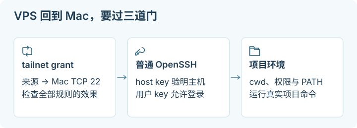

# 09 · 私有远程访问：让 VPS 上的 worker 连接自己的 Mac

## 这一章帮你做什么

写给想让 VPS 上的 worker 安全回到自己 Mac 处理项目的人。前提：你能操作两端设备、有 tailnet 管理权限、并愿意逐层验收。读完你会得到：一条不依赖家门口公网 IPv4 的私有路径，明确它只到“某个 Mac 用户 + TCP 22”，以及从真实 worker 用户出发的正向、反向和项目命令验收。



<details>
<summary>适用环境与验证范围</summary>
<p>目标路径为 Linux VPS 的真实 worker 用户，经 Tailscale 连接 macOS Remote Login/OpenSSH；Mac GUI 客户端、系统版本与非交互环境的限制见正文。</p>
<p>本章只编写文档与示例，没有操作账户或连接真实 Mac/VPS 复现。官方机制核验、示例语法检查与读者的端到端验收是不同证据。具体记录见<a href="sources-and-maintenance.md">来源与维护</a>。</p>
</details>

本章建立一条具体路径：**VPS 上某个真实 Linux 用户运行的 worker，通过 Tailscale 网络，使用专用 SSH key 登录 Mac 的普通 Remote Login/OpenSSH。** 它适合在得到授权后检查或处理 Mac 上的项目文件，不需要家里有公网 IPv4，也不要求把家用路由器的 TCP 22 转发到公网。

这里的 `100.64.0.10`（VPS）与 `100.64.0.20`（Mac）是**合成示例**，来自 [RFC 6598 的 Shared Address Space](https://www.rfc-editor.org/rfc/rfc6598.html)，不是本书的 live 设备。部署时从自己的 Tailscale 设备列表逐项确认真实地址、节点与 owner 后替换。示例账户 `worker`、`macowner` 和项目 `example-project` 同样是占位。

> [!NOTE]
> **停下检查点：“网络能到”不等于“被授权”，更不等于“只有这个节点能连”。**
> `tailscale ping` 成功只证明路径可达，不证明 TCP 22 被 [grant](glossary.md#grant) 放行，也不证明用户 key 或项目权限通过。反过来，新加的窄规则不会自动收窄已有的宽规则——新建 tailnet 的初始策略默认就允许设备广泛互通。

## 1. 先选择访问形态

涉及多个 CLI/harness 或第三方工具服务时，结合[跨机器运维专题](multi-machine-operations.md)定位每次调用的执行机器和资源。本章继续完成一条准确的 VPS → Mac 访问路径。

| 需求 | 较直接的方式 | 入口与权限边界 |
| --- | --- | --- |
| 自己的 VPS/电脑持续访问 Mac 的 SSH 或多个私有服务 | Tailscale 私有访问 | 设备加入 [tailnet](glossary.md#tailnet)，grants/ACL 控制网络，SSH/应用另做认证 |
| 让指定用户只用浏览器访问一个 Web 工具 | Cloudflare Tunnel + Access | origin 主动连出去，public hostname 提供入口，Access 管理身份；Tunnel 路由本身不等于已受保护 |
| 临时查看一台已能 SSH 登录的机器上的本机端口 | SSH `-L` | 本地端口经 SSH 转发，通常随 SSH 进程结束；它需要先有一条可达的 SSH 路径 |

家用 NAT 把内网设备的流量转换成路由器的外部地址；CGNAT 又可能让多个家庭共享运营商外部地址。因此即使你能访问互联网，也未必能从公网直接连回家里。Tailscale 可以尝试建立设备直连，必要时通过中继；Cloudflare Tunnel 则由 origin 主动连接其网络。它们都不要求你先获得家用公网 IPv4，但仍需要两端有正常网络、客户端运行和正确访问策略。[Tailscale connectivity troubleshooting](https://tailscale.com/docs/reference/troubleshooting/network-configuration/tcp-connection-two-devices)、[Cloudflare Tunnel](https://developers.cloudflare.com/cloudflare-one/networks/connectors/cloudflare-tunnel/)

SSH `-L` 本身不会穿过一个完全不可达的 NAT 来找到 Mac；它可以使用已经打通的 Tailscale 路径，也可以连接已有的 VPS。具体本地转发练习见 [07 · 网络与代理](07-network-and-proxies.md)。本章 worker key 会禁止端口转发，若要做临时 Web 转发，应使用另行授权的管理 key，不能以测试不通为由去掉 worker 的权限限制。

## 2. 明确这条 SSH 能做什么

网络层仅允许某台 VPS 连到 Mac 的 TCP 22，解决的是**来源设备与目的端口**。SSH key 决定可登录哪个 macOS 用户。成功登录现有 owner 用户后，worker 原则上具有该用户的文件与命令权限；写上 `cd ~/Projects/example-project` 只是指定工作目录，**不是单仓库沙箱**。

如果需求是不让 worker 接触 owner 的其他目录，应先采用适当的独立系统用户、文件权限、隔离环境或受限命令入口，再安排项目访问；单独的 SSH `Host` alias、Tailscale grant 和 key 的 `from=` 都无法实现这一点。若接受使用既有 owner 用户，也应把这项权限事实写进 worker 的授权范围。不要从“SSH 已通”推导出可以读整个 home、提权、上传数据或操作账号。

多个 agent/设备并用时，按真实任务决定是否共用管理账号；独立 key 方便撤销某个入口，系统用户与提权路径决定进入后的能力。新增入口、收回权限和避免锁死见[共享访问专题](access-control-recovery.md)。

本章只新增 exact source → exact destination → TCP 22 规则，保留既有 HTTPS 等服务。不要为了一个 worker 改成全 tailnet 互通，也不把下面的 JSON 当成完整策略覆盖上传。

## 3. 准备两端与恢复路径

**运行位置：两台设备的拥有者界面。** Mac 要有人能本地操作或已有独立恢复通道；VPS 保留已验证的管理员会话。记录准备改变的三项：tailnet 新增 grant、Mac 新增一条用户公钥、VPS 新增一份专用 SSH 配置。恢复时逐项撤销本次改动，不能清空原策略或整个 `authorized_keys`。

1. **Mac：** 使用官方 [macOS 版本说明](https://tailscale.com/docs/concepts/macos-variants) 选择一个受支持的 GUI 版本，按官方安装界面完成登录与 system/network extension 授权。不要同时安装多个互相冲突的 GUI 变体。已有客户端时先检查现状，不重装。
2. **VPS：** 按 [官方 Linux 安装文档](https://tailscale.com/docs/install/linux) 选择实际发行版的包安装方式。安装后首次运行 `sudo tailscale up`，在自己浏览器打开输出的认证链接，确认加入的是预期 tailnet；已有配置时先看 `tailscale status`，不要用 `--reset` 消除提示。
3. **回到 tailnet 管理面板：** 根据设备名称、系统、owner 和两端显示的 IP 对照节点，确认在线与密钥有效期。不要只凭相似的设备名选中旧节点。

**运行位置：VPS；只读确认。**

```sh
tailscale version
tailscale ip -4
tailscale status
```

Mac 可以从 GUI 查看 Tailscale IP；若该版本 CLI 已在 PATH，也可运行相同只读命令。输出中可能有自己的设备信息，保留本地即可。预期识别出两台准确设备，而不是出现一串在线节点就继续。

**Mac GUI 版本的关键区别：** App Store / Standalone GUI 客户端不能充当 Tailscale SSH server；官方仅在 Linux 及 macOS 的特定开源 `tailscaled` CLI 形态提供该 server。这里使用的是 **macOS Remote Login 提供的普通 OpenSSH，经 Tailscale 承载**，不运行 `tailscale set --ssh`，也不添加 Tailscale SSH 的 `ssh` policy 来代替普通 SSH 配置。[Tailscale macOS variants](https://tailscale.com/docs/concepts/macos-variants)、[Tailscale SSH](https://tailscale.com/docs/features/tailscale-ssh)

## 4. 只允许准确来源访问 Mac TCP 22

**运行位置：tailnet 管理面板的既有 policy 编辑器；这是账号侧访问规则修改。** 先保存当前策略的受控副本或版本，检查已有 `grants`、`acls`、来源标签和广泛 allow 规则。默认策略也可能允许较广访问；一条较窄新规则不会撤销旧规则。

[tailnet-ssh-grant.example.json](../examples/tailnet-ssh-grant.example.json) 是**合并片段**：把其中那一个 grant 对象加入既有 `grants` 数组，保留其他字段与规则，不重复创建第二个同名 JSON key，不用整份示例覆盖 tailnet policy。

```json
{
  "grants": [
    {
      "src": ["100.64.0.10"],
      "dst": ["100.64.0.20"],
      "ip": ["tcp:22"]
    }
  ]
}
```

这里限定的是两台准确节点的当前地址与 TCP 22；不是 `*`，不是整个 `100.64.0.0/10`，也不是所有 owner 设备。IP 改变、节点重建或转移时需要重新确认归属并更新。保存前用控制面的 policy 校验/测试功能核对该路径，保留原有 HTTPS 放行规则，并检查未授权 peer 的 TCP 22 仍然没有其他规则授予。

Grants 是 allow 规则，多个允许会叠加；已有广泛 `acls` 或 `grants` 可能使别的节点仍可连 22。新建 tailnet 的初始 policy 通常允许设备广泛互通，不能把“规则模型默认拒绝”误解成“自己的初始策略已经最小化”。缩窄旧规则可能影响别的使用者，先查清其用途再做针对性调整，不能声称“加了 exact rule，所以只有这个节点能连”。语法与默认策略说明见 [Tailscale grants syntax](https://tailscale.com/docs/reference/syntax/grants)、[grant examples](https://tailscale.com/docs/reference/examples/grants)。

**运行位置：VPS。**

```sh
tailscale ping 100.64.0.20
```

该命令默认测试 Tailscale 的 discovery path，可以显示直连或中继；它不验证 TCP 22 grant、Mac 是否监听 SSH、用户 key 或项目权限。典型故障是已有规则只允许 `tcp:443`，ping 与 HTTPS 都成功，而 SSH timeout；这时应检查并精确补齐 TCP 22 路径，不改密码、不全网放行。真正的 TCP/SSH 验证在第 7 节。

## 5. Mac 启用普通 Remote Login，安装受限公钥

**运行位置：Mac 本地 System Settings。** 打开 General → Sharing → Remote Login，选择 **Only these users**，仅添加实际需要登录的用户。记录原设置，保留已有合法使用者。界面名称可能因 macOS 版本变化，按 [Apple Remote Login 指南](https://support.apple.com/guide/mac-help/allow-a-remote-computer-to-access-your-mac-mchlp1066/mac) 对照。

Remote Login 是系统的 SSH 服务，可能也在 LAN 等其他接口可用；Tailscale grant 仅控制 tailnet 路径，不会自动限制其他接口。不要在家用路由器上额外开放公网端口。不要为了提前避免文件权限问题就勾选 “Allow full disk access for remote users”；若项目确需受保护目录，应针对实际需要与用户授权决定。

**运行位置：VPS 上未来真正运行 worker 的 Linux 用户会话。** 先用 `whoami`、`id` 和 `printf '%s\n' "$HOME"` 确认身份；root 的连接成功不算 worker 的连接成功。若 worker 使用独立服务账户，应在那个账户的实际执行环境准备 key 和 config。

```sh
mkdir -p ~/.ssh
chmod 700 ~/.ssh
ls -l ~/.ssh/mac_worker_ed25519 ~/.ssh/mac_worker_ed25519.pub
```

两者均不存在才新建；已存在时停下确认用途，不覆盖：

```sh
ssh-keygen -t ed25519 -a 64 -f ~/.ssh/mac_worker_ed25519 -C "vps-worker-mac"
ssh-keygen -lf ~/.ssh/mac_worker_ed25519.pub -E sha256
cat ~/.ssh/mac_worker_ed25519.pub
```

私钥留在该 VPS 用户的受控位置，复制的只有 `.pub` 整行。使用带口令 key 时，实际 worker 运行环境必须有经过授权且能解锁该 key 的 agent/凭据方案；人工交互终端里的临时 ssh-agent 不一定能被 systemd worker 继承。后文 `BatchMode yes` 会令无法非交互认证的任务明确失败，避免无限等待密码。不要通过把私钥放进仓库解决凭据交付。

**运行位置：Mac 本地，以准许登录的 `macowner` 用户打开 Terminal。** 核对 `whoami` 正确，保留现有 `.ssh` 与 key，再编辑自己的 `authorized_keys`：

```sh
mkdir -p ~/.ssh
chmod 700 ~/.ssh
touch ~/.ssh/authorized_keys
chmod 600 ~/.ssh/authorized_keys
vi ~/.ssh/authorized_keys
```

在文件尾**追加一行**，用真实 VPS Tailscale IPv4 和刚复制的公钥替换占位内容；不要真的粘贴 `PUBLIC_KEY_BODY`：

```text
from="100.64.0.10",restrict ssh-ed25519 PUBLIC_KEY_BODY vps-worker-mac
```

`from=` 把这条 key 限于准确来源；`restrict` 禁止端口/agent/X11 forwarding、PTY 与用户 rc 等能力，但仍允许远程执行命令，**不把用户限制在一个目录**。这条限制只管这把 key，其他 key、密码和 LAN 登录还遵守既有配置。Mac 与 VPS 如果改用 IPv6，该 IPv4 `from=` 不会匹配，应有意更新并重新验收，不加入宽网段应付报错。[OpenSSH authorized_keys 格式](https://man.openbsd.org/sshd#AUTHORIZED_KEYS_FILE_FORMAT)

若 `vi` 不熟，可使用熟悉的本地纯文本编辑器编辑同一文件，保证每把 key 在完整的一行，保存后再确认权限。不要清空原有 key，不对 home 做递归 `chmod`。公钥指纹可用 `ssh-keygen -lf ~/.ssh/authorized_keys -E sha256` 与 VPS 对照。

## 6. 独立固定 Mac 的 host key

**运行位置：Mac 本地 Terminal，经已信任的本地路径读取。**

```sh
sudo ssh-keygen -lf /etc/ssh/ssh_host_ed25519_key.pub -E sha256
```

记录算法与指纹，不输出私钥。若未生成对应 host key，先核对 Remote Login 服务和实际可用算法，不重建一台已有 Mac 的所有 host key。通过自己信任的方式把这个公开指纹带到 VPS。

**运行位置：VPS 的真实 worker 用户。** 先取得候选 key 到临时文件；这是网络取得的候选，尚未可信：

```sh
mac_key_candidate=$(mktemp "$HOME/.ssh/mac-hostkey-candidate.XXXXXX")
ssh-keyscan -T 5 -t ed25519 100.64.0.20 > "$mac_key_candidate"
ssh-keygen -lf "$mac_key_candidate" -E sha256
```

预期有一个 Ed25519 key，`SHA256:` 指纹与 Mac 本地逐字一致。网络超时、空文件、算法或指纹不同都停止；回到准确节点、grant 和 Remote Login 检查，不把候选直接标记可信。`ssh-keyscan` 成功本身不是身份验证。

核对一致后，先检查 `~/.ssh/known_hosts_infra_mac` 是否已有这个地址的记录，保留其余项；有冲突时查明 Mac 重装、key 变更或地址变更原因，不能直接忽略。若这是尚未创建的专用文件，才运行：

```sh
cat "$mac_key_candidate" >> ~/.ssh/known_hosts_infra_mac
chmod 600 ~/.ssh/known_hosts_infra_mac
```

追加动作只在已人工比对后执行一次。以后更换 key 也重复独立核验，而不是把 `StrictHostKeyChecking` 设为 no。候选文件只含公开 key，可在确认已导入后删除那个确切临时文件。

## 7. 写入 worker 专用 SSH 配置并验证登录

用 [ssh-config.example](../examples/ssh-config.example) 为该用户创建一个新的 `~/.ssh/config-infra-guide`，或把其中准确 Host block 合并到已有配置；不覆盖整个 `~/.ssh/config`。逐项替换 `HostName`、`User`、key 路径，保留：

```sshconfig
Host mac-workbench
    HostName 100.64.0.20
    User macowner
    IdentityFile ~/.ssh/mac_worker_ed25519
    UserKnownHostsFile ~/.ssh/known_hosts_infra_mac
    StrictHostKeyChecking yes
    IdentitiesOnly yes
    BatchMode yes
    PasswordAuthentication no
    KbdInteractiveAuthentication no
    ForwardAgent no
    RequestTTY no
    ControlMaster no
    ControlPath none
    ConnectTimeout 10
```

**运行位置：VPS 的真实 worker 用户。** `ssh -G` 只解析配置，不连接：

```sh
chmod 600 ~/.ssh/config-infra-guide
ssh -G -F ~/.ssh/config-infra-guide mac-workbench
```

检查解析结果的 hostname、user、identityfile、stricthostkeychecking、identitiesonly 和 userknownhostsfile。命令失败时先改配置，不进行下一步。再建立真实但只读的连接：

```sh
ssh -F ~/.ssh/config-infra-guide mac-workbench 'id; uname -s; pwd'
```

预期是选定 Mac 用户、`Darwin` 和其实际目录，无密码/指纹交互提示。timeout 先看 TCP 22 路径、Mac 在线与监听；host key failure 回第 6 节；`Permission denied` 看 Remote Login 允许的用户、公钥、来源和权限。若 worker key 因 passphrase 不能非交互使用，修正真实 credential delivery，不把 `BatchMode` 关掉让任务挂住。

普通 SSH 连接通过之后，Tailscale ping 仍只是网络辅助证据。不要使用自己电脑登录成功来代替 VPS worker 用户、其 home、config 与 agent 的实际验收。

## 8. 验证 cwd、写入与真实项目命令

先由 Mac owner 确认项目的真实路径与允许的操作。示例路径 `~/Projects/example-project` 不是已经存在的项目；替换后再运行。

**运行位置：VPS 的真实 worker 用户；命令在 Mac 执行。** 前半段只读，后半段在选定项目创建唯一临时文件、读回后删除该文件，不改原有项目内容：

```sh
ssh -F ~/.ssh/config-infra-guide mac-workbench 'sh -s' <<'REMOTE'
set -eu
cd "$HOME/Projects/example-project"
pwd -P
git rev-parse --show-toplevel
git status --short
probe_file=$(mktemp "$PWD/.remote-access-check.XXXXXX")
printf '%s\n' 'synthetic-write-read-check' > "$probe_file"
cat "$probe_file"
rm "$probe_file"
REMOTE
```

预期物理 cwd 与 Git root 是准许的项目，输出合成测试文本，原有 Git 状态不变。路径不存在、权限错误、挂载卷不可用时停止，不创建同名空项目冒充成功。中途失败可能留下唯一临时文件，核对该文件后清理，不能清理整个工作区。

接着读取该项目自己的 README、AGENTS 与验收命令，并执行一个已授权、可重复且不部署的真实 command。例如只有项目确实定义了 `npm run check` 且已理解其作用时，才运行：

```sh
ssh -F ~/.ssh/config-infra-guide mac-workbench \
  'cd "$HOME/Projects/example-project" && npm run check'
```

不同项目用它自身的命令替换，不能把示例的 `npm run check` 写进不存在的项目来让教程通过。接受标准是实际 worker 按真实运行方式完成所需工作，而不是单独输出一个 `echo ok`。

### 非交互 SSH 的 PATH 经常与本地 Terminal 不同

> [!TIP]
> **先记住这一点：本地终端能找到的命令，远程非交互 SSH 不一定找得到。**
> zsh 的 `.zprofile` 面向 login shell，`.zshrc` 面向 interactive shell，一般 SSH command 两者都不读。验收时要让远程 shell 自己打印环境，再按查到的真实路径写明确 PATH，而不是把交互配置塞进 `.zshenv` 或假设机器架构。

**运行位置：Mac 本地 Terminal，记录实际环境；只读。**

```sh
printf '%s\n' "$SHELL"
command -v node
command -v npm
command -v brew
```

**运行位置：VPS，让远程非交互 shell 检查同样的事。**

```sh
ssh -F ~/.ssh/config-infra-guide mac-workbench \
  'printf "%s\n" "$SHELL" "$PATH"; command -v node; command -v npm'
```

本地能找到 `node`，远程找不到，可能是 shell 启动文件差异。zsh 的 `.zprofile` 面向 login shell，`.zshrc` 面向 interactive shell；一般 SSH command 的非交互执行不能假定读取两者。应核对该用户实际 shell 和启动路径，选择在实际命令中设置明确 PATH，或由 owner 调整适用的 shell 环境文件。不要把含提示输出、交互选择器的整段配置塞进 `.zshenv`。[zsh startup files](https://zsh.sourceforge.io/Doc/Release/Files.html)

例如，**仅当本地查明安装前缀确实是 `/opt/homebrew`** 时，可以把真实验收命令写为：

```sh
ssh -F ~/.ssh/config-infra-guide mac-workbench \
  'export PATH="/opt/homebrew/bin:/opt/homebrew/sbin:/usr/bin:/bin:/usr/sbin:/sbin"; cd "$HOME/Projects/example-project" && npm run check'
```

Intel Homebrew、版本管理器或其他安装位置可能不同，应按查到的路径修改；如果 npm 通过 `/usr/bin/env node` 找解释器，只写 npm 的绝对路径还可能不够。Homebrew 的 `shellenv` 可用于受控环境初始化，但应使用真实 `brew` 路径和实际 shell 文档，不猜机器架构。[Homebrew shellenv](https://docs.brew.sh/Manpage#shellenv-shell-)

## 9. 正向、反向与原有功能都要验收

| 验收 | 从哪里做 | 成功是什么 |
| --- | --- | --- |
| 普通 SSH | VPS 上实际 worker 用户和其真实执行环境 | 无交互登录准确的 Mac 用户，host key 检查通过 |
| cwd/Git | 同一 SSH 路径 | 物理路径和 Git root 是准许项目，原有改动保留 |
| 临时写读 | 同一 SSH 路径、指定项目 | 唯一临时文件读回正确，清理后没有无关改动 |
| 项目 command | 同一非交互环境 | 按项目合同执行成功；PATH、依赖与权限均可用 |
| 原有 HTTPS | 原本获准的客户端与原入口 | 与变更前相同的有效响应；没有因编辑 policy 丢失 TCP 443 |
| 未授权 peer | 自己控制但未被授予此路径的另一节点 | 对 Mac TCP 22 的连接不建立；不能拿 key 认证拒绝冒充网络层拒绝 |

在自己控制的未授权 peer 上，可以用 `nc -vz -w 5 100.64.0.20 22` 做一次有限 TCP 探测，前提是该系统已有支持这些参数的 netcat；否则按本机 manual 使用等效短超时连接。预期未建立 TCP 连接。连接失败也可能来自服务离线，所以要与正向测试同时段对照，并结合 policy 测试和实际设备状态。若没有第二台可用 peer，明确记“反向运行时验收未完成”，不能据此宣称只有一个节点可达。

若 Mac 本身不提供 HTTPS，不虚构一个 443 服务作验收；检查的是原架构确实存在、应继续可用的入口。所有检查都只针对自己控制并获准测试的设备，不扫描整个 tailnet。

## 10. 休眠、重启、FileVault 与 GUI 是另一组边界

在已登录且唤醒的 Mac 上成功，不证明夜间、掉电或重启后 worker 仍能进入。检查并记录：

- **睡眠与网络：** 当前电源、网络唤醒能力和连接方式是否满足可用时间。不要未经 owner 决定就永久关闭所有睡眠。
- **登录与客户端生命周期：** 当前官方 macOS variant 表中，两种 GUI 版本的 `Run before login` 都为 no；注销或重启后的无人值守能力不能从一次成功连接推导。
- **FileVault：** 未解锁阶段是单独恢复边界。Apple 文档说明 Apple silicon + macOS 26 或以后，在 Remote Login 和可达网络等前提下可以通过 SSH 解锁 FileVault；这不保证 GUI Tailscale 已在该阶段提供路径，也不保证所有旧系统支持。不要为远程便利关闭磁盘加密，应按自己的硬件、系统、网络和恢复方式验证。
- **挂载盘与文件权限：** 外置盘、网络卷和加密卷可能只在用户登录后挂载。SSH 登录成功但项目路径不可用，需要恢复该卷，不能在挂载点底下另建空目录。
- **TCC 与 GUI：** shell 能访问普通文件，不代表有 Full Disk Access、Automation、Accessibility、Screen Recording 或已登录图形会话。远程命令也不能代替 owner 对具体权限提示的决定。GUI/browser 自动化应通过相应工具和可验证的授权界面单独建立。

对应一手说明见 [Tailscale macOS variants](https://tailscale.com/docs/concepts/macos-variants)、[Apple Managing FileVault](https://support.apple.com/guide/security/managing-filevault-sec8447f5049/web)、[Apple Remote Login](https://support.apple.com/guide/mac-help/allow-a-remote-computer-to-access-your-mac-mchlp1066/mac)。

## 11. 什么时候改用 Cloudflare Tunnel + Access

如果使用者只需浏览器访问一个 Web 工具，可以按 [Cloudflare private web application 指南](https://developers.cloudflare.com/cloudflare-one/setup/secure-private-apps/private-web-app/) 建立不同的路径：先验证本机服务和应用认证，再建立 connector，将 `app.example.com` 映射到准确本地端口，配置 Access application 与具体允许的身份，并核验 origin 不能通过另一条未保护路径绕过访问策略。先有受保护设计，再启用公开 hostname 路由。

验收必须覆盖未登录、获准用户、未获准用户、应用正常操作和 connector 重启后的结果；仅看到 Tunnel Healthy 不够。Token、服务凭据和访问日志按其敏感性保存。公开 hostname 可以受身份保护，但仍是公开可寻址入口；它与只对 tailnet 设备可达的私有 SSH 不相同，也不会赋予浏览器访问整台 Mac 文件系统的能力。非 HTTP 服务有额外的客户端和产品要求，不把 Web 教程直接套给 SSH。

## 12. 撤销与故障恢复

结束授权时，按当时记录只移除本次 grant、Mac `authorized_keys` 中这把专用 key，以及不再需要的 VPS 专用配置/凭据；保留其他合法 key 与 policy。规则移除和 key 删除不一定终止已经建立的会话，需要终止在用会话时，先在 Mac 确认对应进程与任务，按任务的安全停止方式处理。

若怀疑私钥泄露，先撤销这把 key 的准入并核查使用记录，再生成新 key；不能仅删除 VPS 上的私钥文件当作撤销。不要通过关闭整个 tailnet、关闭所有 Remote Login 或删掉全份 policy 来修复一条路径。重建节点或更换 Mac host key 时，重新做身份核验和验收，不接受旧配置“碰巧又能用”作为完成。

保留一份简短验收记录：节点归属、授权范围、网络规则、host key 核验方式、真实 worker 用户、项目路径和命令、正反向结果、重启/休眠/TCC 等未验证项。它能告诉下一个操作者当前究竟获得了什么能力，而不会把网络连通写成无限机器权限。

## 一手资料与查阅日期

查阅日期：**2026-10-02**。

- [Tailscale Linux install](https://tailscale.com/docs/install/linux)、[macOS variants](https://tailscale.com/docs/concepts/macos-variants)、[system extension authorization](https://tailscale.com/docs/concepts/macos-sysext)：安装与 Mac 能力边界。
- [Tailscale SSH](https://tailscale.com/docs/features/tailscale-ssh)：支持的 server 形态，与普通 OpenSSH 区别。
- [Grants syntax](https://tailscale.com/docs/reference/syntax/grants)、[access control](https://tailscale.com/docs/features/access-control)：准确来源/目的/端口选择。
- [Grant examples](https://tailscale.com/docs/reference/examples/grants)：初始 allow-all policy 与收紧规则的区别。
- [Tailscale ping types](https://tailscale.com/docs/reference/ping-types)、[TCP troubleshooting](https://tailscale.com/docs/reference/troubleshooting/network-configuration/tcp-connection-two-devices)：discovery 与 TCP 验收区别。
- [Apple Remote Login](https://support.apple.com/guide/mac-help/allow-a-remote-computer-to-access-your-mac-mchlp1066/mac)、[Managing FileVault](https://support.apple.com/guide/security/managing-filevault-sec8447f5049/web)：Mac 登录与解锁边界。
- [OpenSSH sshd(8)](https://man.openbsd.org/sshd)、[ssh(1)](https://man.openbsd.org/ssh)、[ssh-keygen(1)](https://man.openbsd.org/ssh-keygen)：专用 key、authorized_keys 选项、host key 与客户端配置。
- [zsh files](https://zsh.sourceforge.io/Doc/Release/Files.html)、[Homebrew manual](https://docs.brew.sh/Manpage)：非交互 PATH 的依据。
- [Cloudflare Tunnel](https://developers.cloudflare.com/cloudflare-one/networks/connectors/cloudflare-tunnel/)、[private web application](https://developers.cloudflare.com/cloudflare-one/setup/secure-private-apps/private-web-app/)：无需直接入站的 Web 入口与 Access。

**想一想：新增一条只允许 VPS 到 Mac TCP 22 的 grant，是否就能说只有这台 VPS 能连 SSH？**

<details>
<summary>查看答案</summary>
<p>不能。grants 与 ACL 的允许规则会叠加，既有宽规则仍可能放行其他 peer；还要检查原策略，并在同一时段验证获准与未获准节点。Tailnet 规则也不会自动限制 Mac 的 LAN 等其他接口。</p>
</details>
