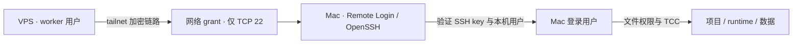
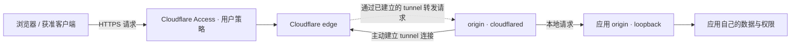
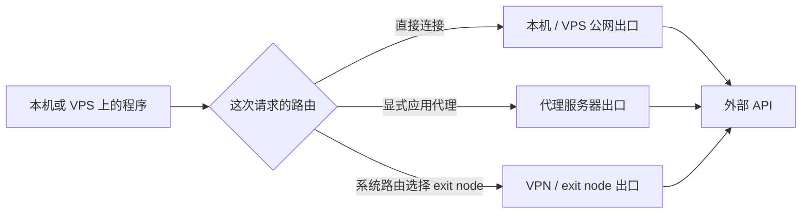
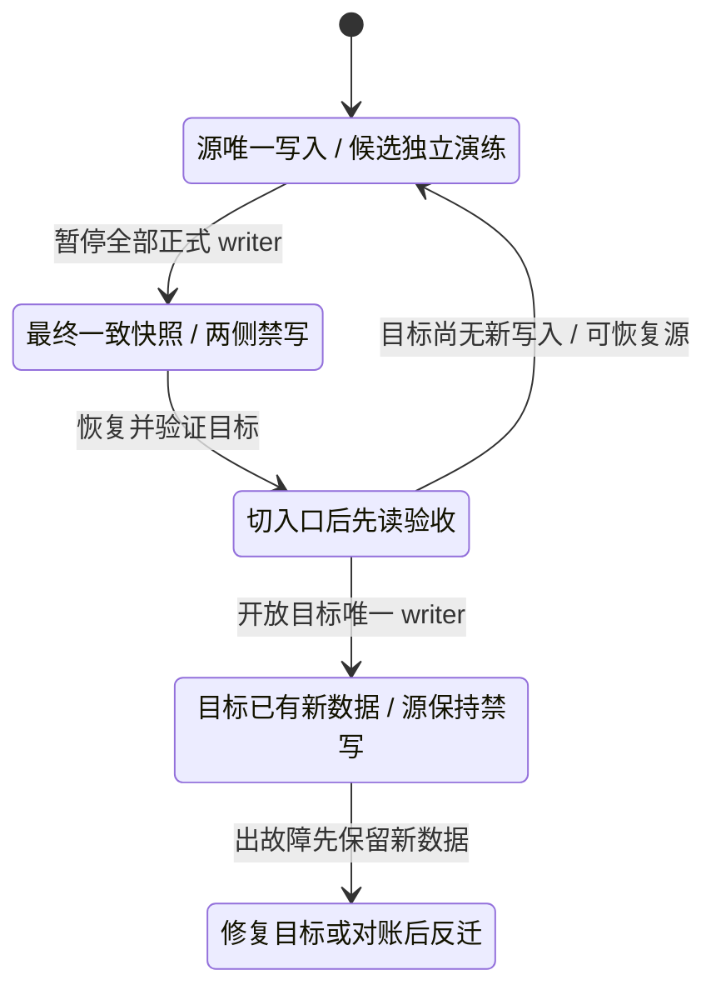

# 三条路径：控制自己的机器、接待请求、访问外网

[返回首页](../README.md) · [网络与代理](07-network-and-proxies.md) · [私有远程访问](09-private-access.md)

同一台 VPS 可以同时出现在下面三条路径中，但它们的入口、鉴权者、出口不同。以下图是教程方案模型，全部名称为合成角色；不代表任何已经部署的真实拓扑。

## 1. VPS 上的 worker 回到 Mac 工作

问题：远程 worker 如何访问留在 Mac 上的项目？Tailscale grant 只允许网络路径，OpenSSH key 决定本机登录身份，macOS 文件权限及 TCC 决定能读写哪些文件。

路由可以是 direct 或 DERP relay；中继不是另一个登录用户。OpenSSH 登录成 owner 并不会自动限制在一个 repo。若需要隔离 agent 的文件访问，应另外设计专用 OS 用户、受限执行器或工作空间边界。正确验收是从真实 VPS worker 用户执行真实项目命令，并确认未获准 peer 仍不能到 TCP22。

## 2. 浏览器访问你提供的服务

问题：家里没有公网入站地址，怎样提供一个经过鉴权的 HTTPS 入口？本图选 Cloudflare Tunnel + Access 的私有应用方案。

实线 C→E 表示连接的建立方向，虚线 E→C 表示在现有连接上的请求转发，避免把“无需公网入站端口”误读成“没有外部请求”。Tunnel 本身没有替你创建 Access 用户策略；应用自己的鉴权与写入权限仍要成立。公共网站可以选择不同的 Access 策略，但那是另一项明确的产品选择。

## 3. 程序访问外部 API

问题：平台看到请求从哪里来？取决于程序实际使用的出口，不由你给自己服务挂了哪个 Tunnel 决定。

同一程序可因 `HTTP_PROXY`、`HTTPS_PROXY`、`ALL_PROXY`、`NO_PROXY` 或客户端不支持这些变量而走不同路径；IPv4、IPv6、代理 DNS 也要分开验证。图中的分支是几种可选方案，不表示它们一定同时开启，更不表示某个出口能保证账号结果。

## 数据迁移另有一个分界

[迁移章](05-vps-to-vps.md)的关键不是域名改成功，而是谁可以写入正式数据。

目标接受首次新写入后，仅把 DNS 指回旧机可能丢失或分叉新数据。恢复方式必须覆盖这部分差异；“旧机还在”并不是足够的恢复方案。

图的可编辑源就是本文件的 Mermaid blocks。它们对应第04、05、07、09章的机制；具体软件行为与来源见各章。任何实时节点、策略和运行状态都需要在实施时重新确认。
