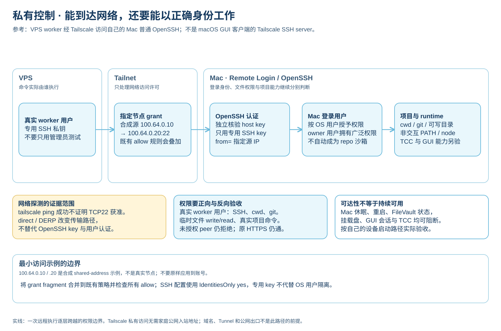
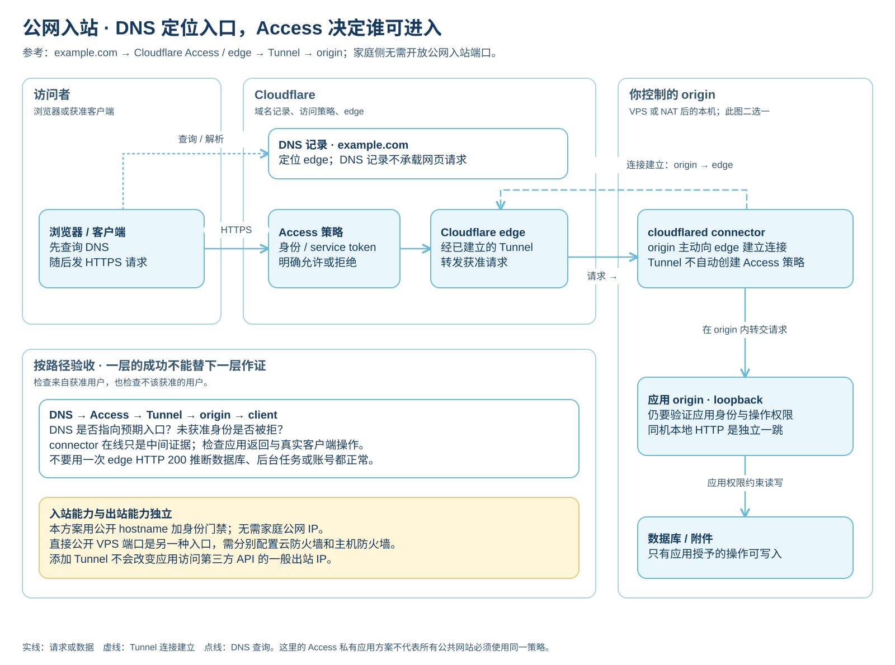
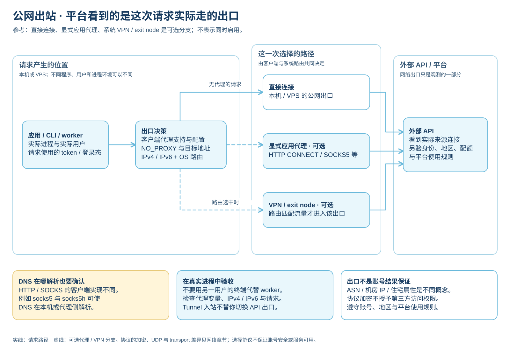
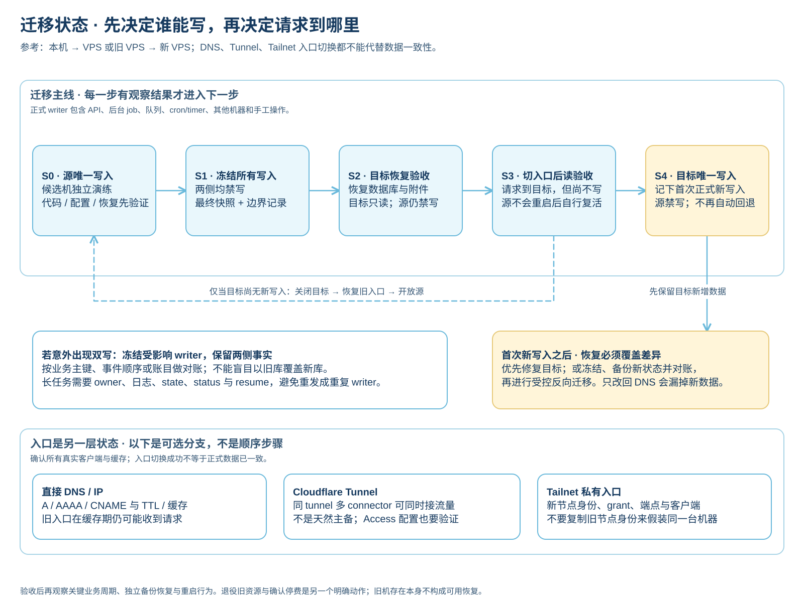
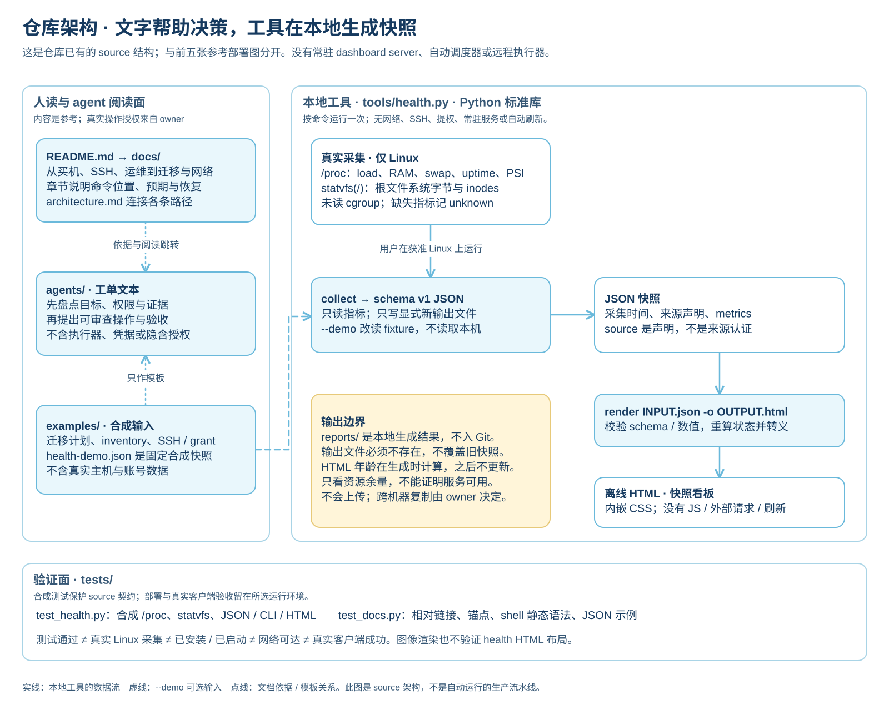

# 架构地图：机器、请求、数据与证据

[返回首页](../README.md) · [网络与代理](07-network-and-proxies.md) · [私有远程访问](09-private-access.md) · [图源与导出说明](diagrams/README.md)

一台 VPS 可以同时承担远程 worker、应用 origin 和公网出口，但这三种职责的访问路径、授权者和验收方式不同。先把它们放在同一张地图里，再分别看每条路径跨过什么边界。

前五张图是**合成参考架构**，表达教程中可以组合的方案，不代表本仓库已经部署了这些服务。第六张图是**本仓库现有 source 的结构**。图中 `example.com`、`100.64.0.10`、`100.64.0.20` 都是示例；后两个属于 shared-address 空间，不是真实节点。软件行为的官方来源与查阅日期在相应章节中，图的证据对照日期为 **2026-10-02**。

## 怎样阅读

| 顺序 | 想回答的问题 | 读图后去哪里做 |
| --- | --- | --- |
| 1. [全局总览](#1-全局总览) | 本机、VPS、Cloudflare、外部 API 如何分工？ | [买机](01-vps-basics.md)、[首台服务器](02-first-server.md) |
| 2. [私有控制](#2-私有控制) | VPS worker 怎样回到 Mac，以什么权限工作？ | [私有远程访问](09-private-access.md) |
| 3. [公网入站](#3-公网入站) | 外面的客户端怎样进入自己的服务？ | [网络与代理](07-network-and-proxies.md)、[入口教程](09-private-access.md) |
| 4. [公网出站](#4-公网出站) | 程序访问 API 时实际使用哪个出口？ | [网络与代理](07-network-and-proxies.md)、[排障](08-troubleshooting.md) |
| 5. [迁移状态](#5-迁移状态) | 什么时候允许谁写，什么情况下还能回旧机？ | [本机到 VPS](04-local-to-vps.md)、[VPS 到 VPS](05-vps-to-vps.md) |
| 6. [仓库与 health](#6-仓库与-health) | 文档、工单、示例、工具和测试怎样配合？ | [agent 入口](../agents/README.md)、[health 使用说明](../tools/README.md) |

每张图都附有文字说明。点击 SVG 可放大，PNG 是同一版面按固定字体环境渲染的查看副本。浅蓝表示普通组件，浅金强调需要做选择或处理状态边界的地方；颜色不代表运行成功。实线、虚线和点线的含义以每张图底部图例为准，关键差异同时写在线旁文字中。

## 1. 全局总览


[放大 SVG](diagrams/infrastructure-overview.svg) · [PNG](diagrams/infrastructure-overview.png) · [可编辑源](diagrams/infrastructure-overview.excalidraw)

按三个区域读：左边是你拥有的本机，中间是选择运行任务或服务的 VPS，右边是 DNS、公共入口和外部 API。图下方的运维区域覆盖整张图，提醒你分别观察 host、service、origin、edge 和真实 client，并把数据库与附件的一致备份放到独立故障域中做恢复演练。

上方的控制路径以 OS 用户和 SSH key 为身份边界；中间的入站路径接待外部请求；下方的出站路径描述应用自己访问 API。Cloudflare Tunnel 出现在入站路径上，不因此成为应用的一般出站代理。Tailscale grant 与 Access 是逻辑许可关口，图中卡片不表示要额外购买一台机器。

应用与后台任务都是潜在 writer。备份、迁移和故障恢复要覆盖两者，以及图中未逐个展开的队列消费者、定时任务、其他机器和手工操作。systemd、日志限额、OOM、容量与恢复演练的实际步骤见[日常运维](03-operations.md)。这张图不指定数据库产品，也不假设后台任务已经启用。

## 2. 私有控制



[放大 SVG](diagrams/control-access.svg) · [PNG](diagrams/control-access.png) · [可编辑源](diagrams/control-access.excalidraw)

这里选的是 Tailscale overlay 上的 **Mac 普通 Remote Login / OpenSSH**。macOS GUI / system-extension Tailscale 客户端与 Tailscale SSH server 的支持范围不同，不能因为安装了 GUI 客户端，就假定它提供后者。direct 与 DERP relay 改变传输路径；`tailscale ping` 成功不证明 TCP22 已获授权。

OpenSSH 还要独立核验 host key、使用专用 key，配合 `StrictHostKeyChecking yes` 与 `IdentitiesOnly yes`。在适用的 `authorized_keys` 条目上限制 `from=` 是额外约束，不取代 Tailnet grant。将[grant fragment](../examples/tailnet-ssh-grant.example.json)合并到现有 policy 时，要检查其他 allow 是否已经放行更宽的来源。

登录成现有 owner 用户，就拥有该用户的文件权限；这不是单 repo 沙箱。真正的验收要从**真实 worker 用户**出发，完成 SSH、cwd / git、临时文件 write/read 和实际项目命令，同时确认原 HTTPS 仍能访问、未授权 peer 仍被拒绝。Mac 本地终端能运行 `node`，不证明非交互 SSH 的 PATH 也能找到它。供电、睡眠、重启后的登录状态、FileVault、挂载盘、TCC 与 GUI 能力也要按使用场景分别验证。

## 3. 公网入站



[放大 SVG](diagrams/public-ingress.svg) · [PNG](diagrams/public-ingress.png) · [可编辑源](diagrams/public-ingress.excalidraw)

DNS 回答入口在哪里，Access 判断访问者能否进入，Tunnel 把请求传到 origin。图中的 DNS 点线与网页请求主线分开：设置 A、AAAA、CNAME 或代理 DNS 记录，不等于建立到家庭内网的隧道。

图里两条 Tunnel 箭头故意方向相反：虚线是 `cloudflared → edge` 主动建立连接，实线是 `edge → cloudflared` 在已有连接内转发请求。无需家庭公网入站端口，仍然可以接待通过门禁的外部请求。Tunnel 本身不会替你创建 Access 策略，应用自己的身份、角色与写入权限也仍然有效。这里按逻辑职责拆开 Access 与 edge，并非声称它们是用户需要管理的两台服务器。

这张图选用公开 hostname 加 Access 的私有应用方案。若只需要自己的设备互相访问，可以选 Tailscale 私有路径；若只是临时查看远端 loopback 服务，可以在已有 SSH 上建立 `ssh -L` 本地转发。三者比较与逐步设置见[私有远程访问](09-private-access.md)。直接开放 VPS 公网端口是另一种入口，主机防火墙、云防火墙、IPv4 / IPv6 和 Docker published ports 的边界见[首台服务器](02-first-server.md)。

## 4. 公网出站



[放大 SVG](diagrams/outbound-access.svg) · [PNG](diagrams/outbound-access.png) · [可编辑源](diagrams/outbound-access.excalidraw)

出口是这次请求的结果。一个程序可能支持 `HTTP_PROXY`、`HTTPS_PROXY`、`ALL_PROXY`、`NO_PROXY`，另一个程序可能忽略它们；不同用户、systemd service 与交互 shell 的环境也可能不同。IPv4 与 IPv6 可以走不同路径，代理 DNS 解析位置也要单独检查。

三个分支是可选方案。显式代理与系统 VPN / exit node 不能仅凭软件“已启动”就判断生效，应从实际发请求的用户和程序验证。网络章节另行比较 HTTP CONNECT、SOCKS5、SSH、WireGuard、Trojan、VLESS 与 Hysteria2 的加密、UDP 和 transport 差异；总览不把它们画成可以无条件互换的同一种链路。

外部服务还会检查请求携带的身份、权限、配额与使用规则。公网入站 IP、实际出站 IP、ASN、机房或住宅属性分别回答不同问题；协议与出口都不能保证账号安全或平台一定放行。

## 5. 迁移状态



[放大 SVG](diagrams/migration-state.svg) · [PNG](diagrams/migration-state.png) · [可编辑源](diagrams/migration-state.excalidraw)

这张图用写入权限定义迁移状态。S0 的候选演练不接正式写入；S1 到 S3 两侧均禁写；只有 S4 开放目标唯一 writer。最终快照必须覆盖业务需要一致的数据，停止 timer 也不等于已经停止它启动的任务。恢复源时，要先确认目标尚无新写入、关闭目标、恢复入口，再重新开放源。

目标接受首次正式新写入，是恢复策略的分界。此后仅把 DNS 改回旧机可能丢失或分叉新数据，应优先修复目标；需要回旧机时，先冻结、备份新状态并完成对账，再做受控反向迁移。若已经双写，保留两侧事实，不用旧库盲目覆盖新库。

入口是另一层状态：DNS 有 TTL 与缓存；同一 Cloudflare Tunnel 的多个 connector 可同时接流量，不是天然主备；Tailnet 节点身份、grant 和客户端端点也要分别迁移。应用恢复、入口切换、真实用户验收、旧资源退役与账号侧停费是不同结果，不能用一个“迁移成功”标签全部代替。

## 6. 仓库与 health



[放大 SVG](diagrams/repository-map.svg) · [PNG](diagrams/repository-map.png) · [可编辑源](diagrams/repository-map.excalidraw)

左边是人和 agent 使用的内容：README 帮助选择阅读路径，docs 给出机制和 runbook，agents 提供可审查工单，examples 提供合成输入。工单不包含远程执行器、SSH 凭据或隐含授权；真实目标与允许执行的动作来自 owner 的当前任务。

右边是实际存在的本地工具。`collect` 在获准的 Linux 环境中读取 `/proc` 与 `statvfs('/')`，或由 `--demo` 改为读取固定合成 fixture，然后生成 schema v1 JSON；`render` 校验 JSON，重算状态并进行 HTML 转义，生成离线单文件 HTML。没有常驻 server、自动调度、网络请求或自动刷新。渲染时间、采集时间和“来源声明”有各自的证据范围，详见[工具契约](../tools/README.md)。

`tests/test_health.py` 使用合成指标、模拟文件系统统计和临时文件；`tests/test_docs.py` 检查文档链接、shell 静态语法与 JSON 示例。它们不证明真实 VPS 已安装、服务已启动、网络可达或客户端成功。图像的浏览器渲染也不构成 health HTML 的布局验收。

## 维护、再生成与已验证范围

[docs/diagrams](diagrams/README.md)保存六份可编辑 Excalidraw 源、对应 SVG / PNG 和生成的[语义模型索引](diagrams/architecture-model.json)。图源里的稳定 ID、节点职责、边的 payload、区域与状态权威均带证据字段。没有把实时地址、账号策略或部署状态写进这些图。

修改时先检查变化属于哪条路径，再更新对应图源及受影响的总览。图中许可、writer、状态转换或验证条件变化时，也要对照相应章节与工单。不要只改导出的 SVG、PNG 或模型索引；具体字段及渲染器支持范围见[维护说明](diagrams/README.md)。

在本地仓库根目录，用已安装的 Node.js 运行：

```sh
node scripts/render-diagrams.mjs
```

它读取图源，重新生成六个 SVG 和语义模型 JSON；只覆盖这些图的派生导出，不执行教程命令，不联网，不安装依赖，不触及真实服务器或 health 报告。

需要 PNG 与浏览器文字边界检查时，向脚本传入**已经存在**的 Playwright 模块文件与 Chromium 可执行文件路径；占位路径必须替换：

```sh
node scripts/render-diagrams.mjs --png \
  --playwright-module /path/to/playwright/index.mjs \
  --browser /path/to/chromium
```

本次使用已有 Node.js 24.19.0、Playwright 1.62.1 与 Chromium 155.0.8059.12 headless，对六个 SVG 逐一渲染为 PNG；查看实际图像后修正长文本和截图问题。最终六图的卡片内文字边界检查通过，并已逐张检查箭头方向、文字、重叠、裁切和颜色。SVG 使用系统中文字体回退，其他机器的字体可能改变字宽；随附 PNG 保留本次查看的版面。

这项验证只覆盖**图源、导出与图像呈现**。没有连接真实 VPS、Mac、Tailnet、Cloudflare 或外部 API，也没有验证 health HTML 的浏览器布局。真实环境的操作和验收仍按相关章节分别进行。

独立阅读站是以上公共 Markdown 与图示的派生阅读界面，不是业务服务部署：正文与选定素材 → `site/build.py` → 静态 HTML／搜索索引 → GitHub Pages。第六张图聚焦教程、工单与 health 工具的关系；阅读站的文件职责、发布白名单和验收说明见 [site/README.md](../site/README.md)。
