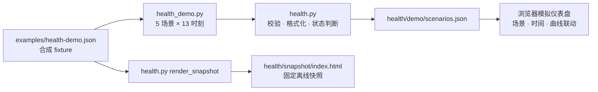

# 独立阅读站

[阅读站](https://indeliblevivi.github.io/infra-field-guide/)把仓库现有 Markdown 生成静态 HTML。`docs/`、`agents/`、`tools/README.md` 等仍是正文真源；不要复制出另一套教程，也不要手改生成的 `_site/`。

## 构建与本地预览

构建使用 Python 3.10+ 和唯一的构建依赖 [Python-Markdown](https://python-markdown.github.io/)。health 工具的 Python 3.9+、标准库契约不变。示例以 POSIX shell 为例；Windows 可直接使用虚拟环境中的 `Scripts/python.exe`。

```sh
python3 -m venv .local/site-venv
.local/site-venv/bin/python -m pip install -r site/requirements.txt
.local/site-venv/bin/python site/build.py --output .local/preview/infra-field-guide
.local/site-venv/bin/python -m unittest discover -s site -p 'test_*.py' -v
python3 -m http.server 4178 --bind 127.0.0.1 --directory .local/preview
```

然后打开 `http://127.0.0.1:4178/infra-field-guide/`。预览服务只绑定 loopback；修改源后重新构建并刷新。临时前台服务器随终端退出停止。需要跨终端保留预览时，使用自己的受管会话并记录停止方式。

`--base` 默认为 `/infra-field-guide/`，可以设为 `/` 用于根路径预览。该参数须以 `/` 开始和结束。发布目标固定为本项目 Pages；换仓库时须一并修改 canonical / Open Graph URL、公开站点链接、`sitemap.xml` 和工作流配置。

每个发布页都带唯一的 `title`、`description`、`canonical`、`og:*`（含 `og:url`、`og:site_name`、`og:image` 与 `og:image:alt`）和 `twitter:*`（`summary_large_image`）。`description` 来自 `pages.json` 的 `summary`，逐页不同；缺省只作兜底，不应长期复用。`sitemap.xml` 由 `build.py` 从显式发布路由生成：列出首页、`PAGES` 路由与 `health/demo/`，404 标 `noindex` 且不给 canonical。`health/snapshot/` 是 `tools/health.py` 的固定离线渲染，带 CSP 且不参与上述站点 head 契约，也不进入 sitemap。

本项目部署在 GitHub Pages 子路径；Google 读取的是主机根部的 `https://indeliblevivi.github.io/robots.txt`，项目目录内的同名文件不会控制抓取，因此这里不生成它。将 `https://indeliblevivi.github.io/infra-field-guide/sitemap.xml` 提交到对应 Search Console URL-prefix property，是独立账号操作；构建、push 或 Pages 部署不代表已经提交或收录。参见 [Google robots.txt 位置规则](https://developers.google.com/crawling/docs/robots-txt/robots-txt-spec)。

`shell.html` 的 `google-site-verification` 是本项目 Search Console 所有权的公开验证标记，不是访问凭据或 analytics 脚本。正式站点须持续保留；重排模板时检查生成首页的 `<head>` 仍含该标记。fork 或更换站点所有者时移除原标记，并在自己的 Search Console 获取新的验证值。验证成功、提交 sitemap 与 Google 实际收录是独立状态。

## 文件职责与发布边界

| 文件 | 职责 |
| --- | --- |
| `pages.json` | 发布的正文白名单、路径、章节序号与导航短标题；原文 h1 的文字与锚点保留；章节编号移到眉题，冒号后的说明单独一行 |
| `build.py` | Markdown 渲染、链接去向分类、章节目录、分节搜索索引、逐页 metadata、`sitemap.xml` 生成和显式素材白名单 |
| `ui.py` | 原创线性 UI 图标，供标题、目录和链接标记共用 |
| `home.html` / `shell.html` | 首页编辑排版与公共阅读界面 |
| `site.css` / `site.js` | 响应式排版、原生 dialog 搜索／目录／术语解释、代码复制、表格滑动提示与目录当前位置 |
| `search.js` / `test_search.cjs` | 本地多词检索、问题别名及真实问法回归；可同时在浏览器与 Node 测试中使用 |
| `health_demo.py` / `health.html` / `health.css` / `health.js` | 生成合成场景、模拟仪表盘布局与本地时间回放；`health.html` 头部自带该页的 description／canonical／社交 metadata；指标判断继续由 `tools/health.py` 管理 |
| `test_build.py` | 全部生成页面的链接／锚点、搜索目标、发布文件白名单与 Markdown 关键结构 |
| `../.github/workflows/pages.yml` | PR 只构建验证；main 推送验证后部署到 `github-pages` environment |

页面正文、导航链接和原图入口无需 JavaScript；搜索、手机目录抽屉、术语就地解释和代码复制为渐进增强。搜索索引按需从同一站点加载，关键词在浏览器内匹配，不发往搜索服务；站点无 analytics、第三方脚本、远程字体或登录。普通外链与 referral 由读者自行点击。

正文中的本地 Markdown 链接改写为对应站点路由；选定图片、完整许可与图源直接随站点发布，其他源码和示例链接回 GitHub。密集架构图保留“放大 SVG”、PNG 与可编辑源入口。代码复制只复制代码文本；剪贴板权限不可用时选中文本并提示手动复制。

构建只读取 `pages.json` 与 `build.py` 明确选择的公共内容，不打包整个仓库、`.local/`、`reports/` 或真实 health 输出。CI 在全新 checkout 构建，只上传 `_site/`。本地变更路由／移除页面后，使用新的空输出目录检查，避免旧预览文件干扰判断。

## 首页阅读入口

首页的第一章入口采用书签式链接，直接进入 VPS 选购与基础概念。目录按 `pages.json` 已有的「从零开始／迁移与恢复／连接与排障」分为三组；章节标题、简介和地址仍取自该文件，组间引导文案和小图标由 `home.html` 管理。桌面显示三栏，平板使用左侧组说明／右侧章节，手机按组纵排。主题导航是普通页内锚点链接，不依赖 JavaScript，也不改变章节原有顺序或相邻章导航。

时间同步与共享访问恢复作为「随手查阅」的专题页，保留九章顺序；首页目录下方另有两个普通链接。两篇正文与两张配套工单均在 `pages.json` 明确列入发布范围，分节内容自动进入同站搜索。

## 问题搜索

`search.js` 将「SSH 超时／连接超时／timeout」「磁盘满／空间不足／No space left」「公钥拒绝／publickey」等问法对应到正文词组和直接排障小节。输入多个关键词时，各组都要匹配；别名命中后，额外关键词仍参与筛选。标题和直接处理症状的章节优先。别名是小型人工维护表，没有向量库、在线模型或服务端查询。

时间与访问专题另覆盖「UDP123」「NTP 不通」「kvm-clock」「加固后连不上」「fail2ban」「撤销 key」；这些别名只指向正文中的已有解释，不生成新的操作建议。

修改别名、排序或正文目标后运行：

```sh
.local/site-venv/bin/python site/build.py
node --test site/test_search.cjs
node --check site/site.js
node --check site/health.js
```

## Health 模拟仪表盘

`health/demo/` 是交互式教学演示，`health/snapshot/` 是原有 CLI renderer 生成的固定离线示例。二者不是同一种产品行为：模拟页需要 JavaScript，快照无需脚本。站点构建不会调用真实采集，也不会发布 `reports/`。



所有曲线都来自显式合成数据：每 5 分钟一帧，共 60 分钟。`health_demo.py` 定义场景，`health.py` 是字段校验与状态语义的真源；JS 只管理选择、回放和图表。切换场景、拖动时间轴、从头开始或离开可见页面会暂停回放。缺失值保持空缺，不变成零或绿色。界面上的曲线阈值与工具说明一致，修改阈值时须同时核对图表标签。手机改为横向场景选择与纵排图表，键盘焦点只在时间滑块上提示。

网站加载同站 CSS、JS 和合成 JSON，不连接 VPS，不执行 SSH，不上传读数。`test_build.py` 验证五组场景、缺失读数、状态转换和发布白名单；时间回放、切换、键盘操作及响应式布局另做浏览器验收。

## 章节图、词表与便笺

- `docs/glossary.md` 是词义真源，每个稳定的 `## 术语` 下第一段是释义，另段“继续读”链接回章节。普通 Markdown 链接在 GitHub 与无 JavaScript 的页面均可用；阅读站把指向词条的链接增强为原生 dialog。修正词义只改这份 Markdown，构建器自动提取，避免两份定义漂移。Escape／关闭后焦点返回原词，Ctrl/Cmd 点击仍按普通链接行为处理。
- `docs/diagrams/chapter-maps.json` 与 `scripts/render-chapter-maps.py` 生成 12 张章节概念图的桌面／手机 SVG；9 张用于各章开头，3 张用于重点小节。Markdown 引用普通 SVG；站点构建为 `<picture>`，视口 1000px 及以下改用纵排，并限制图宽以保留可读字号。完整图源约定见[图示维护](../docs/diagrams/README.md)。
- GitHub 兼容的 `> [!TIP]` / `> [!NOTE]` 在站点渲染为带图钉的阅读便笺。只改变容器与视觉层级，不改变提醒正文或代码块。
- `favicon.svg` 是 Moonlight Fawn 月牙／水纹标记的唯一源，页眉与浏览器页签共用。正文保持白底墨蓝；月光和浅金只用来陪衬层级，不承担唯一语义。

## 正文阅读与链接标记

正文页使用实际章节／参考分类作为面包屑，顶部「仓库原文」明确前往本项目 GitHub。Markdown 中孤立的「返回首页」入口在阅读站省去，GitHub 原文不变；文章标题与小节锚点保持稳定。二级标题配章主题图标，三级标题用小星形区分层级；装饰图标对辅助技术隐藏，不进入搜索文本。标题旁的 `¶` 是本节锚点，不表示外部链接。

构建器按实际去向为正文链接加标记；标题下的「链接标记」可展开文字说明：

- 右箭头：本站页面或页内小节。
- 圆问号与虚线下划线：词义解释；支持就地弹窗和普通词表链接。
- 分支图标：本项目 GitHub 仓库，包括源码、原文、示例与 Actions。
- 方框外箭头：其他网站；悬停提示包含目标域名，不表示对来源的质量背书。
- 下载形图标：本站提供的图像或文件；点击行为仍由原链接与浏览器决定，不强制下载。

分类依据解析后的主机和路径，不把所有 GitHub 链接都当作本仓库。外部链接保持普通同页导航，由读者选择是否在新标签打开。源代码块和引用文字不因图标改变。

## 发布与验收

GitHub 仓库 Settings → Pages 的 Source 为 **GitHub Actions**。发布行为见 [GitHub 官方 custom workflows 文档](https://docs.github.com/en/pages/getting-started-with-github-pages/using-custom-workflows-with-github-pages)。首次启用与后续 workflow 部署是仓库 owner 授权的独立发布动作，不等于部署教程所描述的 VPS 服务。

每次修改生成器或导航应运行本目录测试；样式或交互改动还需用浏览器查看桌面和手机尺寸，检查首页／长文、搜索结果与空结果、目录跳转、长表格、长命令、复制和架构图原图。构建成功不代表视觉验收或线上可达。线上发布后从 Pages URL 检查首页、至少一章、搜索索引与素材；历史发布状态见 Actions 的 `Reading site` workflow。

构建器、模板功能结构、CSS、JavaScript 与测试使用 SUL-1.0；原创文案、图示和独立视觉素材按 CC BY-NC-SA 4.0，完整范围见 [LICENSING.md](../LICENSING.md)。Python-Markdown 仅为构建时安装的第三方依赖，适用其自身许可，不随站点分发。
